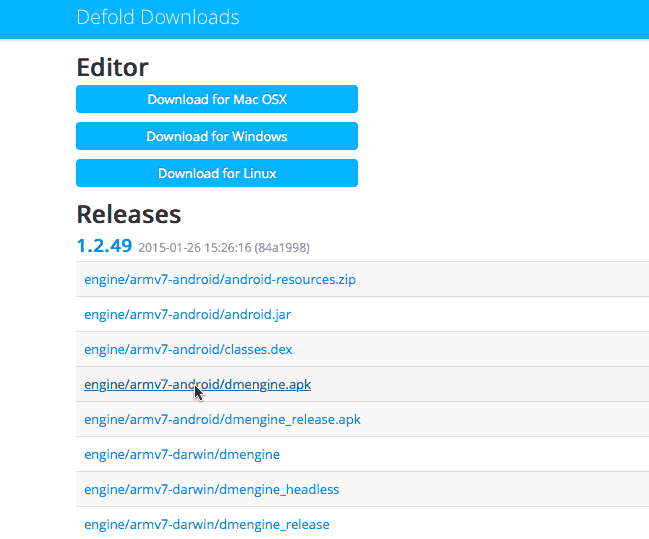
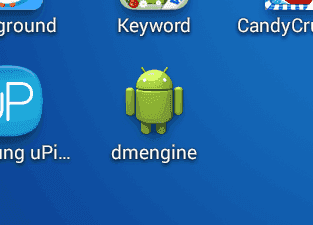
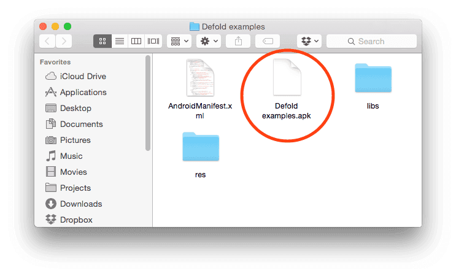

# Android development

Android development differs from iOS development in that the devices give free access to upload content. It is very easy to build a version of your game and copy it onto an Android device. You can just as easily put the development engine on a device for iterative development on the device over wifi.

## Android and Google Play signing process

Android requires that apps that you want to install are digitally signed. Unlike iOS where all certificates are issued by Apple, Android allows self signed apps so you can freely create certificates and keys required to sign apps.

The process of creating certificates and keys may seem complicated but as long as you are in development, Defold fully automates the process. When you create an Android application bundle from the editor you can provide a specific certificate and key. If you don't, Defold generates a random certificate and a key and signs the resulting *.apk* (Android Application Package) file.

It is important to note that when it is time to release an app on Google Play, you will need to create a certificate and key that you use to sign the app. The reason is that when you intend to publish an updated version of the app, _the updated *.apk* file needs to be signed with the same signature as the current version_. If you sign with a different private key, Google Play will reject the *.apk* update and you will need to publish the game as a totally new app.

You can find more information from the [Google Play developer console](https://play.google.com/apps/publish/). See below for info on how to create your own certificates and keys.

## Android Debug Bridge

The `adb` command line tool is an easy to use and versatile program that is used to interact with Android devices. You can download and install `adb` as part of the Android SDK package, for Mac, Linux or Windows.

Download the Android SDK from: http://developer.android.com/sdk/index.html. You find the *adb* tool in *<sdk>/platform-tools/*. Alternatively, platform specific packages can be installed through respective package managers.

On Ubuntu Linux:

```sh
$ sudo apt-get install android-tools-adb
```

On Fedora 18/19:

```sh
$ sudo yum install android-tools
```

On Mac OS X (Homebrew)

```sh
$ brew cask install android-platform-tools
```

You can veryfy that `adb` works by connecting your Android device to your computer via USB and issue the following command:

```sh
$ adb devices
List of devices attached
31002535c90ef000    device
```

If your device does not show up, verify that you have enabled *USB debugging* on the Android device. Open the device *Settings* and look for *Developer options* (or *Development*).


## Installing and running the development dmengine

A stand-alone version of the Defold engine is available as a ready made *.apk* file that you can install on a device and use for iterative development wirelessly.

* Visit http://d.defold.com where Defold downloads can be found.
* Click on the version you want to download to expand a list of available engine builds.
* Select *engine/armv7-android/dmengine.apk* for a debug enabled build for the Android platform (Armv7).



Download the file, then issue the following `adb` command from the location of the *.apk*:

```sh
$ adb install dmengine.apk
4445 KB/s (8706017 bytes in 1.912s)
	pkg: /data/local/tmp/dmengine.apk
Success
```

The development "dmengine" app is now available on the device.



## Launching the game

To launch your game on your Android device, the dmengine app and editor must be able to connect over the same wifi network.

1. Make sure the editor is up and running.
2. Launch the "dmengine" app on the Android device.
3. Select your device under <kbd>Project ▸ Targets</kbd> in the editor.
4. Select <kbd>Project ▸ Build And Launch</kbd> to run the game. It may take a while for the game to start since the game content is streamed to the device over the network.

While the game is running, you can use [hot reloading](/manuals/debugging#anchor-hr) as usual.

## Creating an Android application bundle

The editor lets you easily create a stand alone application bundle for your game. Select <kbd>Project ▸ Bundle... ▸ Android Application...</kbd> from the menu.


Select your code signing identity and browse for your mobile provisioning file. Press *Package* and you will then be prompted to specify where on your computer the bundle will be created.



The editor writes an *.apk* file which is an Android application bundle. This file can be copied to your device with the `adb` tool, or to Google Play via the [Google Play developer console](https://play.google.com/apps/publish/). You can specify what icon(s) to use for the app, set version code etc in the "game.project" project settings file.

## Debugging an application bundle

A bundle built with the debug mode version of the engine (i.e. "Release mode" unchecked during bundling) will send all its console output to the Android system log. Access the log with the `adb` tool and give the `logcat` command. You probably want to filter the output by a tag (`-s [tagname]`):

```sh
$ adb logcat -s "defold"
--------- beginning of /dev/log/system
--------- beginning of /dev/log/main
I/defold  ( 6210): INFO:DLIB: SSDP started (ssdp://192.168.0.97:58089, http://0.0.0.0:38637)
I/defold  ( 6210): INFO:ENGINE: Defold Engine 1.2.50 (8d1b912)
I/defold  ( 6210): INFO:ENGINE: Loading data from:
I/defold  ( 6210): INFO:ENGINE: Initialised sound device 'default'
I/defold  ( 6210):
D/defold  ( 6210): DEBUG:SCRIPT: Hello there, log!
...
```

## Creating certificates and keys

You need the to create certificates in *.pem*-format and keys in *.pk8*-format. You can generate these with the `openssl` tool:

```sh
$ openssl genrsa -out key.pem 2048
$ openssl req -new -key key.pem -out request.pem
$ openssl x509 -req -days 9999 -in request.pem -signkey key.pem -out certificate.pem
$ openssl pkcs8 -topk8 -outform DER -in key.pem -inform PEM -out key.pk8 -nocrypt
```

This will leave you with the files *certificate.pem* and *key.pk8* that you can use to sign your application bundles:


::: important
Make sure that you store your certificate and key safely. If you lose them you will _not_ be able to upload updated *.apk* file versions to Google Play.
:::

## Troubleshooting

Your device does not appear in the Targets menu
: Make sure that your device and computer are on the same wifi network. Also, the *dmengine* app needs to be of the same version as the editor. If you have upgraded the editor, you will need to download a new *dmengine.apk* and install it on your device.

I'm getting "Failure [INSTALL_PARSE_FAILED_INCONSISTENT_CERTIFICATES]" when installing
: Android detects that you try to install the app with a new certificate. When bundling debug builds, each build will be signed with a temporary certificate. Uninstall the old app before installing the new version:

  ```sh
  $ adb uninstall com.defold.examples
  Success
  $ adb install Defold\ examples.apk
  4826 KB/s (18774344 bytes in 3.798s)
  	pkg: /data/local/tmp/Defold examples.apk
  Success
  ```

