# Animation

Defold has built in support for many types of animation that you can use as a source of graphics for object components:

Flip-book animation
: A flip book animation consists of a series of still images that are shown in succession. The technique is very similar to traditional cell animation (see http://en.wikipedia.org/wiki/Traditional_animation). The technique offers limitless opportunities since each frame can be manipulated individually. However, since each frame is stored in a unique image, the memory footprint can be high. The smoothness of animation is also dependent on the number of images shown each second but increasing the number of images usually also increase the amount of work. Defold flip book animations are either stored as individual images added to an Atlas, or as a Tile Source with all frames laid out in a horizontal sequence.

  {.inline}
  {.inline}

Spine animation
: Spine animation provides 2D _skeletal animation_ support (see http://en.wikipedia.org/wiki/Skeletal_animation). This is a fundamentally different technique that is closer to cutout animation. In cutout animation separate pieces of the animated object (e.g body parts, eyes, mouth etc) are moved individually between each frame. Spine animation let you build an invisible, virtual skeleton consisting of a hierarchy of interconnected _bones_. This skeleton, or _rig_, is then animated and individual images are attached to the bones. Defold supports animations created or exported in the [Spine JSON format](http://esotericsoftware.com/spine-json-format). Skeletal animation is very smooth since the engine can interpolate the location of each bone for each frame.

  For details on how to import Spine data into a Spine model for animation, see the [Spine documentation](/manuals/spine).

  {.inline}
  {.inline}

3D skinned animation
: Skeletal animation of 3D models is similar to Spine animation but works in 3D as opposed to 2D. The 3D model is not cut into separate parts and tied to a bone like in cutout animation. Instead, the bones apply deformation to vertices in the model and you have great control over how much a bone should affect the vertices.

  For details on how to import 3D data into a Model for animation, see the [3D graphics documentation](/manuals/3dgraphics).

  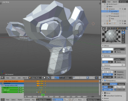{.inline}
  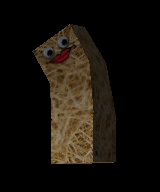{.inline}

Property animation
: All numeric properties (numbers, vector3, vector4 and quaterions) can be animated in the built in animation system, using the function `go.animate()`. The engine will automatically "tween" properties for you according to given playback modes and easing functions. You can also specify custom easing functions.

  {.inline}
  {.inline}

## Playing flip-book animations

Sprites and GUI box nodes can play flip-book animations and you have great control over them at runtime.

Sprites
: To run an animation during runtime you post [`play_animation`](/ref/sprite#play_animation)messages to the Sprite component you want to animate the texture on. 

  As soon as an animation is finished playing, the engine sends back a [`animation_done`](/ref/sprite#animation_done) message to the script that sent the `play_animation` message.

GUI box nodes
: To run an animation during runtime you use the [`gui.play_flipbook()`](/ref/gui#play_flipbook) function. See below for an example.

## Sprite example

Suppose that your game has a "dodge" feature that allows the player to press a specific button to dodge. You have created four animations to support the feature with visual feedback:

"idle"
: A looping animation of the player character idling.

"dodge_idle"
: A looping animation of the player character idling while being in the dodging stance.

"start_dodge"
: A play-once transition animation taking the player character from standing to dodging.

"stop_dodge"
: A play-once transition animation taking the player character from dodging back to standing.

The following script provides the logic:

```lua
function on_input(self, action_id, action)
    -- "dodge" is our input action
    if action_id == hash("dodge") then
        if action.pressed then
            msg.post("#sprite", "play_animation", {id = hash("start_dodge")})
            -- remember that we are dodging
            self.dodge = true
        elseif action.released then
            msg.post("#sprite", "play_animation", {id = hash("stop_dodge")})
            -- we are not dodging anymore
            self.dodge = false
        end
    end
end

function on_message(self, message_id, message, sender)
    if message_id == hash("animation_done") then
        -- one of the transition animations are finished, let's start looping
        if self.dodge then
            msg.post("#sprite", "play_animation", {id = hash("dodge_idle")})
        else
            msg.post("#sprite", "play_animation", {id = hash("idle")})
        end
    end
end
```

## GUI box node example

When selecting an animation or image for a node, you are in fact assigning the image source (atlas or tile source) and default animation in one go. The image source is statically set in the node, but the current animation to play can be changed in runtime. Still images are treated as one frame animations so changing an image means in run time is equivalent to playing a different flip book animation for the node:

```lua
local function flipbook_done(self)
    msg.post("#", "jump_completed")
end

function init(self)
    local character_node = gui.get_node("character")
    -- This requires that the node has a default animation in the same atlas or tile source as
    -- the new animation/image we're playing.
    gui.play_flipbook(character_node, "jump_left", flipbook_done)
end
```

An optional function that is called on completion can be provided. It will be called on animations that are played back in any of the `ONCE_*` modes.

## Animating Spine models

To run animations on your model, simply call the [`spine.play_anim()`](/ref/spine#spine.play_anim) function:

```lua
local function anim_done(self)
    -- the animation is done, do something useful...
end

function init(self)
    -- Play the "walk" animation on component "spinemodel" and blend against previous
    -- animation for the first 0.1 seconds, then call callback.
    local anim_props = { blend_duration = 0.1 }
    spine.play_anim("#spinemodel", "walk", go.PLAYBACK_LOOP_FORWARD, anim_props, anim_done)
end
```


If an animation is played with any of the `go.PLAYBACK_ONCE_*` modes and you have provided a callback function to `spine.play_anim()` the callback is run on animation complete. See below for information on callbacks.

## Cursor animation

In addition to using the `spine.play_anim()` to advance a spine animation, *Spine Model* components expose a "cursor" property that can be manipulated with `go.animate()`:

```lua
-- Set the animation on the spine model but don't run it.
spine.play_anim("#spinemodel", "run_right", go.PLAYBACK_NONE)

-- Set the cursor to position 0
go.set("#spinemodel", "cursor", 0)

-- Tween the cursor slowly between 0 and 1 pingpong with in-out quad easing.
go.animate("#spinemodel", "cursor", go.PLAYBACK_LOOP_PINGPONG, 1, go.EASING_INOUTQUAD, 6)
```

::: important
When tweening or setting the cursor, timeline events may not fire as expected.
:::

## The bone hierarchy

The individual bones in the Spine skeleton are represented internally as game objects. In the *Outline* view of the Spine model component, the full hierarchy is visible. You can see each bone's name and its place in the skeleton hierarchy.


With the bone name at hand, you are able to retrieve the instance id of the bone in runtime. The function [`spine.get_go()`](/ref/spine#spine.get_go) returns the id of the specified bone and you can, for instance, child other game objects under the animated game object:

```lua
-- Attach pistol game object to the hand of the heroine
local hand = spine.get_go("heroine#spinemodel", "front_hand")
msg.post("pistol", "set_parent", { parent_id = hand })
```

## Timeline events

Spine animations can trigger timed events by sending messages at precise moments. They are very useful for events that should take place in sync with your animation, like playing footstep sounds, spawning particle effects, attach or detach objects to the bone hierarchy or anything else you would like happen.

Events are added in the Spine software and are visualized on the playback timeline:


Each event is referenced with a name identifier ("bump" in the example above) and each event instance on the timeline can contain additional information:

Integer
: A numerical value expressed as an integer.

Float
: A floating point numerical value.

String
: A string value.

When the animation plays and events are encountered, `spine_event` messages are sent back to the script component that called `spine.play()`. The message data contains the custom numbers and strings embedded in the event, as well as a few additional fields that are sometimes useful:

`t`
: The number of seconds passed since the first frame of the animation.

`animation_id`
: The animation name, hashed.

`string`
: The provided string value, hashed.

`float`
: The provided floating point numerical value.

`integer`
: The provided integer numerical value.

`event_id`
: The event identifier, hashed.

`blend_weight`
: How much of the animation is blended in at this point. 0 means that nothing of the current animation is part of the blend yet, 1 means that the blend consists of the current animation to 100%.

```lua
-- Spine animation contains events that are used to play sounds in sync with the animation.
-- These arrive here as messages.
function on_message(self, message_id, message, sender)
  if message_id == hash("spine_event") and message.event_id == hash("play_sound") then
    -- Play animation sound. The custom event data contains the sound component and the gain.
    local url = msg.url("sounds")
    url.fragment = message.string
    msg.post(url, "play_sound", { gain = message.float })
  end
end
```

## 3D Model animation

Models are animated with the [`model.play_anim()`](/ref/model#model.play_anim) function:

```lua
function init(self)
    -- Start the "wiggle" animation back and forth on #model
    model.play_anim("#model", "wiggle", go.PLAYBACK_LOOP_PINGPONG)
end
```

::: important
Defold currently supports only baked animations. Animations need to have matrices for each animated bone each keyframe, and not position, rotation and scale as separate keys.

Animations are also linearly interpolated. If you do more advanced curve interpolation the animations needs to be prebaked from the exporter.

Animation clips in Collada are not supported. To use multiple animations per model, export them into separate *.dae* files and gather the files into an *.animationset* file in Defold.
:::

## The bone hierarchy

The bones in the Model skeleton are represented internally as game objects. In the *Outline* view of the Model component, you can see the bone hierarchy and each bone's name.

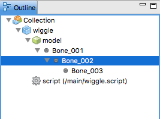

You can retrieve the instance id of the bone game object in runtime. The function [`model.get_go()`](/ref/model#model.get_go) returns the id of the specified bone.

```lua
-- Get the middle bone go of our wiggler model
local bone_go = model.get_go("#wiggler", "Bone_002")

-- Now do something useful with the game object...
```

## Cursor animation

Just as Spine models, 3D models can be animated by manipulating the `cursor` property:

```lua
-- Set the animation on #model but don't start it
model.play_anim("#model", "wiggle", go.PLAYBACK_NONE)
-- Set the cursor to the beginning of the animation
go.set("#model", "cursor", 0)
-- Tween the cursor between 0 and 1 pingpong with in-out quad easing.
go.animate("#model", "cursor", go.PLAYBACK_LOOP_PINGPONG, 1, go.EASING_INOUTQUAD, 3)
```

## Property animation

To animate a game object or component property, use the function `go.animate()`. For GUI node properties, the corresponding function is `gui.animate()`.

```lua
-- Set the position property y component to 200
go.set(".", "position.y", 200)
-- Then animate it
go.animate(".", "position.y", go.PLAYBACK_LOOP_PINGPONG, 100, go.EASING_OUTBOUNCE, 2)
```

To stop all animations of a given property, call `go.cancel_animations()`, or for GUI nodes, `gui.cancel_animation()`:

```lua
-- Stop euler z rotation animation on the current game object
go.cancel_animation(".", "euler.z")
```

If you cancel the animation of a composite property, like `position`, any animations of the sub-components (`position.x`, `position.y` and `position.z`) will be cancelled as well.

The [Properties Manual](/manuals/properties) contains all the available properties on game objects, components and GUI nodes.

## GUI node property animation

Almost all GUI node properties are possible to animate. You can, for instance, make a node invisible by setting its `color` property to full transparency and then fade it into view by animating the color to white (i.e. no tint color).

```lua
local node = gui.get_node("button")
local color = gui.get_color(node)
-- Animate the color to white
gui.animate(node, gui.PROP_COLOR, vmath.vector4(1, 1, 1, 1), gui.EASING_INOUTQUAD, 0.5)
-- Animate the outline red color component
gui.animate(node, "outline.x", 1, gui.EASING_INOUTQUAD, 0.5)
-- And move to x position 100
gui.animate(node, hash("position.x"), 100, gui.EASING_INOUTQUAD, 0.5)
```

## Playback Modes

Animations can be played either once or looping. How the animation plays is determined by the playback mode:

* go.PLAYBACK_NONE
* go.PLAYBACK_ONCE_FORWARD
* go.PLAYBACK_ONCE_BACKWARD
* go.PLAYBACK_ONCE_PINGPONG
* go.PLAYBACK_LOOP_FORWARD
* go.PLAYBACK_LOOP_BACKWARD
* go.PLAYBACK_LOOP_PINGPONG

The pingpong modes run the animation first forwards, then backward. A set of corresponding modes exist for GUI property animations:

* gui.PLAYBACK_NONE
* gui.PLAYBACK_ONCE_FORWARD
* gui.PLAYBACK_ONCE_BACKWARD
* gui.PLAYBACK_ONCE_PINGPONG
* gui.PLAYBACK_LOOP_FORWARD
* gui.PLAYBACK_LOOP_BACKWARD
* gui.PLAYBACK_LOOP_PINGPONG

## Easing

Easing defines how the animated value changes over time. The images below describe the functions applied over time to create the easing.

The corresponding value to use when calling `go.animate()` are `go.EASING_LINEAR`, `go.EASING_INBACK`, `go.EASING_OUTBACK` and so forth.

For `gui.animate()` the values are named `gui.EASING_LINEAR`, `gui.EASING_INBACK`, `gui.EASING_OUTBACK` and so forth.

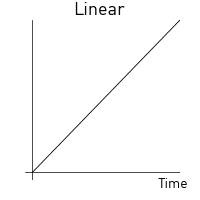{.inline}
{.inline}
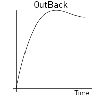{.inline}
{.inline}
{.inline}
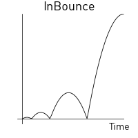{.inline}
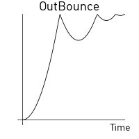{.inline}
{.inline}
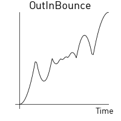{.inline}
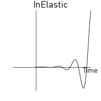{.inline}
{.inline}
{.inline}
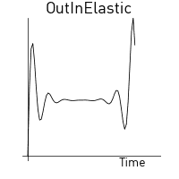{.inline}
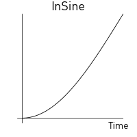{.inline}
{.inline}
{.inline}
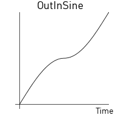{.inline}
{.inline}
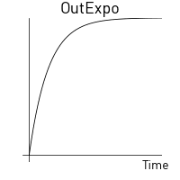{.inline}
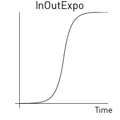{.inline}
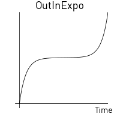{.inline}
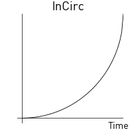{.inline}
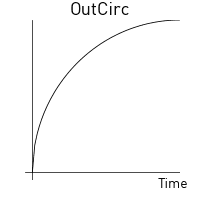{.inline}
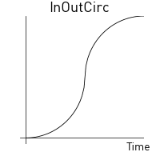{.inline}
{.inline}
{.inline}
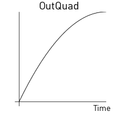{.inline}
{.inline}
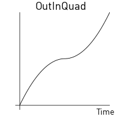{.inline}
{.inline}
{.inline}
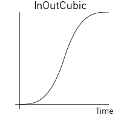{.inline}
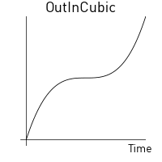{.inline}
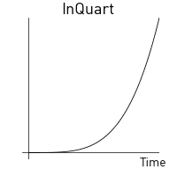{.inline}
{.inline}
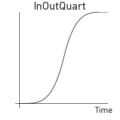{.inline}
{.inline}
{.inline}
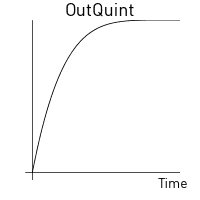{.inline}
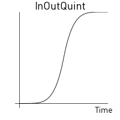{.inline}
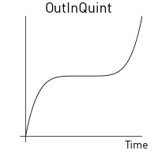{.inline}

## Custom easing

You can create custom easing curves by defining a `vector` with a set of values and then provide the vector instead of one of the predefined easing constants above:

```lua
local values = { 0, 0, 0, 0, 0, 0, 0, 0,
                 1, 1, 1, 1, 1, 1, 1, 1,
                 0, 0, 0, 0, 0, 0, 0, 0,
                 1, 1, 1, 1, 1, 1, 1, 1,
                 0, 0, 0, 0, 0, 0, 0, 0,
                 1, 1, 1, 1, 1, 1, 1, 1,
                 0, 0, 0, 0, 0, 0, 0, 0,
                 1, 1, 1, 1, 1, 1, 1, 1 }
local square_easing = vmath.vector(values)
go.animate("go", "position.y", go.PLAYBACK_LOOP_PINGPONG, 100, square_easing, 2.0)
```

## Completion callbacks

All animation functions (`go.animate()`, `gui.animate()`, `gui.play_flipbook()`, `gui.play_spine_anim()`, `spine.play_anim()` and `model.play_anim()`) supports an optional Lua callback function as the last argument. This function will be called when the animation has played to the end. The function is never called for looping animations, nor when an animation is manually canceled via `go.cancel_animations()`. The callback can be used to trigger events on animation completion or to chain multiple animations together.

The exact function signature of the callback differs slightly betweeen the animation functions. See the API documentation for the function you are using.

```lua
local function done_bouncing(self, url, property)
    -- We're done animating. Do something...
end

function init(self)
    go.animate(".", "position.y", go.PLAYBACK_ONCE_FORWARD, 100, go.EASING_OUTBOUNCE, 2, 0, done_bouncing)
end
```

