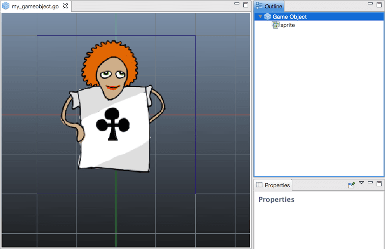
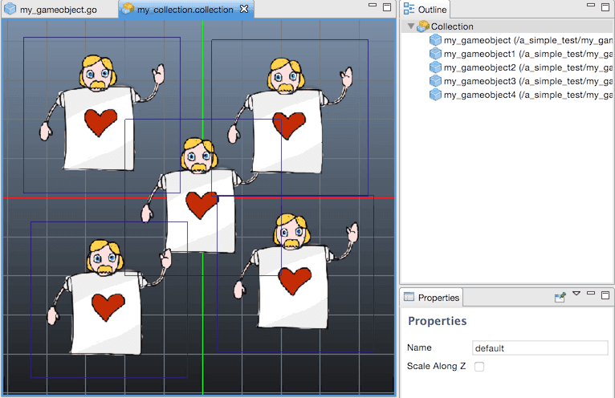
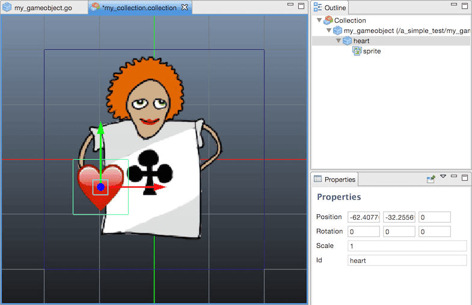
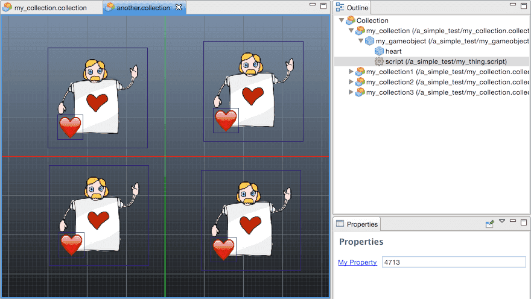
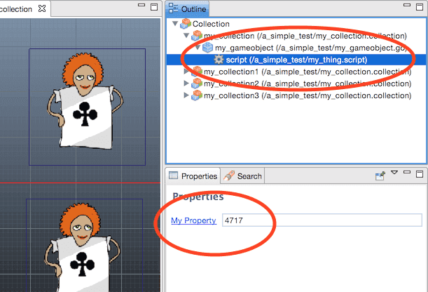

#  Building blocks

Some of the design decisions made in Defold differ from other software and it may take some time to get a good grip on how and why things are put together the way they are. In order to properly understand how Defold manages and gives you access to game resources, read this document and the [Message passing documentation](/manuals/message-passing). Some or many of the things here might be unfamiliar and hard to understand at first, but don't worry. Take your time, experiment with the editor and engine and return to the documentation when you run into problems.


## Game objects

Game objects are simple objects that each have a separate lifespan during the execution of your game. Game objects are usually equipped with visual or audible representation (a sound or sprite component, for instance). They can also be equipped with behavior through script components. Game objects are thus a separate thing from sprites, models or sounds in that they are _containers_ for these different type of components. You create game objects and place them in collections in the editor, or spawn them dynamically at run-time with _factories_.

There are two different ways you can create game objects in the editor:

1. Create a game object file and then create an instance of that file in a collection.
2. Create an _in-place_ instance of a game object in a collection.

Let's look at the difference between these.

## Prototypes and instances

When you create a game object _file_, you create a blueprint, or a prototype, for a game object. This prototype can then be _instanced_ into one or many game objects.



Creating a game object file does not add anything to your running game. The game object does not exist yet, only the formula to create it. To add an actual game object based on the blueprint just created, you add an instance of the game object to a collection in your project by right clicking the collection and selecting <kbd>Add Game Object File</kbd>.


Now you are able to start working on the game object. You might create a large number of instances of the object, each one being an exact clone of what's stored in the game object file.


The nice thing with this model is that if you change the game object file you are changing the prototype, so any instance that uses the file as its blueprint will immediately change.



## Childing game objects

Let's now look at a case which might seem peculiar at first. Add an instance "my_gameobject" of the above prototype file to a collection, then create another game object called "heart" _in place_ (right click and select <kbd>Add Game Object</kbd>) with some component. Finally, make "heart" the child of "my_gameobject" by dragging it onto it. You now have a collection that looks like this:



You might assume that by dragging the "heart" object onto "my_gameobject" you would change the file "my_gameobject.go", but that is not what happens. The effect of the operation is that the game object _instance_ "my_gameobject" gets a child attached to it. The game object instance has two separate properties for its prototype and its children. When you add children to a game object instance you add the object to the object's *children* property -- you don't touch the prototype.

If you open the collection in the text editor by right clicking and selecting <kbd>Open With ▸ Text Editor</kbd> you can inspect the game object data structure:

```txt
name: "default"
instances {
  id: "my_gameobject"
  prototype: "/a_simple_test/my_gameobject.go"
  children: "heart"
  ...
}
scale_along_z: 0
embedded_instances {
  id: "heart"
  data: "embedded_components {\n  id: \"sprite\"\n  type: \"sprite\"\n  data: \"tile_set: \\\"/cards_example/cards_sprites.atlas\\\"\\ndefault_animation: \\\"heart\\\"\\nmaterial: \\\"/builtins/materials/sprite.material\\\"\\nblend_mode: BLEND_MODE_ALPHA\\n\"\n  position {\n    x: 0.0\n    y: 0.0\n    z: 0.0\n  }\n  rotation {\n    x: 0.0\n    y: 0.0\n    z: 0.0\n    w: 1.0\n  }\n}\n"
  ...
}
```

You can see clearly that the game object instance has a property *prototype* that is set to the game object file. It has another property *children* that lists "heart" as its only child. The game object "heart" is different. Since it's an in_place game object not based on a prototype, it is listed under *embedded_instances* and all its data is stored right inside the collection file.

::: important
Apart from making a clear distinction between game object prototypes and instances when working with them in the editor, you should also take the time to carefully study how game objects are identified with a _fixed_ id in run time and how and why the id is unaffected by childing. The [Message passing documentation](/manuals/message-passing) explains this in detail.
:::

At this point you might ask yourself _"What if I create a game object file with a game object and a child, and then remove the child after having instanced the object in a collection?"_ The answer is simply that you can't. A game object file is a blueprint for a single game object. It only makes sense to add children to instances of game objects, either at build time in the editor by editing a collection---or at runtime via:

```lua
msg.post("my_object", "set_parent", { parent_id = go.get_id("my_parent") })
```

## Components

Components are used to give specific expression and/or functionality to game objects. They don't live a life on their own but have to be contained inside game objects. There are two different ways in which you can create new components in the editor:

1. Create a component-type _file_, then create an instance of that component inside a game object.
2. Create an _in-place_ instance of a component in a game object.

In either of these cases you create components of a specific type. Opening that component in the editor fires up a component type specific editor that allows you to manipulate the component in ways that make sense for the type.

In the previous section you saw how the editor stores embedded components in a game object though the *embedded_components* property. If we instead chose to instance the component from a file reference, the data looks like this:

```lua
embedded_instances {
  id: "heart2"
  data: "components {\n  id: \"sprite\"\n  component: \"/a_simple_test/my_heart.sprite\"\n  position {\n    x: 0.0\n    y: 0.0\n    z: 0.0\n  }\n  rotation {\n    x: 0.0\n    y: 0.0\n    z: 0.0\n    w: 1.0\n  }\n}\n"
  ...
}
```

The component specific data are stored in the component file referenced via the *component* property.

The most common component type is probably the _script component_ that you use to create behaviors. It is easy to forget that there is a clear boundary between the script component and the containing game object. For instance, the following style of message passing is common:

```lua
msg.post("my_object", "my_message", { my_data = 1 }})
```

Here, we send a custom message to a game object "my_object". This usually works, but is not recommended. First, since sending messages to a game object _broadcasts_ the message to all containing components you create unnecessary overhead. Secondly, you might even break the behavior of a game object. Suppose, for instance, that the game object has several script components that all listen to the "my_message" message and they are not designed to run simultaneously. The recommended way of addressing messages is to instead be as specific as possible, and that requires that you keep the difference between game object and component in mind.

```lua
msg.post("my_object#script", "my_message", { my_data = 1 })
```

## Custom component properties

Components have type specific properties that you set to alter the component in one way or another. It may be the width and height of a sprite component, or whether a sound component should loop its sound or not during playback. _Script components_, in contrast, allows you to specify custom properties for any purpose. In a script you define a script component simply by adding its definition to the script file:

```lua
-- self.health will be automatically set to 100 by default. You can change
-- the init value for any instance containing the script component in the editor.
go.property("health", 100)

function on_message(self, message_id, message, sender)
    -- Now we can access the property as "self.health"
    ...
end
```

A detailed explanation of how script properties work and how they can be used is found in the [Script properties documentation](/manuals/script-properties). The script properties you define are a type of instance property associated your script component. Defold stores them on file as a generic component property. If the game object is instanced from a prototype, a separate *component_properties* property is added to the object instance containing any script properties (and in the future, possibly other component properties):


```txt
component_properties {
  id: "script"
  properties {
    id: "my_property"
    value: "4712.0"
    type: PROPERTY_TYPE_NUMBER
  }
}
```

Conversely, in an embedded game object, any component properties are explicitly expressed as a *properties* property in the collection file:


```txt
data: "components {\n"
"  id: \"some_script\"\n"
"  component: \"/a_simple_test/my_thing.script\"\n"
"  position {\n"
"    x: 0.0\n"
"    y: 0.0\n"
"    z: 0.0\n"
"  }\n"
"  rotation {\n"
"    x: 0.0\n"
"    y: 0.0\n"
"    z: 0.0\n"
"    w: 1.0\n"
"  }\n"
"  properties {\n"
"    id: \"my_property\"\n"
"    value: \"4713.0\"\n"
"    type: PROPERTY_TYPE_NUMBER\n"
"  }\n"
"}\n"
```

## Collections

Collections are Defold's mechanism for creating templates, or what in other engines are called "prefabs". Collections are tree structures that holds game objects and other collections. A collection is _always_ stored on file and brought into the game in one of two ways:

1. Either at build time by placing the collection in another collection in the editor.
2. At runtime by dynamically loading all resources gathered in the collection through a _collection proxy_ (See [Collection proxy documentation](/manuals/collection-proxy) for details).



Collections that have been placed in the editor cannot be modified. You cannot, for instance, add children to game objects that are part of the placed collection. Why you can't do that becomes clear when you look at the data that is stored for the collection instance. The data for the containing game objects is inside the _referenced_ collection file *my_collection.collection* and that is not what you're editing.

While you can't modify the contents of a collection instance without editing the source collection file, the editor allows modification of property values such as script properties that are associated with components in the collection.



```txt
collection_instances {
  id: "my_collection"
  collection: "/a_simple_test/my_collection.collection"
  position {
    x: -172.74739
    y: 149.61157
    z: 0.0
  }
  rotation {
    x: 0.0
    y: 0.0
    z: 0.0
    w: 1.0
  }
  scale: 1.0
  instance_properties {
    id: "my_gameobject"
    properties {
      id: "script"
      properties {
        id: "my_property"
        value: "4717.0"
        type: PROPERTY_TYPE_NUMBER
      }
    }
  }
}
```

::: important
A common misunderstanding is that a game object's place in the collection hierarchy is connected to the runtime parent-child hierarchy (which is altered with the `set_parent` message). It is important to realize that they are two different things. Collections are a means of managing and grouping, whereas the parent-child hierarchy dynamically alters the scene graph which allows objects to be visually attached to each other. The place a game object has in the collection hierarchy dictates its id, but the id is static throughout the lifetime of the object. A thorough description on game object addressing can be found in the [Message passing documentation](/manuals/message-passing).
:::

