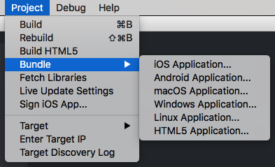

# Bundling an application

While developing your application you should make a habit of testing the game on the target platforms as often as possible. You should do this to detect performance issues early on in the development process where these things are much easier to fix. It is also recommended to test on all target platforms to find discrepancies in for instances shaders early on. When developing on mobile you have the option to use the [mobile development app](/manuals/dev-app/) to push content to the app, instead of having to do a full bundle and uninstall/install cycle.

You can create an application bundle for all platforms that Defold supports from within the Defold editor itself, with no external tools needed. You can also bundle from the command line using our command line tools.

## Bundling from within the editor

You create an application bundle from the Project menu and Bundle option:

Selecting any of the menu options will bring up the Bundle dialog for that specific platform.

### Android

Creating an Android application bundle (.apk file) as well as the prerequisite setup is documented in the [Android manual](/manuals/android/#_creating_an_android_application_bundle).

### iOS

Creating an iOS application bundle (.ipa file) as well as the prerequisite setup is documented in the [iOS manual](/manuals/ios/#_creating_an_ios_application_bundle).

### OSX

Creating an OSX application bundle (.app file) requires no specific setup, but optional platform specific configuration is done in the "game.project" [project settings file](/manuals/project-settings/#_macos_os_x).

### Linux

Creating a Linux application bundle requires no specific setup and no optional platform specific configuration in the "game.project" [project settings file](/manuals/project-settings/).

### Windows

Creating a Windows application bundle (.exe file) requires no specific setup, but optional platform specific configuration is done in the "game.project" [project settings file](/manuals/project-settings/#_windows).

#### Facebook Gameroom

It is possible to create a special version of a Windows application bundle specifically for Facebook Gameroom. This process is documented in the [Facebook Gameroom manual](/manuals/gameroom/).

### HTML5

Creating an HTML5 application bundle as well as optional setup is documented in the [HTML5 manual](/manuals/html5/#_creating_html5_content).

#### Facebook Instant Games

It is possible to create a special version of an HTML5 application bundle specifically for Facebook Instant Games. This process is documented in the [Facebook Instant Games manual](/manuals/instant-games/).

## Bundling from the command line

While doing day to day development of your application it is likely that you build and bundle from within the Defold editor. In other circumstances you may wish to automatically generate application bundles, for instance batch building for all targets when releasing a new version or when creating nightly builds of the latest version of the game, perhaps in a CI environment. Building and bundling of an application can be done outside the normal editor workflow using the [Bob command line tool](/manuals/bob/).
