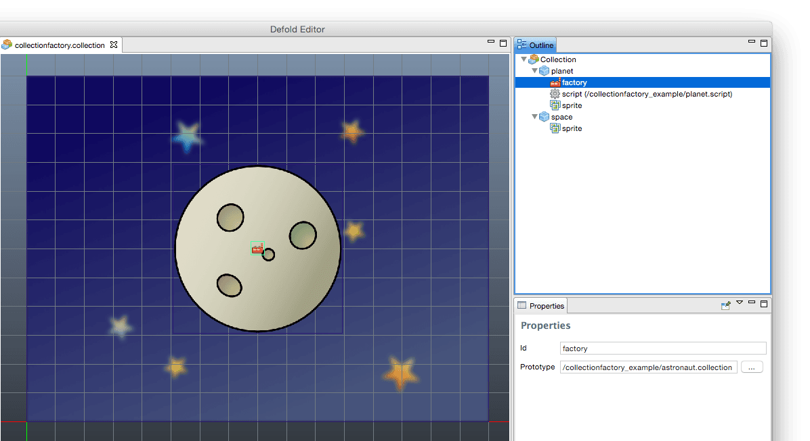
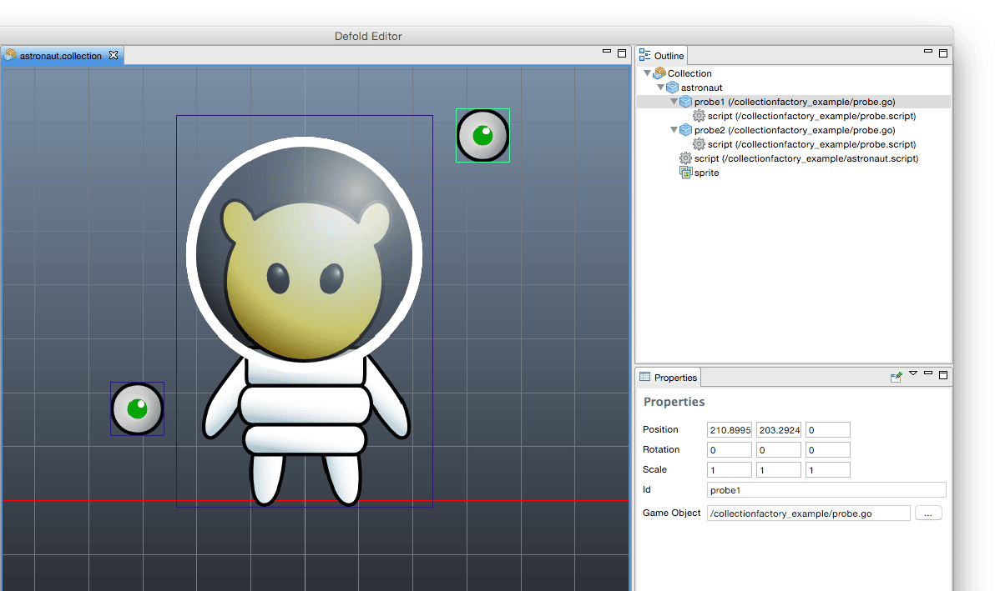
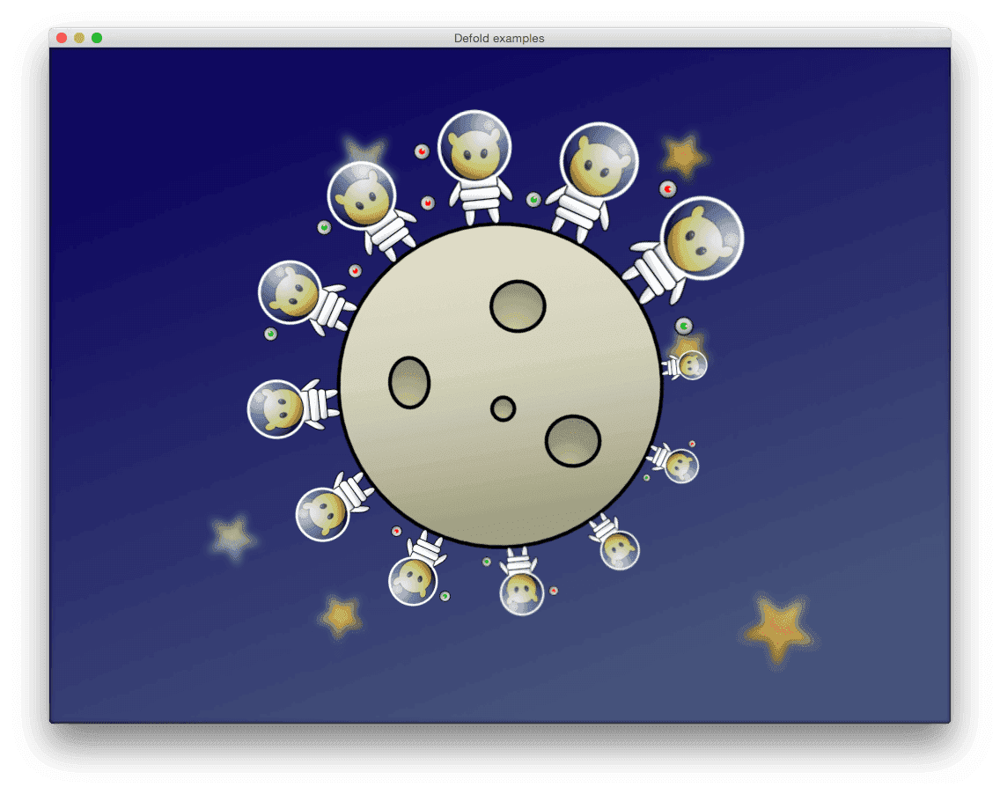

# Collection factories

The collection factory component is used to spawn ready made blueprint hierarchies of game objects (collections) into a running game.

Collections provide a powerful mechanism to create reusable templates, or "prefabs" in Defold. For an overview on Collections, see the [Building blocks documentation](/manuals/building-blocks#_collections). Collections can be placed in the editor and be cloned into the game at compile-time, and they can be dynamically inserted into your game in two ways:

1. Loaded through collection proxies. This method essentially loads a new isolated world (including how physics interact) into a running game. The loaded collection is accessed through a new socket. All assets contained in the collection are loaded through the proxy when you message the proxy to start loading. This makes them very useful to, for instance, change levels in a game. For more information, see the [Collection proxy documentation](/manuals/collection-proxy).

2. Collection factory components allow spawning of the content of a collection proxy into the current main collection. This is analogous to performing factory spawning of all game objects inside the collection and then building the parent-child hierarchy between the objects. Typical use cases is to spawn enemies consisting of multiple game objects (enemy + weapon, for instance).

## Spawning a collection

For the simple case, spawning a collection is performed exactly as when spawning a game object. Suppose we creating a planet sprite and want to spawn complex astronaut figures on the planet surface. We can then simply add a *Collection factory* to the "planet" gameobject and set *astronaut.collection* (supposing it exists) as the component's *prototype*:



Spawning an astronaut is now a matter of sending a message to the factory:

```lua
local astro = collectionfactory.create("#factory", nil, nil, {}, nil)
```

The astronaut that is spawned is a tree of game objects, and we need to be able to address all those objects after spawning:



The regular factory component returns an id to the spawned object. The collection factory returns a table that maps a hash of the collection-local id of each object to the runtime id of each object. A prefix `/collection[N]/`, where `[N]` is a counter, is added to the id to uniquely identify each instance:

```lua
pprint(astro)
-- DEBUG:SCRIPT:
-- {
--   hash: [/probe2] = hash: [/collection0/probe2],
--   hash: [/probe1] = hash: [/collection0/probe1],
--   hash: [/astronaut] = hash: [/collection0/astronaut],
-- }
```

Observe that the parent-child relations between "astronaut" and "probe" is not reflected in the id/path of the objects but only in the runtime scene-graph, i.e. how objects are transformed together. Re-parenting an object never changes its id.

## Properties

When spawning a collection, we can pass property parameters to each game object by constructing a table with pairs of collection-local object id:s and tables of script properties to set:

```lua
-- planet.script
--
local props = {}
props[hash("/astronaut")] = { size = 10.0 }
props[hash("/probe1")] = { color = hash("red") }
props[hash("/probe2")] = { color = hash("green") }
local astro = collectionfactory.create("#factory", nil, nil, props, nil)
...
```

Each spawned instance of "astronaut" gets its `size` property set to the passed value and each "probe" its `color` property:

```lua
-- probe.script
--
go.property("color", hash("blue"))

function init(self)
  ...
```

By spawning a set of astronauts and carefully placing them and passing the right properties, we can now populate the planet:



