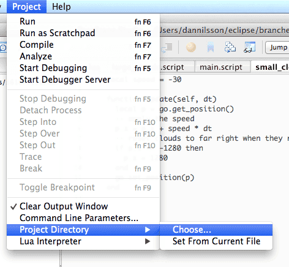
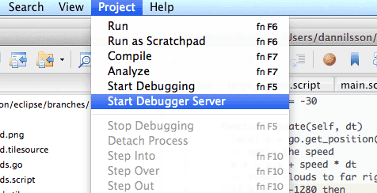
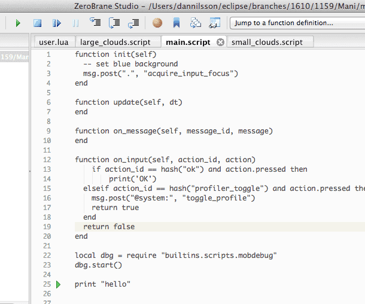
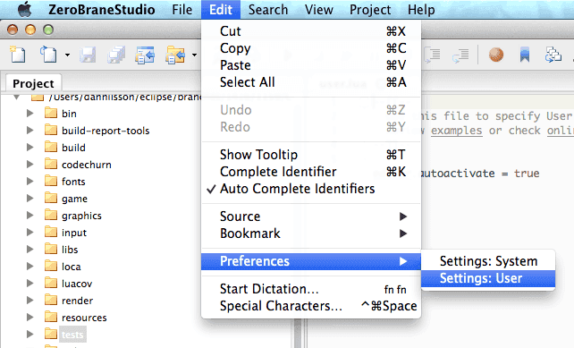
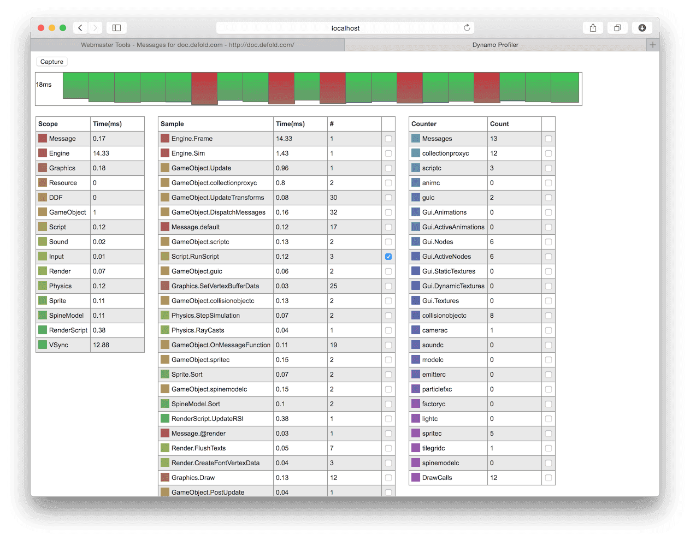
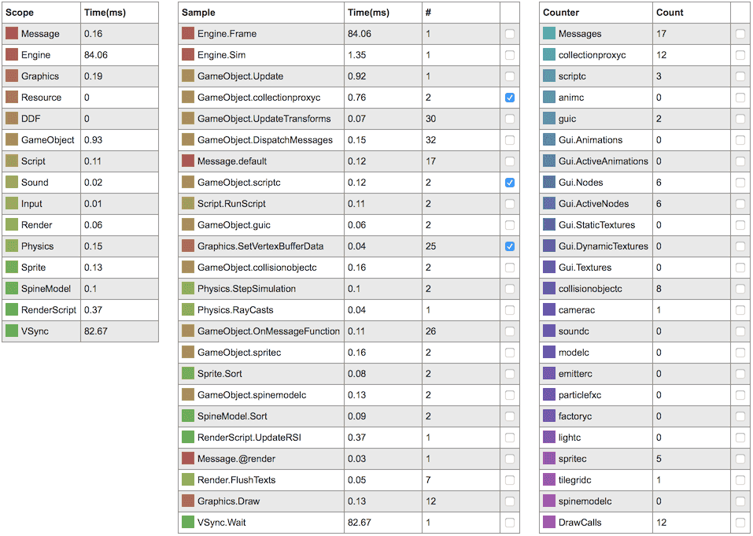
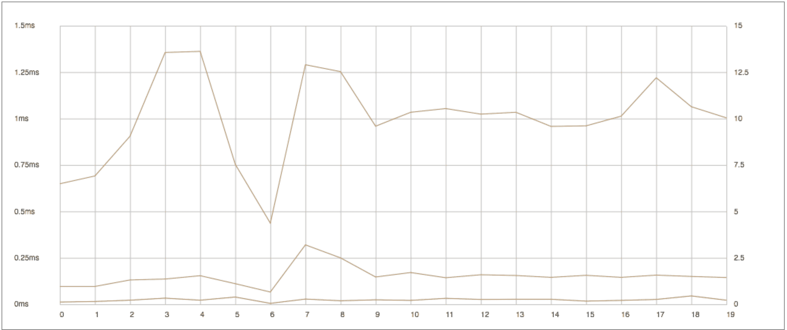
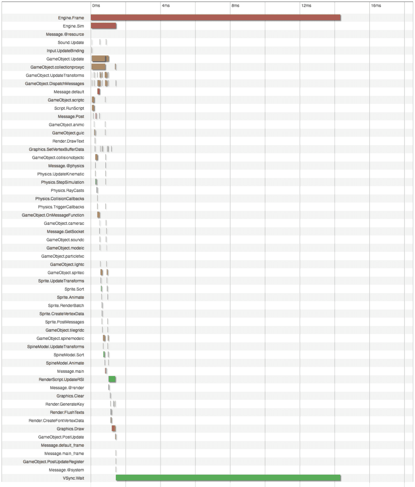

Debugging
=========
:location: documentation manuals logic
:type: manual

This manual explains the debugging facilities present in Defold.

The simplest way to debug your game in Defold is to use [print debugging](http://en.wikipedia.org/wiki/Debugging#Techniques). The technique is simply to use `print()` or [pprint()](/ref/builtins#pprint) statements to watch variables or indicate the flow of execution. If a game object without a script acts weird, you can just attach a script to it with the sole purpose of debugging.

Using any of the printing functions will print to the Console view in the Editor. You can also draw text on screen by posting `draw_text` messages to the `@render` socket:

```lua
msg.post("@render:", "draw_text", {text = "My value: " .. my_val, position = vmath.vector3(200, 200, 0)})
```

If you run into problems with spatial calculations, like movement and physics, it is often very helpful to visualize the calculations by drawing lines on the screen. Send `draw_line` messages to the `@render` socket:

```lua
msg.post("@render:", "draw_line", {start_point = my_start, end_point = my_end, color = my_color})
```

Lua comes with a debug library that is useful in some situations, particularly if you need to inspect the innards of your Lua environment. You can find more information about it on http://www.lua.org/pil/contents.html#23.

## Debugging Lua scripts with ZeroBrane

Defold engine comes with built-in support for debugging your Lua scripts through the free and open-source Lua IDE _ZeroBrane Studio_. ZeroBrane Studio needs to be installed in order to use the debugging features. The program is cross-platform and runs on both OSX and Windows.

Download "ZeroBrane Studio" from http://studio.zerobrane.com

## ZeroBrane configuration

In order for ZeroBrane to find the files in your project, you need to point it to the location of your Defold project directory. A convenient way of finding this out is by using the *Show in Finder/Explorer* option in your Defold project.

1. Right click on "game.project"
2. Choose *Show in Finder*, for OS X users, or *Show in Explorer* for Windows users

OS X:


Windows:


## To set up ZeroBrane

To set up ZeroBrane, select menu:Project[Project Directory > Choose...]:



Once this has been set up to match the current Defold project directory, it should be possible to see the directory tree of the Defold project in ZeroBrane, and to navigate and open the files.

Other recommended, but not necessary configuration changes can be found further down in the document.

## Starting the debugging server

Before starting a debugging session, the ZeroBrane built-in debugging server needs to be started. The menu option for starting it can be found under the menu:Project menu. Just select menu:Project[Start Debugger Server]:



## Connecting your application to the debugger

Debugging can be started at any point in the lifetime of the Defold application, but needs to be actively initiated from Lua script. The Lua code to start a debugging session looks like this:

```lua
local dbg = require "builtins.scripts.mobdebug"
dbg.start()
```

By inserting the above code into the application, it will connect to ZeroBrane’s debugging server (through "localhost", by default) and pause at the next statement to be executed.

::: sidenote
If your game exits when `dbg.start()` is called, it might be because ZeroBrane has detected a problem and sends the exit command to the game. For some reason, ZeroBrane needs a file opened to start the debug session, otherwise it will output:
"Can't start debugging without an opened file or with the current file not being saved ('untitled.lua')."
In ZeroBrane, open the file you added `dbg.start()` to fix this error.
:::

::: sidenote
The debugging will only be enabled for the lua context from where debugging is initiated. Enabling "shared_state" in game.project means you can debug all your application no matter where you started.
:::

Debugging session started in "<defold-dir>/branches/1610/1159/Main/".

Now it it possible to use the debugging features available in ZeroBrane; you can step, inspect, add and remove breakpoints etc.



Should the connection attempt fail (possibly because the debugging server is not running), your application will continue to run as normal after the connection attempt has been made.

## Remote debugging

As debugging happens over regular network connections (TCP), this allows for debugging remotely. This means it is possible to debug your application while it is running on a mobile device.

The only change needed is to the command which starts the debugging. By default, `start()` will try to connect to localhost, but for remote debugging, we need to manually specify the address to ZeroBrane’s debugging server, like this:

```lua
local dbg = require "builtins.scripts.mobdebug"
dbg.start("192.168.5.101")
```

This also means it is important to make sure to have network connectivity from the remote device, and that any firewalls or similar software allows TCP connections through on port 8172. Otherwise the application might stall when launching when it attempts to make the connection to your debugging server.

## Other recommended ZeroBrane setting

It is possible to make ZeroBrane automatically open Lua script files during debugging. This makes it possible to step into functions in other source files without having to open them manually.

First step is to access the editor configuration file. Recommended is to change the user version of the file.

- Select menu:Edit[Preferences > Settings: User]
- Add the following to the configuration file:
+
----
– to automatically open files requested during debugging

editor.autoactivate = true
----
- Restart ZeroBrane



[[anchor-hr]]
## Hot reloading

Defold allows you to perform hot reloading of resources. When developing a game this feature helps speed up certain task enormously. It allows you to change scripts in a game while it is running live. Common use-cases is to tweak gameplay parameters or to perform debugging on a running game.

To reload a changed resource, simply select the menu item menu:Edit[Reload Resource] or press the corresponding shortcut on the keyboard:


Every script component can define a `on_reload()` function. If it exists it will be called anytime a script is reloaded into the game from the editor:

```lua
function on_reload(self)
    -- Print the current velocity
	print(self.velocity)

    -- Zero the velocity
    self.velocity = vmath.vector3()
end
```

## Visual profiler

The Defold engine is also able to display profiling information in a running game. This can be helpful when debugging or optimizing.

```lua
function on_reload(self)
    -- Turn on profiler on hot reload.
	msg.post("@system:", "toggle_profile")
end
```

The profiler displays live information on the running application:


## Web profiler

While running the game, a web-based profiler can be accessed that provides detailed profiling information. It allows you to sample a series of data points and then analyze it in detail.

To access the profiler:

1. Start your game on your target device.
2. Open a web browser and point it to \http://<device IP>:8002 where <device IP> is the IP address of the device.

If you are running your game on your desktop computer, _http://localhost:8002_ would bring up the profiler. You can find the IP numbers of your target devices in the menu:Project[Target] menu.



The profiler is divided into 4 sections that all give different views into the current sample data. To update the sample data, press the *Capture* button at the top.

## Frames overview

The frames overview plots the currently sampled 20 frames side by side. The height of each bar shows the time spent in the frame. The number on the left hand side shows the max time spent in a frame in the current sample data.


Below the frames overview is a detailed frame data view. You can click on any frame bar in the overview to show the data for that specific frame in the data view. The frame timechart at the bottom of the page also updates to show the clicked frame's data.

## Frame data

The frame data view is a table where all data for the currently selected frame is broken down into detail. You can view how many milliseconds is spent in each engine scope (to the left) and also see sample points within the scopes (middle column). On the right hand side is a table of counters. The numbers presented are counters so it is easy to, for instance, track the number of draw calls required for each frame in the sample data.



Ticking the checkbox associated with a sample point or counter adds that data to the plot below.

## Frames plot

The frames plot view displays a plot over all sampled frames using the data selected in the frame data table, frame number on the X axis and time in milliseconds on the Y axis. Each selected data point is drawn in the color specified in the frame data table.



## Frame time chart

The frame time chart breaks the frame down visually making it is very easy to inspect where the engine spends its time during the selected frame.



(Some of the graphic assets used are made by Kenney: http://kenney.nl/assets)
