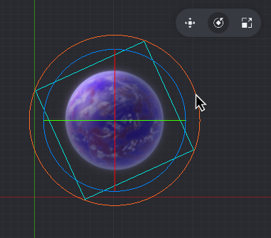

# Editor overview

The editor allows you to browse and manipulate all files in your game project in an efficient manner. Editing files brings up a suitable editor and shows all relevant information about the file in separate views.

:[overview](../shared/editor-views.md)

## The scene editor

The *Scene Editor* is used to create and edit game objects with their components and collections.

Selecting objects
: Click on objects in the main window to select them. The rectangle surrounding the object in the editor view will highlight green to indicate what item is selected. The selected object is also highlighted in the *Outline* view.

  You can also select objects by:

  - <kbd>Click and drag</kbd> to select all objects inside the selection region.
  - <kbd>Click</kbd> objects in the Outline view.

  Hold <kbd>Shift</kbd> or <kbd>⌘</kbd> (Mac) / <kbd>Ctrl</kbd> (Win/Linux) while clicking to expand the selection.

The move tool
: {.left}
  To move objects, use the *Move Tool*. You find it in the toolbar in the top right corner of the scene editor, or by pressing the <kbd>W</kbd> key.

  

  The selected object shows a set of manipulators (squares and arrows). Click and drag the green center square handle to move the object freely in screen space, click and drag the arrows to move the object along the X, Y or Z-axis. There arn also square handles for moving the object in the X-Y plane and (visible if rotating the camera in 3D) for moving the object in the X-Z and Y-Z planes.

The rotate tool
: {.left}
  To rotate objects, use the *Rotate Tool* by selecting it in the toolbar, or by pressing the <kbd>E</kbd> key.

  

  This tool consists of four circular manipulators. An orange manipulator that rotates the object in screen space and one for rotation around each of the X, Y and Z axes. Since the view is peripendicular to the X- and Y-axis, the circles only appear as two lines crossing the object.

::: sidenote
Currently, sprite components can not be individually scaled in the editor, you have to scale the game object holding the sprite. Sprites do, however, support *runtime* free-form scaling. See the [2D Graphics documentation](/manuals/2dgraphics/) for details.
:::

The scale tool
: {.left}
  To scale objects, use the *Scale Tool* by selecting it in the toolbar, or by pressing the <kbd>R</kbd> key.

  

  This tool consists of a set of square handles. The center one scales the object uniformly in all axes (including Z). There also one handle for scaling along each of the X, Y and Z axes and one handle for scaling in the X-Y plane, the X-Z plane and the Y-Z plane.

