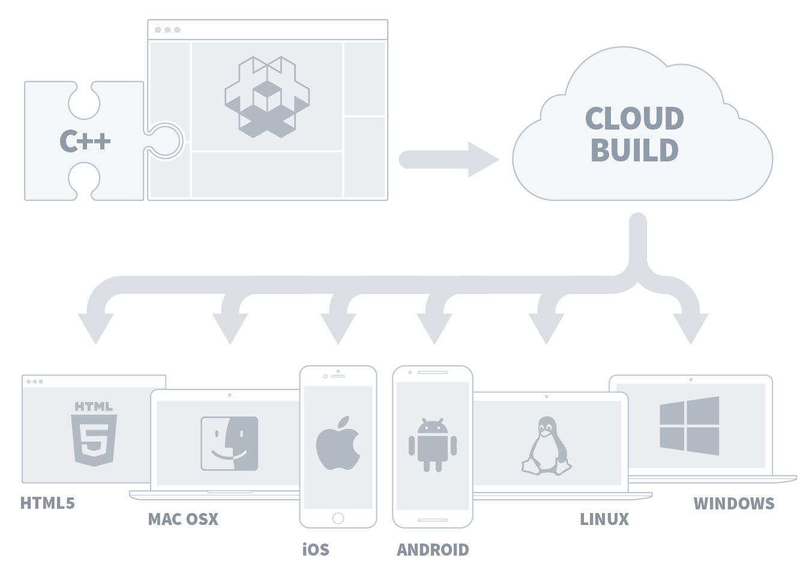
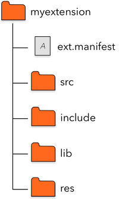
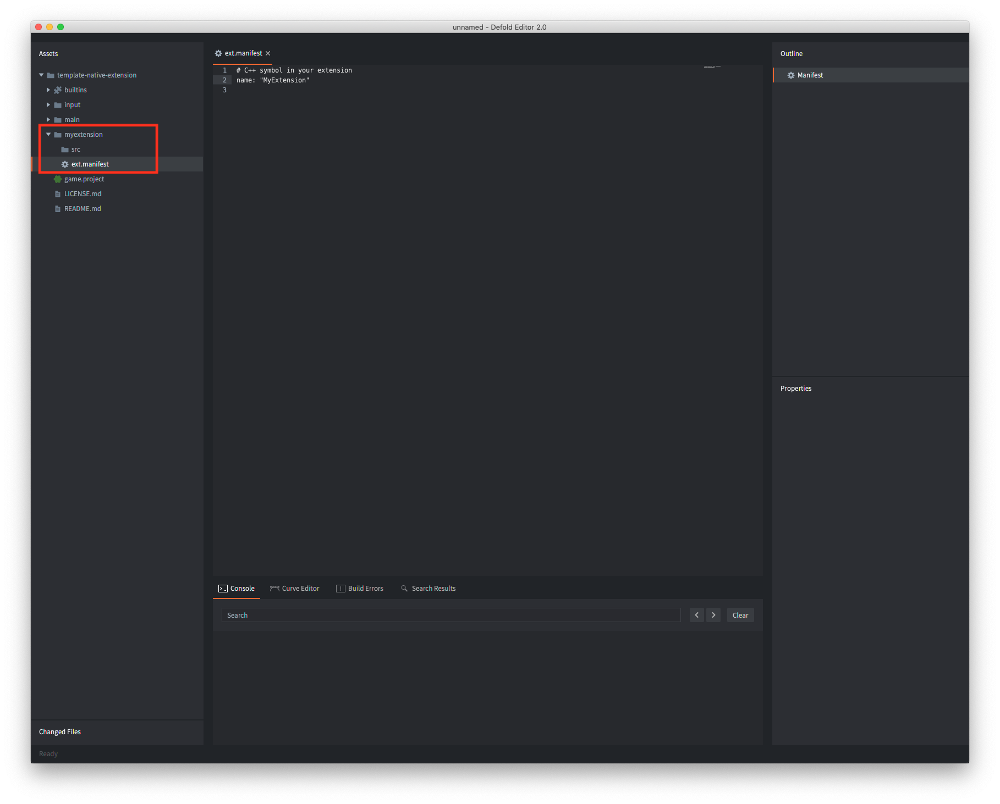

# Native extensions

If you need custom interaction with external software or hardware on a low level where Lua won't suffice, the Defold SDK allows you to write extensions to the engine in the C++, Objective C or Java language. Typical use cases for native extensions are:

- Interaction with specific hardware, for instance the camera on mobile phones.
- Interaction with external low level APIs, for instance advertising network APIs that do not allow interaction through network APIs where Luasocket could be used.
- High performance calculations and data processing.

## The build platform

Defold provides a zero setup entry point to native extensions with a cloud based build solution. Any native extension that is developed and added to a game project becomes part of the ordinary project content. There is no need to build special versions of the engine and distribute them to team members, that is handled automatically---any team member that builds and runs the project will get a project specific engine executable with all native extensions baked in.



## Project layout

To create a new extension, create a folder in the project root. This folder will contain all settings, source code, libraries and resources associated with the extension. The extension builder recognizes the folder structure and collects any source files and libraries.



*ext.manifest*
: The extension folder _must_ contain an *ext.manifest* file. This file is a YAML format file that is picked up by the extension builder. A minimal manifest file should contain the name of the extension.

*src*
: This folder should contain all source code files.

*include*
: This optional folder contains any include files.

*lib*
: This optional folder contains any compiled libraries that the extension depends on. Library files should be placed in subfolders named by `platform`, or `architecure-platform`, depending on what architectures are supported by your libraries.

  Supported platforms are `ios`, `android`, `osx`, `win32`, . Supported `arc-platform` pairs are `armv7-ios`, `arm64-ios`, `armv7-android`, `x86-osx`, `x86_64-osx`, `x86-win32`, `x86_64-win32`.

*res*
: This optional folder contains any extra resources that the extension depends on. Resource files should be placed in subfolders named by `platform`, or `architecure-platform` just as the "lib" subfolders. A subfolder `common` is also allowed, containing resource files common for all platforms.

## A simple example extension

Let's build a very simple extension. First, we create a new root folder *myextension* and add a file *ext.manifest* containing the name of the extension "MyExtension". Note that the name is a C++ symbol and must match the first argument to `DM_DECLARE_EXTENSION` (see below).



```yaml
name: "MyExtension"
```

The extension consists of a single C++ file, *myextension.cpp* that is created in the "src" folder.

The Defold editor will not open *.cpp* files by default so if you double click the file the system editor set for that file type is used. You can use the built in text editor by right-clicking the file and selecting <kbd>Open With ▸ Text Editor</kbd>. Note that Defold has no support for C++ files so the editing experience is minimal.


The extension source file contains the following code:

```cpp
// myextension.cpp
// Extension lib defines
#define LIB_NAME "MyExtension"
#define MODULE_NAME "myextension"

// include the Defold SDK
#include <dmsdk/sdk.h>

static int Rot13(lua_State* L)
{
    int top = lua_gettop(L);

    // Check and get parameter string from stack
    const char* str = luaL_checkstring(L, 1);

    // Allocate new string
    int len = strlen(str);
    char *rot = (char *) malloc(len + 1);

    // Iterate over the parameter string and create rot13 string
    for(int i = 0; i <= len; i++) {
        const char c = str[i];
        if((c >= 'A' && c <= 'M') || (c >= 'a' && c <= 'm')) {
            // Between A-M just add 13 to the char.
            rot[i] = c + 13;
        } else if((c >= 'N' && c <= 'Z') || (c >= 'n' && c <= 'z')) {
            // If rolling past 'Z' which happens below 'M', wrap back (subtract 13)
            rot[i] = c - 13;
        } else {
            // Leave character intact
            rot[i] = c;
        }
    }

    // Put the rotated string on the stack
    lua_pushstring(L, rot);

    // Free string memory. Lua has a copy by now.
    free(rot);

    // Assert that there is one item on the stack.
    assert(top + 1 == lua_gettop(L));

    // Return 1 item
    return 1;
}

// Functions exposed to Lua
static const luaL_reg Module_methods[] =
{
    {"rot13", Rot13},
    {0, 0}
};

static void LuaInit(lua_State* L)
{
    int top = lua_gettop(L);

    // Register lua names
    luaL_register(L, MODULE_NAME, Module_methods);

    lua_pop(L, 1);
    assert(top == lua_gettop(L));
}

dmExtension::Result AppInitializeMyExtension(dmExtension::AppParams* params)
{
    return dmExtension::RESULT_OK;
}

dmExtension::Result InitializeMyExtension(dmExtension::Params* params)
{
    // Init Lua
    LuaInit(params->m_L);
    printf("Registered %s Extension\n", MODULE_NAME);
    return dmExtension::RESULT_OK;
}

dmExtension::Result AppFinalizeMyExtension(dmExtension::AppParams* params)
{
    return dmExtension::RESULT_OK;
}

dmExtension::Result FinalizeMyExtension(dmExtension::Params* params)
{
    return dmExtension::RESULT_OK;
}


// Defold SDK uses a macro for setting up extension entry points:
//
// DM_DECLARE_EXTENSION(symbol, name, app_init, app_final, init, update, on_event, final)

DM_DECLARE_EXTENSION(MyExtension, LIB_NAME, AppInitializeMyExtension, AppFinalizeMyExtension, InitializeMyExtension, 0, 0, FinalizeMyExtension)
```

Note the macro `DM_DECLARE_EXTENSION` that is used to declare the various entry points into the extension code. The first argument `symbol` must match the name specified in *ext.manifest*. For this simple example, there is no need for any "update" or "on_event" entry points, so `0` is provided in those locations to the macro.

Now it is just a matter of building the project (<kbd>Project ▸ Build and Launch</kbd>). This will upload the extension to the extension builder which will produce a custom engine with the new extension included. If the builder encounters any errors, a dialog with the build errors will show.

To test the extension, create a game object and add a script component with some test code:

```lua
local s = "abcdefghijklmnopqrstuvwxyzABCDEFGHIJKLMNOPQRSTUVWXYZ"
local rot_s = myextension.rot13(s)
print(rot_s) --> nopqrstuvwxyzabcdefghijklmNOPQRSTUVWXYZABCDEFGHIJKLM
```

And that's it! We have created a fully working native extension.

## The ext.manifest file

Apart from the name of the extension, the manifest file can contain platform specific compile flags, link flags, libs and frameworks. If the *ext.manifest* file does not contain a "platforms" segment, or a platform is missing from the list, the platform you bundle for will still build, but without any extra flags set.

Here is an example:

```yaml
name: "AdExtension"

platforms:
    arm64-ios:
        context:
            frameworks: ["CoreGraphics", "CFNetwork", "GLKit", "CoreMotion", "MessageUI", "MediaPlayer", "StoreKit", "MobileCoreServices", "AdSupport", "AudioToolbox", "AVFoundation", "CoreGraphics", "CoreMedia", "CoreMotion", "CoreTelephony", "CoreVideo", "Foundation", "GLKit", "JavaScriptCore", "MediaPlayer", "MessageUI", "MobileCoreServices", "OpenGLES", "SafariServices", "StoreKit", "SystemConfiguration", "UIKit", "WebKit"]
            flags:      ["-stdlib=libc++"]
            linkFlags:  ["-ObjC"]
            libs:       ["z", "c++", "sqlite3"]

    armv7-ios:
        context:
            frameworks: ["CoreGraphics", "CFNetwork", "GLKit", "CoreMotion", "MessageUI", "MediaPlayer", "StoreKit", "MobileCoreServices", "AdSupport", "AudioToolbox", "AVFoundation", "CoreGraphics", "CoreMedia", "CoreMotion", "CoreTelephony", "CoreVideo", "Foundation", "GLKit", "JavaScriptCore", "MediaPlayer", "MessageUI", "MobileCoreServices", "OpenGLES", "SafariServices", "StoreKit", "SystemConfiguration", "UIKit", "WebKit"]
            flags:      ["-stdlib=libc``"]
            linkFlags:  ["-ObjC"]
            libs:       ["z", "c++", "sqlite3"]
```

## Example extensions

* [Android extension example](https://github.com/defold/extension-android)
* [HTML5 extension example](https://github.com/defold/extension-html5)
* [MacOS, iOS and Android videoplayer extension](https://github.com/defold/extension-videoplayer)
* [MacOS and iOS camera extension](https://github.com/defold/extension-camera)
* [iOS and Android Admob extension](https://github.com/defold/extension-admob)

## Known issues

The native extension feature is in an alpha state, meaning that that the APIs can still change. Furthermore, not all features are in place yet.

Platforms
: There is currently no support for Linux extensions. Android lacks support for *.aar* archives. All platforms currently create debug builds only.

Languages
: C++, Objective C (MacOS and iOS) and Java (Android) are supported. Swift and Kotlin are currently not supported.

Editor
: The editor integration. There is no build process indication. Error reporting is rudimentary.

Debugging
: Currently, when building on iOS, the *.dSYM* files are not included in the build result

