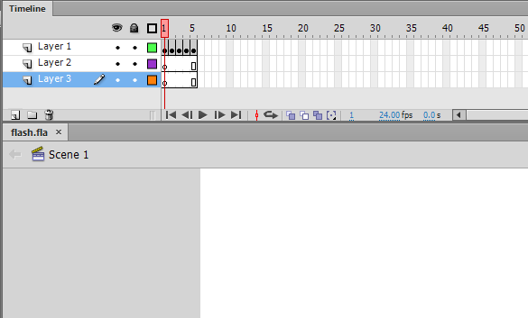
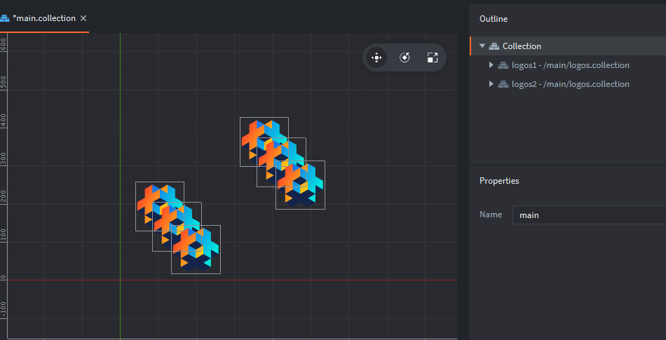
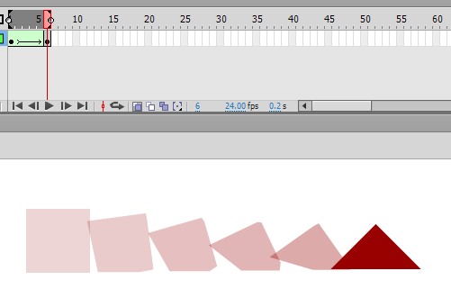
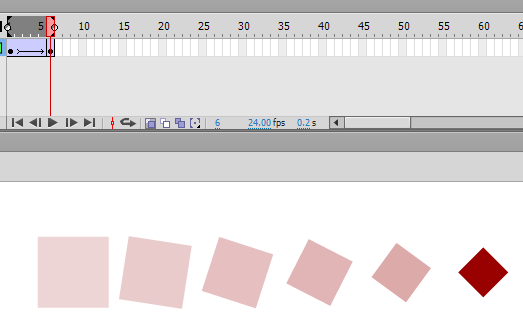
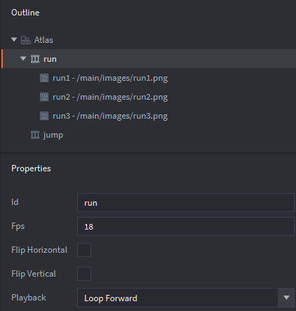
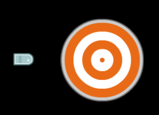
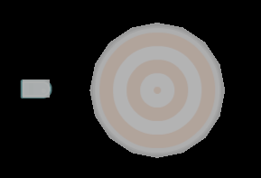
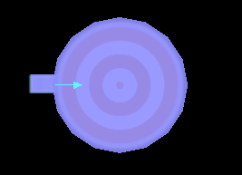

## Flash---stage

In Flash, we are familiar with the Timeline (top section of the screenshot below) and the Stage (visible below the Timeline):



As discussed in the movie clips section above, the Stage is essentially the top level container of a Flash game and is created each time a project is exported. The Stage will by default have one child, the *MainTimeline*. Each movie clip generated in the project will have its own timeline, and can serve as a container for other symbols (including movie clips).

## Defold---Collections

The Defold equivalent of the Flash Stage is a collection. By default, this is the "main" collection which is what will be in a new project when you first create it. Every game needs a collection to bootstrap from. You can change which collection is loaded at startup by accessing the *game.project* settings file that is in the root of every Defold project:


Collections are containers that are used in the editor to organize game objects and other collections. The contents of a collection can also be spawned via script into the runtime using a [collection factory](/manuals/collection-factory/#_spawning_a_collection), which works the same way as a regular game object factory. This is useful for spawning groups of enemies, or a pattern of coin collectables, for instance. In the screenshot below, we have manually placed two instances of the "logos" collection into the "main" collection.



For more advanced uses, the [collection proxy](/manuals/collection-proxy/) component allows you to load and unload root collections. In contrast to the collection factory mentioned previously, this would be useful for scenarios such as loading new game levels, mini games, or cutscenes.


## Flash---timeline

The Flash timeline is primarily used for animation, using various frame by frame techniques or shape/motion tweens. The overall FPS (frames per second) setting of the project defines the length of time a frame is displayed. Advanced users can modify the overall FPS of the game, or even that of individual movie clips.

Shape tweens allow the interpolation of vector graphics between two states. It is mostly only useful for simple shapes and applications, as the below example of shape tweening a square into a triangle demonstrates:



Motion tweens allow the animation of various properties of an object, including size, position and rotation. In the example below, all the listed properties have been modified.



## Defold---property animation

Defold works with pixel images as opposed to vector graphics, thus it does not have an equivalent for shape tweening. However, motion tweening has a powerful equivalent in [property animation](/ref/go/#go.animate). This is accomplished via script, using the `go.animate()` function. The go.animate() function tweens a property (such as color, scale, rotation or position) from the starting value to the desired end value, using one of many available easing functions (including custom ones). Where Flash required user implementation of more advanced easing functions, Defold includes [many easing functions](/manuals/animation/#_easing) built into the engine.

Where Flash makes use of keyframes of graphics on a timeline for animation, one of the main methods of graphic animation in Defold is by flipbook animation of imported image sequences. Animations are organised in a game object component known as an atlas. In this instance we have an atlas for a game character with an animation sequence called "run". This consists of a series of png files:




## Debugging

In Flash, the `trace()` command is your friend when debugging. The Defold equivalent is `print()`, and is used in the same way as `trace()`:

```lua
print("Hello world!"")
```

You can print multiple variables using one `print()` function:

```lua
print(score, health, ammo)
```

There is also a `pprint()` function (pretty print), which is useful when dealing with tables. This function prints the content of tables, including nested tables. Consider the script below:

```lua
factions = {"red", "green", "blue"}
world = {name = "Terra", teams = factions}
pprint(world)
```

This contains a table (`factions`) nested in a table (`world`). Using the regular `print()` command would output the unique id of the table, but not the actual contents:

```
DEBUG:SCRIPT: table: 0x7ff95de63ce0
```

Using the `pprint()` function as illustrated above gives more meaningful results:

```
DEBUG:SCRIPT: 
{
  name = Terra,
  teams = {
    1 = red,
    2 = green,
    3 = blue,
  }
}
```

If your game uses collision detection, you can toggle physics debugging by posting the message below:

```lua
msg.post("@system:", "toggle_physics_debug")
```

Physics debug can also be enabled in the project settings. Before toggling physics debug our project would look like this:



Toggling physics debug displays the collision objects added to our game objects:



When collisions occur, the relevant collision objects light up. In addition, the collision vector is displayed:



Finally, see the [profiler documentation](/ref/profiler/) for information on how to monitor CPU and memory usage. For more information on advanced debugging techniques, see the [debugging section](/manuals/debugging) in the Defold manual.


## Where to go from here

[Defold examples](/examples)
[Tutorials](/tutorials)
[Manuals](/manuals)
[Reference](/ref)
[FAQ](/faq)

If you have questions or get stuck, the [Defold forums](//forum.defold.com) are a great place to reach out for help.
