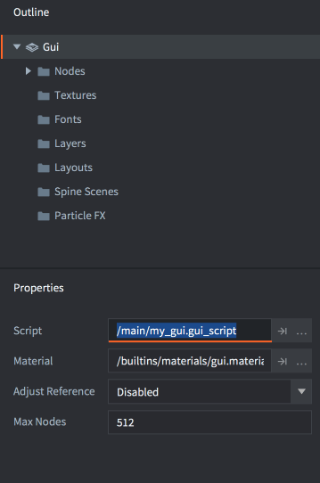
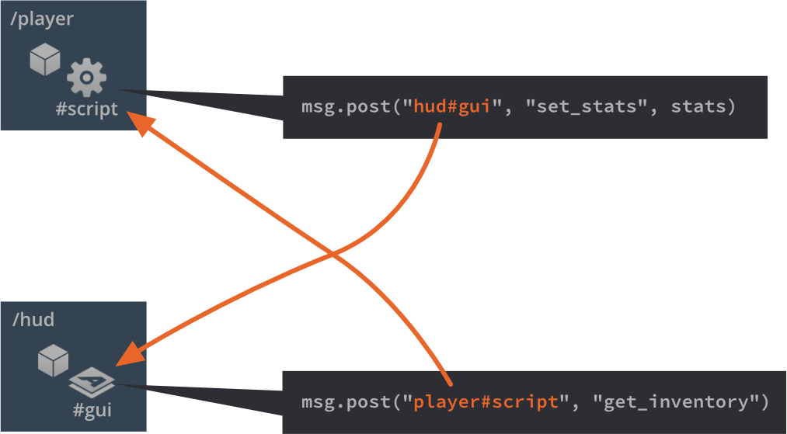

# GUI scripts

To control the logic of your GUI and animate nodes you use Lua scripts. GUI scripts work the same as regular game object scripts, but are saved as a different file type and have access to a different set of functions: the `gui` module functions.

## Adding a script to a GUI

To add a script to a GUI, first create a GUI script file by <kbd>right clicking</kbd> a location in the *Assets* browser and selecting <kbd>New ▸ Gui Script</kbd> from the popup context menu.

The editor automatically opens the new script file. It is based on a template and comes equipped with empty lifetime functions, just like game object scripts:

```lua
function init(self)
   -- Add initialization code here
   -- Remove this function if not needed
end

function final(self)
   -- Add finalization code here
   -- Remove this function if not needed
end

function update(self, dt)
   -- Add update code here
   -- Remove this function if not needed
end

function on_message(self, message_id, message, sender)
   -- Add message-handling code here
   -- Remove this function if not needed
end

function on_input(self, action_id, action)
   -- Add input-handling code here
   -- Remove this function if not needed
end

function on_reload(self)
   -- Add input-handling code here
   -- Remove this function if not needed
end
```

To attach the script to a GUI component, open the GUI component blueprint file and select the root in the *Outline* to bring up GUI *Properties*. Set the *Script* property to the script file

{srcset="images/gui-script/set_script@2x.png 2x"}

If the GUI component has been added to a game object somewhere in your game, the script will now run.

## The gui namespace

GUI scripts have access to the `gui` name space so it can manipulate GUI nodes. The `go` namespace is not available so you will need to separate game object logic into script components and communicate between the GUI and game object scripts. Any attempt to use the `go` functions will cause an error:

```lua
function init(self)
   local id = go.get_id()
end
```

```txt
ERROR:SCRIPT: /main/my_gui.gui_script:2: You can only access go.* functions and values from a script instance (.script file)
stack traceback:
   [C]: in function 'get_id'
   /main/my_gui.gui_script:2: in function </main/my_gui.gui_script:1>
```

## Message passing

Any GUI component with a script attached is able to communicate with other objects in your game runtime environment through message passing, it will behave like any other script component. 

You address the GUI component like you would any other script component:

```lua
local stats = { score = 4711, stars = 3, health = 6 }
msg.post("hud#gui", "set_stats", stats)
```

{srcset="images/gui-script/message_passing@2x.png 2x"}

## Addressing nodes

GUI nodes can be manipulated by a GUI script attached to the component. 

have no logic in themselves but are controlled by a GUI script attached to the GUI component, you have to get direct script control of the nodes. This is done by obtaining a node reference using the node’s id. The reference is usually stored in a variable and then used to manipulate the node:

```lua
-- Obtain a reference to the "magic" text node
local magicnode = gui.get_node("magic")
-- Change the color of the node to orange
local orange = vmath.vector4(1.0, 0.3, 0.0, 1.0)
gui.set_color(magicnode, orange)
```

As soon as you have obtained the reference to a node by the `gui.get_node()` function you can call any of the many manipulation functions in the GUI module to reposition, resize, change appearance of, reorder in draw-order, or move in the parent-child hierarchy. All node properties are accessible through scripting.


## Dynamically created nodes

To create a new node with script in runtime you have two options. You either create the node from scratch:

```lua
-- Create a new, white box node at position 300, 300 with size 150x200
local new_position = vmath.vector3(300, 300, 0)
local new_size = vmath.vector3(150, 200, 0)
local new_boxnode = gui.new_box_node(new_position, new_size)
-- Add a text node at the same position
local new_textnode = gui.new_text_node(new_position, "Hello!")
```

With the newly created nodes' references stored in variables you are now free to manipulate the nodes:

```lua
-- Rotate the text node 10 degrees (around the z-axis)
gui.set_rotation(new_textnode, vmath.vector3(0, 0, 10))
```

If we put this code in the GUI script’s init() function and run the game we get the following:


The alternative way to create new nodes is to clone an existing node:

```lua
-- Clone the magic text node
local magicnode = gui.get_node("magic")
local magic2 = gui.clone(magicnode)
-- The new node is right on top of the original. Let's move it.
gui.set_position(magic2, vmath.vector3(300, 300, 0))
```

## Dynamic node IDs

Dynamically created nodes do not have an id assigned to them. This is by design. The reference that is returned from `gui.new_box_node()`, `gui.new_text_node()`, `gui.new_pie_node()` and `gui.clone()` is the only thing necessary to be able to access the node and you should keep track of that reference.

```lua
-- Add a text node
local new_textnode = gui.new_text_node(vmath.vector3(100, 100, 0), "Hello!")
-- "new_textnode" contains the reference to the node.
-- The node has no id, and that is fine. There's no reason why we want
-- to do gui.get_node() when we already have the reference.
```

## Property animation

Several of the node properties can be fully asynchronously animated. To animate a property, you use the `gui.animate()` function and supply the following parameters:

`gui.animate(node, property, to, easing, duration [,delay] [,complete_function] [,playback])`

::: sidenote
See [`gui.animate()`](/ref/gui#gui.animate) for details on the parameters.
:::

The `property` parameter is usually given as a constant (`gui.PROP_POSITION` etc), but can also be supplied as described in the Properties guide (see [Properties](/manuals/properties)). This is handy if you want to animate just a specific component of a compound property value.

For instance, the `color` property describes an RGBA value, encoded in a vector4 value with one component for each color component---red, green, blue and the last one for alpha. The vector components are named respectively `x`, `y`, `z` and `w` and the alpha is thus in the `w` component.

To fade up and down the alpha value of a node we can use the following piece of code:

```lua
function fadeup(self, node)
   gui.animate(node, "color.w", 1.0, gui.EASING_LINEAR, 0.3, 0, fadedown, gui.PLAYBACK_ONCE_FORWARD)
end

function fadedown(self, node)
   gui.animate(node, "color.w", 0.0, gui.EASING_LINEAR, 0.3, 0, fadeup, gui.PLAYBACK_ONCE_FORWARD)
end
```

Now we can call either `fadeup()` or `fadedown()` and supply the node we want the alpha animated on. Note that we set the `complete_function` parameter to supply the function to call when the animation is done, effectively chaining an endless loop of fade ups and fade downs.
