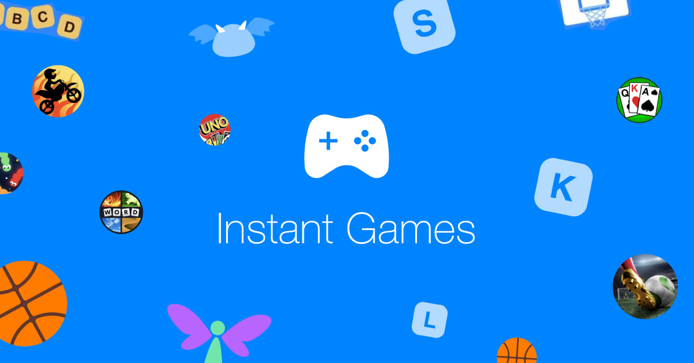
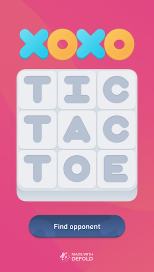

# Facebook Instant Games

Instant Games is a new way for people to play games across Facebook platforms. Powered by HTML5 technology, it allows people to find and play games directly in the News Feed or Messenger conversations, on both desktops and mobile devices.



## Configuring for Instant Games

You need to configure a game for Instant Games in the [Facebook App Dashboard](https://developers.facebook.com/apps). See the [Instant Games Getting Started guide](https://developers.facebook.com/docs/games/instant-games/getting-started/game-setup) for details.

Secondly, you need to add a dependency to the Instant Games extension in your "game.project" file:


Finally, you also need to make sure to include the Instant Games SDK in your "index.html":

    <script src="https://connect.facebook.net/en_US/fbinstant.6.0.js"></script>

## Usage

The Instant Games extension is accessible through the `fbinstant.*` namespace where it wraps the Javascript SDK in a Lua API. The extension provides an almost 1 to 1 mapping between the Javascript SDK and the Lua API. Example:

```javascript
FBInstant.initializeAsync().then(function() {
    FBInstant.startGameAsync().then(function() {
      var playerID = FBInstant.player.getID();
      var playerName = FBInstant.player.getName();
    });
});
```

```lua
fbinstant.initialize(function(self, success)
    fbinstant.start_game(function(self, success)
        local player_id = fbinstant.get_player().id
        local player_name = fbinstant.get_player().name
    end)
end)
```

Refer to the [full API documentation](https://github.com/defold/extension-fbinstant/blob/master/README.md) for details on how to use the Instant Games SDK in Defold.

## Example game

A Defold version of the Tic Tac Toe example game for Instant Games is available with full source code to be used as a learning asset or reference while developing Instant Games using Defold. The game with full source code is available from the [official GitHub repository](https://github.com/britzl/extension-fbinstant).



## Reducing bundle size

The Facebook Instant Games [best practices](https://developers.facebook.com/docs/games/instant-games/best-practices) recommends an initial loading time less than 5 seconds. While Defold games are pretty small as-is, there are a number of things that can be done to reduce the size of your game even further:

### Removing unused engine features

A standard Defold engine for HTML5 is a little less than 1.2MB in size when compressed using gzip. The engine size can be significantly reduce by removing parts of the engine that aren't used by your game. Which parts of the engine to remove is specified in an "app.manifest", referenced from the [Native Extension section](/manuals/project-settings/#_native_extension) of your "game.project" file.

This functionality is still in an alpha state and needs further documentation. Tools for generating app.manifests file can be found here: https://forum.defold.com/t/stripping-appmanifest-maker/16059

### Applying texture compression

Texture compression is an efficient method of reducing both the amount of runtime memory needed by your textures and the size the textures takes in your application bundle. Read more about how to work with texture compression in [Texture Profiles manual](/manuals/texture-profiles/).

### Excluding content and downloading it at run-time

Many games partition or split the game content into levels or episodes. In these types of games it can make sense to only include the first few levels or episodes in the initial application bundle and then, while the user is playing the game, download additional content as the player progresses through the game.

This process of excluding parts of the game content, storing it on a server and then downloading and caching it while the game is running is perfect for reducing the application size of an Instant Game. The entire process is handled by Defold's [Live Update](/manual/live-update/) system.
