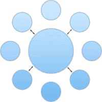

# Welcome to Defold

Welcome to Defold. This introduction covers the core concepts of Defold and is intended to give an overview of the editor and the most important features. All descriptions are quite brief but there are links to more thorough documentation.

:[editor versions](../shared/editor-versions.md)

## Design philosophy

Defold was created with the following goals:

- To be a complete professional turn-key production platform for game teams.
- To be simple and clear, providing explicit solutions to common game development architectural and workflow problems.
- To be a blazing fast development platform ideal for iterative game development.
- To be high-performance in runtime.
- To be truly multi-platform.

The design of the editor and engine is carefully crafted to reach those goals. Some of our design decisions differ from what you may be used to if you have experience with other platforms, for example:

- We require static declaration of the resource tree and all naming. This requires some initial effort from you, but helps the development process tremendously in the long run.
- We encourage message passing between simple encapsulated entities.
- There is no object orientation inheritance.
- Our API:s are asynchronous.
- The rendering pipeline is code driven and fully customizable.
- All our resource files are in simple plain text formats, optimally structured for Git merges as well as import and processing with external tools.
- Resources can be changed and hot reloaded into a running game allowing for extremely fast iteration and experimentation.

Defold is not an all-encompassing solution for everything. There are no ready made complex components available. Instead, we believe the job of Defold is to empower game teams with simple strong collaborative tools. This means that you often have to do a bit more work yourself, but it also means that the path to the goal is clearer.

If you are an experienced developer, Defold's core concepts may be pretty straightforward to understand, but please take the time to experiment and read through the documentation---some of our concepts are, although simple, different from what you might initially expect.

## Collaboration

Most games are created as a collaborative effort between two or more people. We believe that the ability to work together is key for a fast development cycle. Collaboration is therefore a cornerstone of the Defold platform.

When you create a new project, a central repository is automatically created on our servers. During development, the files you create and modify are your personal view of this repository. When you have done some work and are ready to share your changes, just synchronize your personal view with the central repository. The editor uploads your changes, downloads any new changes (from other team members) and helps resolve conflicts if you and someone else have edited the same piece of project data. All changes are recorded and logged so there is a clear history of what has happened in your project. You don't have to worry about backups and you will never need to email files back and forth with your team. Read more about project collaboration in the [Workflow documentation](/manuals/workflow/).

Defold's collaboration tools are built on the popular and extremely powerful distributed version control system "Git". (If you're interested in Git, you can read more on http://git-scm.com).
