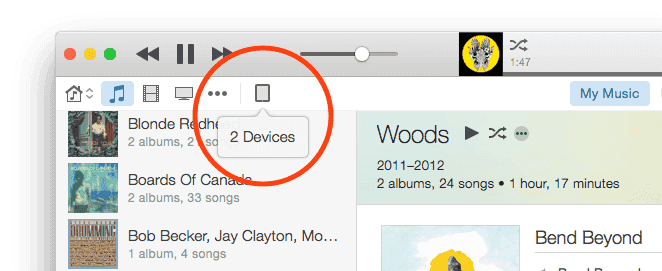
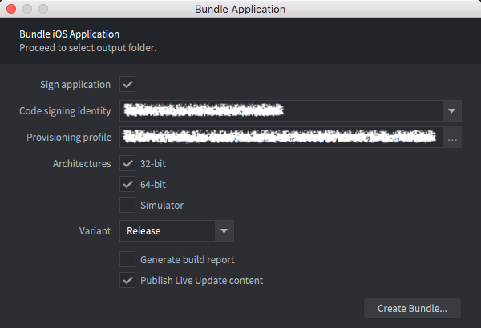

# iOS development

iOS development differs from Android development in that you have to be a registered developer to be able to put apps or games on an iOS device, even during development. iOS requires that all apps that are out on a phone or tablet are signed with an Apple-issued certificate and provisioning profile.

## Apple's code signing process

The security associated with iOS apps consists of several components. To get access to the required tools, you need to sign up to the [Apple's iOS Developer Program](https://developer.apple.com/programs/). When you have enrolled, go to the [Apple's Developer Member Center](https://developer.apple.com/membercenter/index.action).

The section *Certificates, Identifiers & Profiles* contains all the tools you need. From here you can create, delete and edit:

Certificates
: Apple-issued cryptographic certificates that identify you as a developer. You can create development or production certificates. Developer certificates allow you to test certain features such as the in-app purchase mechanism in a sandbox test environment. Production certificates are used to sign the final app for upload to the App Store. You need a certificate to sign apps before you can put them on your device for testing.

Identifiers
: Identifiers for various uses. It is possible to register wildcard identifiers (i.e. `some.prefix.*`) which can be used with several apps. App IDs can contain Application Service information, like if the app enables Passbook integration, the Game Center, etc. Such App IDs cannot be wildcard identifiers. For Application Services to function, your application's *bundle identifier* must match the App ID identifier.

Devices
: Each development device needs to be registered with their UDID (Unique Device IDentifier). See below for details on how to find the UDID of your device.

Provisioning Profiles
: Provisioning profiles associate certificates with App IDs and specific devices. They basically tell which app by what developer is allowed to be on what devices.

When signing your games and apps in Defold, you need a valid certificate and a valid provisioning profile.

::: sidenote
Some of the things you can do on the Member Center homepage you can also perform from inside the XCode development environment---if you have that installed.
:::

## Device UDID

The UDID for an iOS device can be found by connecting the device to a computer via wifi or cable. Open up iTunes and click on the devices symbol. Select your device.

On the *Summary* page, locate the *Serial Number*.

Click the *Serial Number* once so the field changes into *UDID*. If you click repeatedly, several pieces of information about the device will show up. Just continue to click until *UDID* shows. Right-click the long UDID string and select <kbd>Copy</kbd> to copy the identifier to the clipboard so you can easily paste it into the UDID field when registering the device on Apple's Developer Member Center.

## Signing the Defold development app

The development app is a very convenient version of the engine that allows you to push content to it over wifi. You install the development app on your device(s), start the app and then select the device as a build target from the editor.

Currently, at least one team member needs to run OS X and be a registered Apple Developer in order to sign the development app for other team members. We will call this person the _signer_.

* The signer needs a certificate installed on his/her computer.
* The signer needs a mobile provisioning profile on his/her computer.
* The signer needs to collect all the UDIDs from other members and add these to his/her mobile provisioning file.

To upload a signed development app to the Defold Dashboard, the following steps are required:

- In the editor, select <kbd>Project ▸ Sign iOS App...</kbd>
- Select your code signing identity.
- Browse for your mobile provisioning file.
- Press the *Sign and upload* button.

The Defold dev app is uploaded to the project page on the Dashboard.
Each project member can now:

- Browse to the Dashboard from their iOS device.
- Open the project page from the list of projects.
- Click the link *Install the Defold App*, which can be found below the *Members* section.

This video shows the whole process:

<iframe width="560" height="315" src="https://www.youtube.com/embed/T_igYdHubqA" frameborder="0" allowfullscreen></iframe>

## Launching the game

To launch your game on your iOS device, the Defold dev app and editor must be able to connect, over the same wifi network.

- Make sure the editor is up and running.
- Launch the Defold dev app on the iOS device.
- Select your device under <kbd>Project ▸ Targets</kbd> in the editor.
- Select <kbd>Project ▸ Build And Launch</kbd> to run the game. It may take a while for the game to start since the game content is streamed to the device over the network.
- While the game is running, you can use [hot reloading](/manuals/debugging#_hot_reloading) as usual.

## Creating an iOS application bundle

You can also easily create a stand alone application bundle for your game from the editor. Simply select <kbd>Project ▸ Bundle... ▸ iOS Application...</kbd> from the menu.

Select your code signing identity and browse for your mobile provisioning file. Press *Package* and you will then be prompted to specify where on your computer the bundle will be created.

{.left}

The editor writes an *.ipa* file which is an iOS application bundle. This file you can drag and drop into iTunes and it will install on your device during the next sync. You can specify what icon to use for the app, the launch screen image and so forth on the *game.project* project settings file.

## Troubleshooting

Unable to download application
: Make sure the signer has included your UDID in the mobile provisioning  that was used for signing the app.

Your device does not appear in the Targets menu
: Make sure that your device is connected to the same wifi network as your computer.

The game does not start with a message about mis-matching versions
: This happens when you have upgraded the editor to the latest version. You need to sign the app again (<kbd>Project ▸ Sign iOS App...</kbd>) which creates a new dev app from the current engine version. Then download the new app from the dashboard onto your device.

