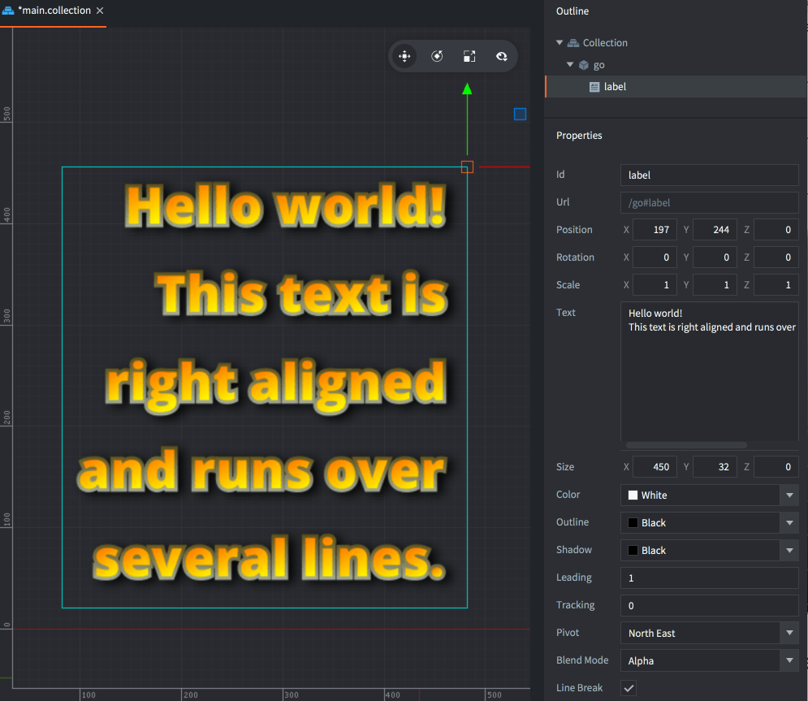

# Label

The *Label* component exists to allow you to attach text content to any game object. While Defold's GUI support is advanced, using it to glue information to in game objects can be tricky since GUI:s does not live in the game world.

## Creating a label

A label component renders a piece of text on screen, in game space. By default it is sorted and drawn with all sprite and tile graphics. The component has a set of properties that governs how the text is rendered.

To create a Label component, either:

1. Add a new component in-place in an existing game object by right clicking the game object and select *Add Component*. Select *Label* and press *OK*.

  

2. If you want to instanciate several labels from the same template you can alternatively make a new *Label File* (right click a folder in the *Project Explorer* and select <kbd>New ▸ Label File</kbd>) and then add that to one or more game objects by right clicking the game objects and select <kbd>Add Component From File</kbd> and select your new label file.

The new label component has a set of special properties exposed that you can change in the editor or in runtime.


*Size*
: The size of the text bounding box. If *Line Break* is set below this governs at what point the text should break.

*Text*
: This property contains the text displayed.

*Color*
: The color of the text.

*Alpha*
: The alpha value of the text.

*Pivot*
: The pivot of the text. Use this to change text alignment (see below).

*Line Break*
: Text alignment follows the pivot setting and setting the this property allows the text to flow over several lines. The width of the component determines where the text will wrap. Note that there has to be a space in the text for it to break.

*Leading*
: A scaling number for the line spacing. A value of 0 gives no line spacing. Defaults to 1.

*Tracking*
: A scaling number for the letter spacing. Defaults to 0.

*Outline*
: The color of the outline.

*Outline Alpha*
: The value of the alpha channel for the generated outline. 0.0--1.0.

*Shadow*
: The color of the shadow.

*Shadow Alpha*
: The value of the alpha channel for the generated shadow. 0.0--1.0.

*Font*
: The font resource to use for this label.

::: sidenote
Note that the default material has shadow rendering disabled for performance reasons.
:::

## Alignment

By setting the pivot you can change the adjust mode for the text.

*Center*
: If the pivot is set to `Center`, `North` or `South`, the text is center-aligned.

*Left*
: If the pivot is set to any of the `West` modes, the text is left-aligned.

*Right*
: If the pivot is set to any of the `East` modes, the text is right-aligned.



## Runtime manipulation

You can manipulate labels in runtime by reading and setting the label text as well as the various properties.

`color`
: The label color (`vector4`)

`outline`
: The label outline color (`vector4`)

`scale`
: The label scale, either a `number` for uniform scaling or a `vector3` for individual scaling along each axis.

`shadow`
: The label shadow color (`vector4`)

`size`
: The label size (`vector3`)

```lua
function init(self)
    -- Set the text of the "my_label" component in the same game object
    -- as this script.
    label.set_text("#my_label", "New text")
end
```

```lua
function init(self)
    -- Set the color of the "my_label" component in the same game object
    -- as this script to grey...
    local grey = vmath.vector4(0.5, 0.5, 0.5, 1.0)
    go.set("#my_label", "color", grey)

    -- ...and remove the outline, by setting its alpha to 0...
    go.set("#my_label", "outline.w", 0)

    -- ...and scale it x2 along x axis.
    local scale_x = go.get("#my_label", "scale.x")
    go.set("#my_label", "scale.x", scale_x * 2)
end
```

