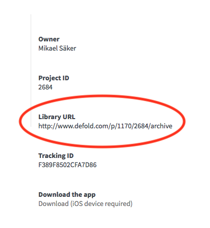
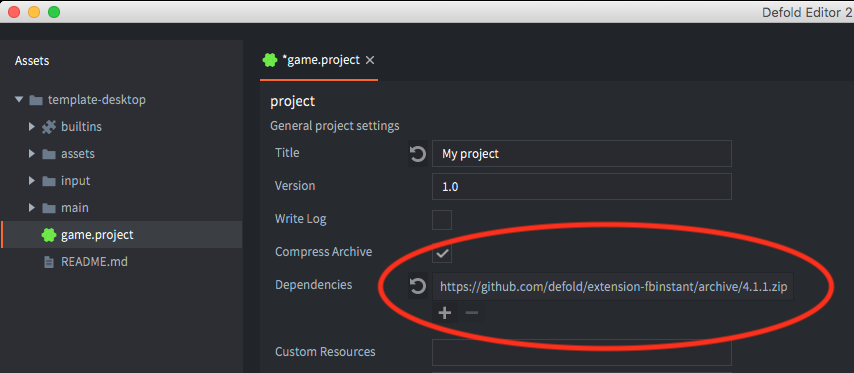
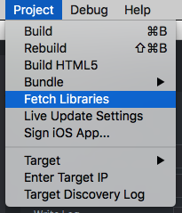

Libraries
=========
:location: documentation manuals project
:type: manual

The Libraries feature allows you to share assets between projects. It is a simple but very powerful mechanism that you can use in your workflow in a number of ways. This manual explains how it works.

Libraries is useful for the following uses:

* To copy assets from a finished project to a new one. If you are making a sequel to an earlier game, this is an easy way to get going.
* To build a library of templates that you can copy into you projects and then customize or specialize.
* To build one or more libraries of ready-made objects or scripts that you can reference directly. This is very handy for storing common script modules or to build a shared library of graphics, sound and animation assets.

## Setting up library sharing

Suppose you want to build a library containing shared sprites and tile sources. You start by setting up a new project in the Defold dashboard (see the [Workflow documentation](/manuals/workflow) for details). Decide what folders you want to share from the project and add the names of those folders to the "include_dirs" property in the Project settings. If you want to list more than one folder, separate the names with spaces:

The Defold server needs to know that the project contain folders that should be shared. Therefore, make sure to _Synchronize your project_. Now, before we can add this library to another project we need to a way to locate the library.

## Library URL

Libraries are referred to via a standard URL. Each project has a Library URL that can be found in the Dashboard. Just select the relevant project and write down or copy the URL:

## Setting up library dependencies

Open the project you would like to have access to the library. In the Project settings, add the URL to the "dependencies" property. You can specify multiple dependent projects if you want. Just list them separated by spaces:

Now, select *Project > Fetch Libraries* to update the Library dependencies. This happens automatically whenever you open a project so you will only need to do this if the dependencies change without re-opening the project. This happens if you add or remove dependency libraries or if one of the dependency library projects are changed and synchronized by someone.

Now the folders that you shared appears in the Project Explorer and you can use everything you shared. Any synchronized changes done to the library project will be available in your project.

## Troubleshooting

## Broken references

Library sharing only include files that are located under the shared folder. If you create something that reference assets that are located outside of the shared hierarchy, the referece paths will be broken.

In the example, the library folder "shared_sprites" contain an atlas. The PNG images that are gathered in that atlas, however, live in a folder in the library project that is not shared.

If you open the atlas in the Text Editor (as opposed to the default Atlas Editor), you can see the paths of the gathered images:

----
images {
  image: "/cards_example/images/clubmaster.png"
}
images {
  image: "/cards_example/images/heartson.png"
}
images {
  image: "/cards_example/images/tree.png"
}
images {
  image: "/cards_example/images/pot.png"
}
images {
  image: "/cards_example/images/heart.png"
}
----

It now becomes clear what the problem is. The atlas file references these PNG images to a path that does not exist in the local project. You can problem by adding the "/cards_example/images" folder to the list of shared folders in the library project. Another option is to create a local folder "/cards_example/images" and drop PNG files with the right names there.

## Name collisions

Since you can list several project URL:s in the "dependencies" Project setting you might encounter a name collision. This happens if two or more of the dependent projects share a folder with the same name in the "include_dirs" Project setting.

Defold resolves name collisions by simply ignoring all but the last reference to folders of the same name in the order the project URL:s are specified in the "dependencies" list. For instance. If you list 3 library project URL:s in the dependencies and all of them share a folder named "items", only one "items" folder will show up: the one belonging to the project that is last in the URL list.

