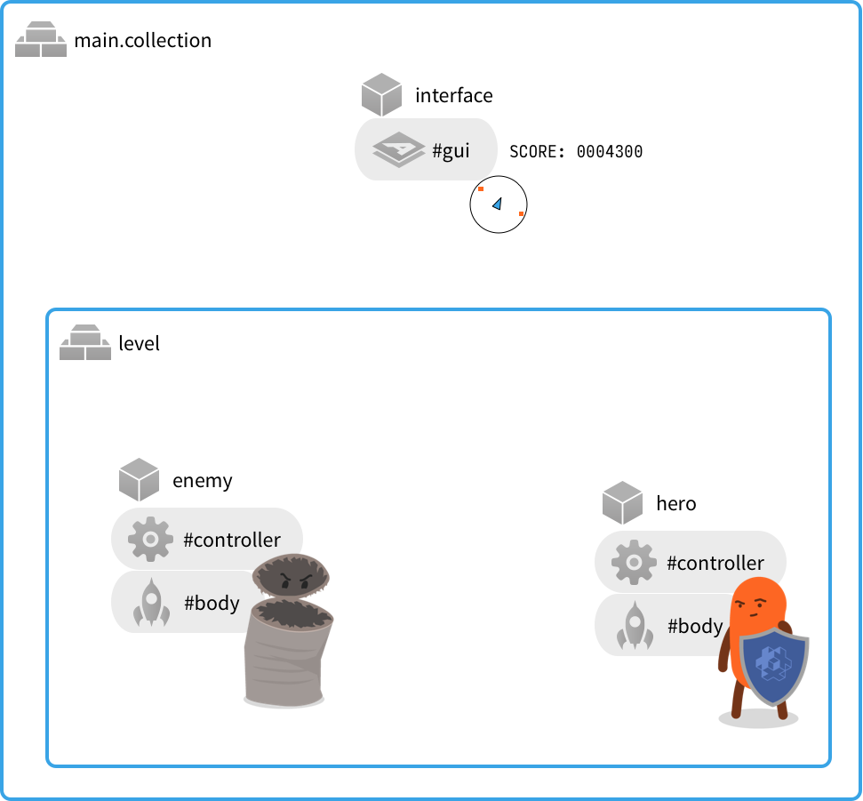
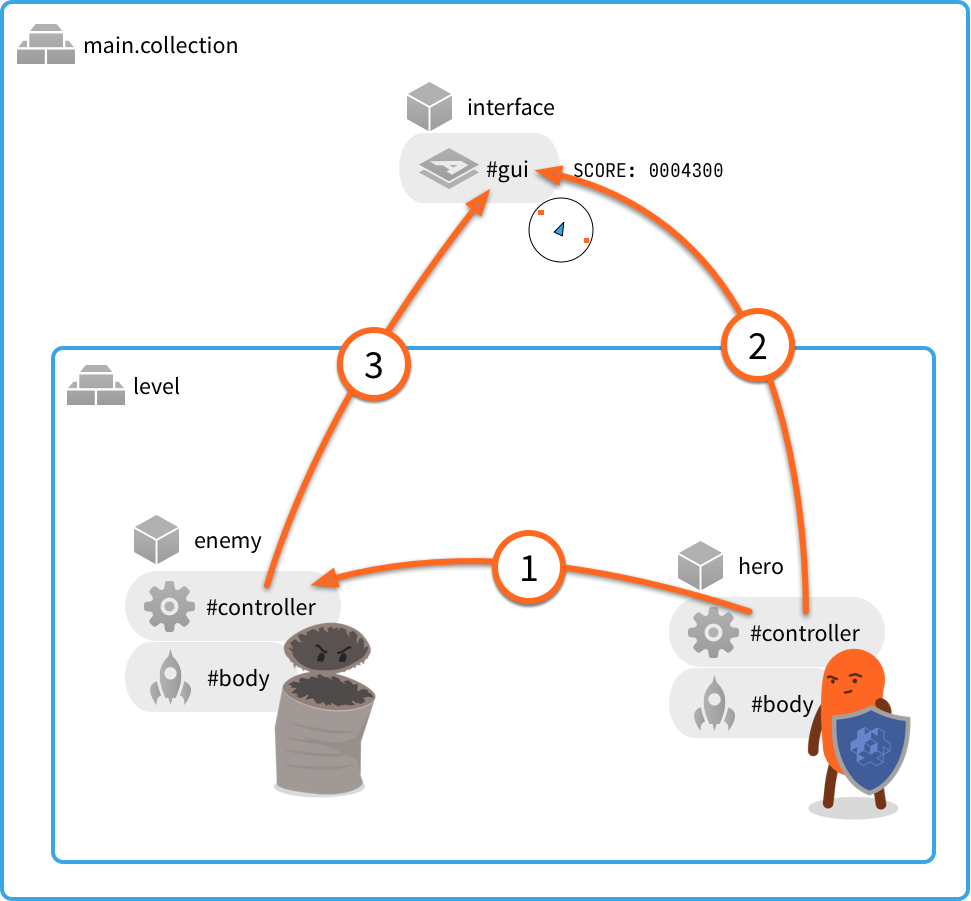
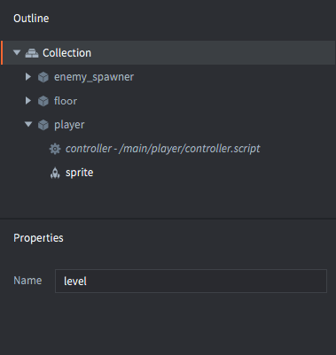

# Message passing

Message passing is a mechanism for Defold game objects to communicate with each other. This manual assumes that you have a basic understanding of Defold's [addressing mechanism](/manuals/addressing) and [basic building blocks](/manuals/building-blocks).

Defold does not do object orientation in the sense that you define your application by setting up class hierarchies with inheritance and member functions in your objects (like Java, C++ or C#). Instead, Defold extends Lua with a simple and powerful object oriented design where object state is kept internally in script components, accessible through the `self` reference. Objects can furthermore be fully decoupled with asynchronous message passing as means of communication between objects.


## Usage examples

Let's first look at a few simple usage examples. Suppose that you are building a game consisting of:

1. A main bootstrap collection containing a game object with a GUI component (the GUI consists of a minimap and a score counter). There is also a collection with id "level".
2. The collection named "level" contains two game objects: one hero player character and one enemy.



::: sidenote
The content of this example lives in two separate files. There is one file for the main bootstrap collection and one for the collection with the id "level". However, file names _do not matter_ in Defold. The identity you assign instances does.
:::

The game contains a few simple mechanics that require communication between the objects:



① The hero punches the enemy
: As part of this mechanic, a `"punch"` message is sent from the "hero" script component to the "enemy" script component. Since both objects live in the same place in the collection hierarchy, relative addressing is preferred:

  ```lua
  -- Send "punch" from the "hero" script to "enemy" script
  msg.post("enemy#controller", "punch")
  ```

  There is only a single strength punch move in the game so the message does not need to contain any more information than its name, "punch".

  In the script component of the enemy, you create a function to receive the message:
  
  ```lua
  function on_message(self, message_id, message, sender)
    if message_id == hash("punch") then
      self.health = self.health - 100
    end
  end
  ```

  In this case, the code only looks at the name of the message (sent as a hashed string in the parameter `message_id`). The code does not care about message data nor the sender---*anyone* sending the message "punch" will inflict damage on the poor enemy.

② Hero gaining score
: Whenever the player defeats an enemy, the player score increases. A `"update_score"` message is also sent from the "hero" game object's script component to the "gui" component of the "interface" game object.

  ```lua
  -- Enemy defeated. Increase score counter by 100.
  self.score = self.score + 100
  msg.post("/interface#gui", "update_score", { score = self.score })
  ```

  In this case it's not possible to write a relative address since "interface" is at the root of the naming hierarchy and "hero" is not. The message is sent to the GUI component that has a script attached to it, so it can react to the message accordingly. Messages can be sent freely between scripts, GUI scripts and render scripts.

  The message `"update_score"` is coupled with score data. The data is passed as a Lua table in the `message` parameter:

  ```lua
  function on_message(self, message_id, message, sender)
    if message_id == hash("update_score") then
      -- set the score counter to new score
      local score_node = gui.get_node("score")
      gui.set_text(score_node, "SCORE: " .. message.score)
    end
  end
  ```

③ Enemy position on the minimap
: The player has a minimap on screen to help locate and track enemies. Each enemy is responsible for signalling its position by sending an `"update_minimap"` message to the "gui" component in the "interface" game object:

  ```lua
  -- Send the current position to update the interface minimap
  local pos = go.get_position()
  msg.post("/interface#gui", "update_minimap", { position = pos })
  ```

  The GUI script code needs to track the position of each enemy, and if the same enemy sends a new position, the old should be replaced. The sender of the message (passed in parameter `sender`) can be used to key a Lua table with positions:

  ```lua
  function init(self)
    self.minimap_positions = {}
  end

  local function update_minimap(self)
    for url, pos in pairs(self.minimap_positions) do
      -- update position on map
      ...
    end
  end

  function on_message(self, message_id, message, sender)
    if message_id == hash("update_score") then
      -- set the score counter to new score
      local score_node = gui.get_node("score")
      gui.set_text(score_node, "SCORE: " .. message.score)
    elseif message_id == hash("update_minimap") then
      -- update the minimap with new positions
      self.minimap_positions[sender] = message.position
      update_minimap(self)
    end
  end
  ```

## Sending messages

The mechanics of sending a message is, as we have seen above, very simple. You call the function `msg.post()` which posts  your message to the message queue. Then, each frame, the engine runs through the queue and delivers each message to its target address. For some system messages (like `"enable"`, `"disable"`, `"set_parent"` etc) the engine code handles the message. The engine also produces some system messages (like `"collision_response"` on physics collisions) that are delivered to your objects. For user messages sent to script components, the engine simply calls a special Defold Lua function named `on_message()`.

You can send arbitrary messages to any existing object or component and it is up to the code on the recipient side to respond to the message. If you send a message to a script component and the script code ignores the message, that is fine. The responsibility of dealing with messages is fully on the receiving end.

The engine will check the message target address. If you try sending a message to an unknown recipient, Defold will signal an error in the console:

```lua
-- Try to post to a non existing object
msg.post("dont_exist#script", "hello")
```

```txt
ERROR:GAMEOBJECT: Instance '/dont_exists' could not be found when dispatching message 'hello' sent from main:/my_object#script
```

The complete signature of the `msg.post()` call is:

`msg.post(receiver, message_id[, message])`

receiver
: The id of the target component or game object. Note that if you target a game object, the message will be broadcast to all components in the game object.

message_id
: A string or hashed string with the name of the message.

[message]
: An optional Lua table with message data key-value pairs. Almost any type of data can be included in the message Lua table. You can pass numbers, strings, booleans, URLs, hashes and nested tables. You can not pass functions.

  ```lua
  -- Send table data containing a nested table
  local inventory_table = { sword = true, shield = true, bow = true, arrows = 9 }
  local stats = { score = 100, stars = 2, health = 4, inventory = inventory_table }
  msg.post("other_object#script", "set_stats", stats)
  ```

::: sidenote
There is a hard limit to the `message` parameter table size. This limit is set to 2 kilobytes. There is currently no trivial way to figure out the exact memory size a table consumes but you can use `collectgarbage("count")` at before and after inserting the table to monitor memory use.
:::

## Receiving messages

Reciving messages is a matter of making sure the target script component contains a function named `on_message()`. The function accepts four parameters:

`function on_message(self, message_id, message, sender)`

`self`
: A reference to the script component itself.

`message_id`
: Contains the name of the message. The name is _hashed_.

`message`
: Contains the message data. This is a Lua table. If there is no data, the table is empty.

`sender`
: Contains the full URL of the sender.

```lua
function on_message(self, message_id, message, sender)
    print(message_id) --> hash: [my_message_name]

    pprint(message) --> {
                    -->   score = 100,
                    -->   value = "some string"
                    --> }
    
    print(sender) --> url: [main:/my_object#script]
end
```

## Messaging between game worlds

If you use a collection proxy component to load a new game world into the runtime, you will want to pass messages between the game worlds. Suppose that you have loaded a collection via proxy and that the collection has its *Name* property set to "level":



As soon as the collection has been loaded, initiated and enabled, you can post messages to any component or object in the new world by specifying the game world name in the recipient address  "socket" field:

```lua
-- Send a message to the player in the new game world
msg.post("level:/player#controller", "wake_up")
```
A more in depth description on how proxies work can be found in the [Collection Proxies](/manuals/collection-proxy) documentation.

## Message chains

When a message that has been posted is eventually dispatched the recipients’ `on_message()` is called. It is quite common that the reaction code post new messages, which are added to the message queue.

When the engine starts dispatching it will work through the message queue and call each message recipient's `on_message()` function and go on until the message queue is empty. If the dispatching pass adds new messages to the queue, it will do another pass. There is, however, a hard limit to how many times the engine tries to empty the queue, which effectively puts a limit to how long message chains you can expect to be fully dispatched within a frame. You can easily test how many dispatch passes the engine performs between each `update()` with the following script:

```lua
function init(self)
    -- We’re starting a long message chain during object init
    -- and keeps it running through a number of update() steps.
    print("INIT")
    msg.post("#", "msg")
    self.updates = 0
    self.count = 0
end

function update(self, dt)
    if self.updates < 5 then
        self.updates = self.updates + 1
        print("UPDATE " .. self.updates)
        print(self.count .. " dispatch passes before this update.")
        self.count = 0
    end
end

function on_message(self, message_id, message, sender)
    if message_id == hash("msg") then
        self.count = self.count + 1
        msg.post("#", "msg")
    end
end
```

Running this script will print something like the following:

```txt
DEBUG:SCRIPT: INIT
INFO:ENGINE: Defold Engine 1.2.36 (5b5af21)
DEBUG:SCRIPT: UPDATE 1
DEBUG:SCRIPT: 10 dispatch passes before this update.
DEBUG:SCRIPT: UPDATE 2
DEBUG:SCRIPT: 75 dispatch passes before this update.
DEBUG:SCRIPT: UPDATE 3
DEBUG:SCRIPT: 75 dispatch passes before this update.
DEBUG:SCRIPT: UPDATE 4
DEBUG:SCRIPT: 75 dispatch passes before this update.
DEBUG:SCRIPT: UPDATE 5
DEBUG:SCRIPT: 75 dispatch passes before this update.
```

We see that this particular Defold engine version performs 10 dispatch passes on the message queue between `init()` and the first call to `update()`. It then performs 75 passes during each subsequent update loop.

