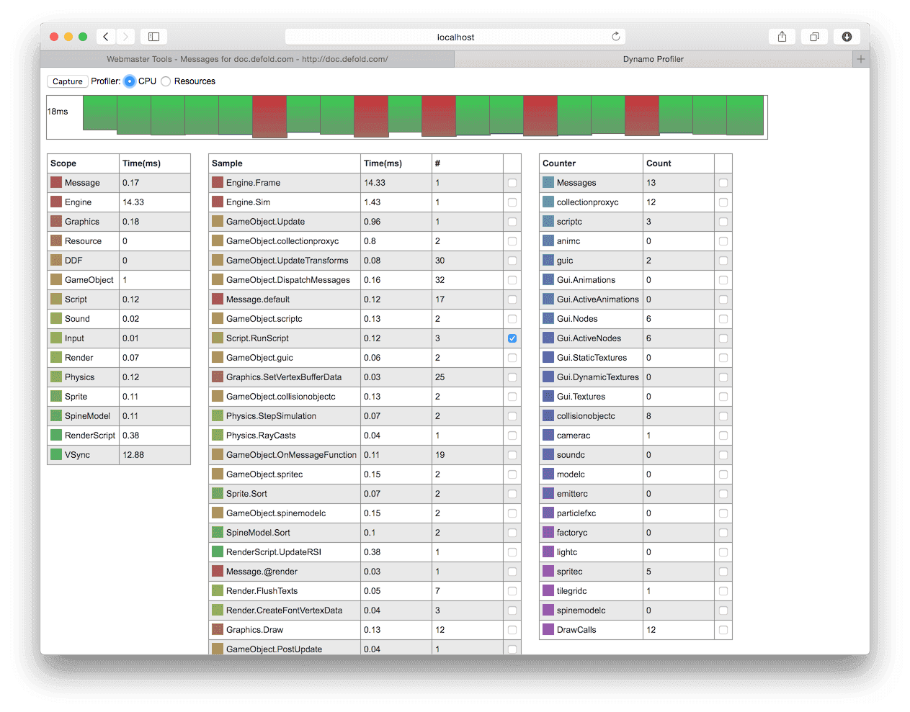
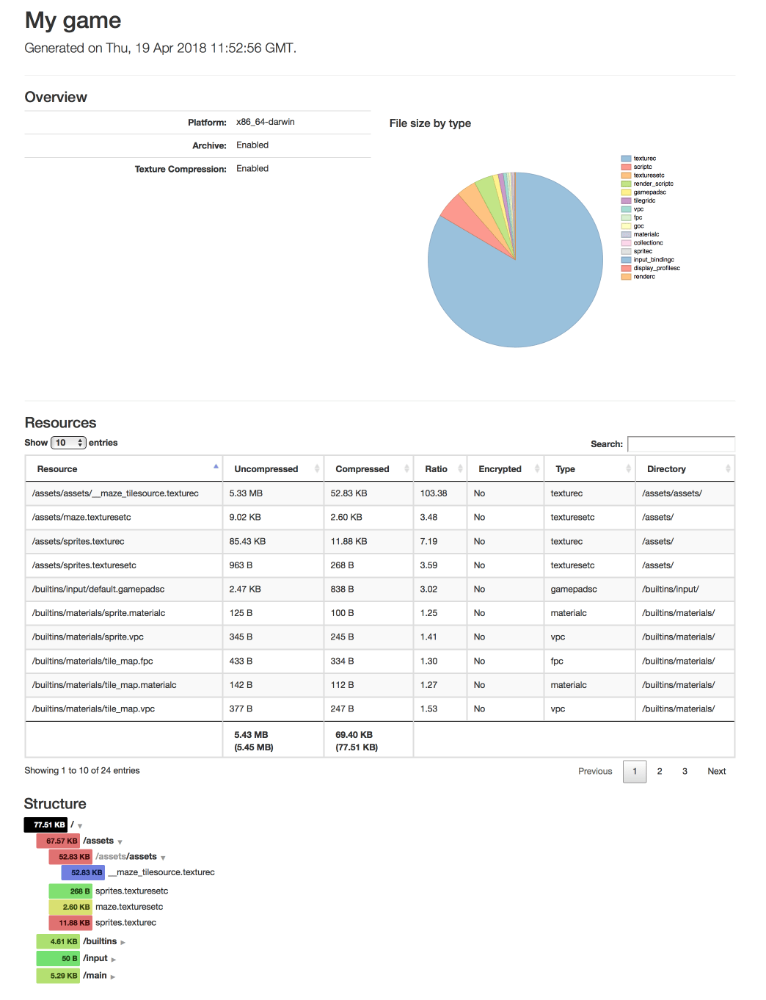
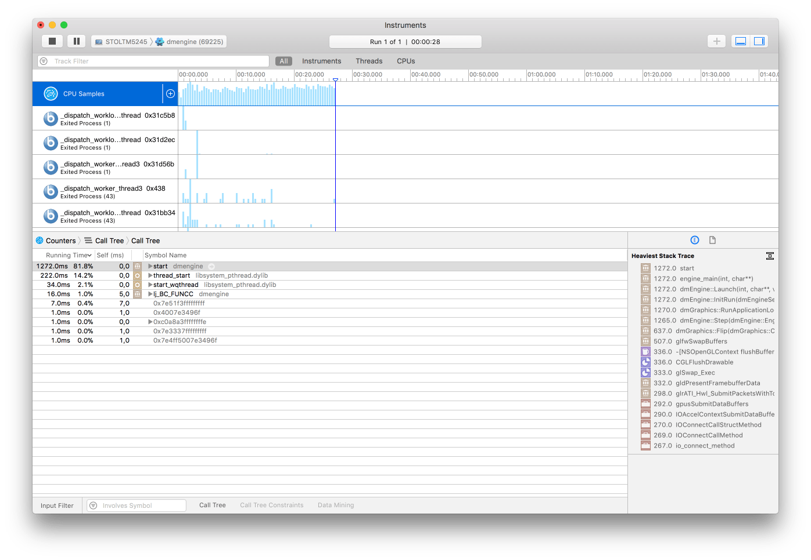
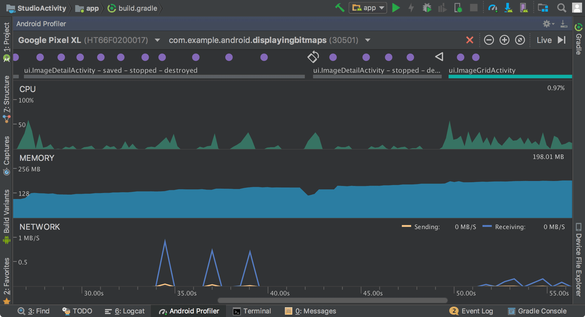
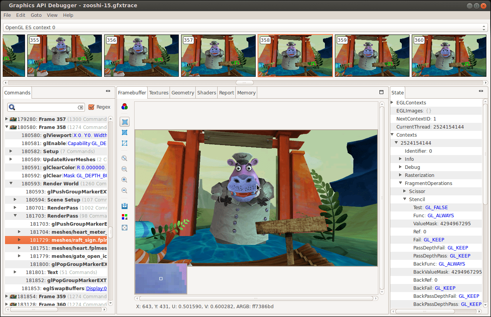

# Profiling

Defold includes a set of profiling tools that are integrated with the engine and the build pipeline. These are designed to help find problems with performance and memory usage. The built in profilers are available on debug builds only.

## The runtime visual profiler

Debug builds feature a runtime visual profiler that displays live information rendered overlayed on top of the running application. It is turned on and off by sending a message named "toggle_profile" to the "system" socket:

```lua
function on_reload(self)
    -- Toggle the visual profiler on hot reload.
    msg.post("@system:", "toggle_profile")
end
```


## The web profiler

While running a debug build of the game, an interactive web-based profiler can be accessed through a browser. It allows you to sample your game over a series of frames and then analyze each frame in detail.

To access the profiler:

1. Start your game on your target device.
2. Open a web browser and point it to `http://<device IP>:8002` where `<device IP>` is the IP address of the device. You can find the IP numbers of your target devices in the <kbd>Project ▸ Target</kbd> menu. If you are running your game on your desktop computer, http://localhost:8002 will bring up the profiler.



The profiler is divided into 4 sections that all give different views into the current sample data. To update the sample data, press the *Capture* button at the top.

Frames overview
: The frames overview plots the currently sampled 20 frames side by side. The height of each bar shows the time spent in the frame. The number on the left hand side shows the max time spent in a frame in the current sample data.

  

  Below the frames overview is a detailed frame data view.

  Click on a frame bar in the overview to show the data for that specific frame in the data view.

Frame data
: The frame data view is a table where all data for the currently selected frame is broken down into detail. You can view how many milliseconds are spent in each engine scope (to the left) and also see sample points within the scopes (middle column). On the right hand side is a table of counters. They make it is easy to, for instance, track the number of draw calls required for each frame in the sample data.

  

  Ticking the checkbox associated with a sample point or counter adds that data to the plot below.

Frames plot
: The frames plot view displays a plot over all sampled frames with the data you have selected in the frame data table above the plot. The plot shows frame number on the X axis and time (in milliseconds) or counts on the Y axis. Each selected data point is drawn in the color specified in the frame data table.

  

Frame time chart
:  The frame time chart breaks the frame down visually making it easy to inspect where the engine spends its time during the selected frame.

  

## Build reports

When bundling your game there is an option to create a build report. This is very useful to get a grip on the size of all the assets that are part of your game bundle. Simply check the *Generate build report* checkbox when bundling the game.

{srcset="images/profiling/build_report@2x.png 2x"}

The builder will produce a file called "report.html" alongside the game bundle. Open the file in a web browser to inspect the report:

{srcset="images/profiling/build_report_html@2x.png 2x"}

The *Overview* gives an over all visual breakdown of the project size based on resource type.

*Resources* shows a detailed list of resources that you can sort based on size, compression ratio, encryption, type and directory name. Use the "search" field to filter the resource entries displayed.

The *Structure* section shows sizes based on how resources are organized in the project file structure. Entries are color coded from green (light) to blue (heavy) according to the relative size of the file and directory content.

## External tools

In addition to the built in tools, there is a wide range of free high quality tracing and profiling tools available. Here is a selection:

ProFi (Lua)
: We do not ship any built in Lua profiler but there are external libraries that are easy enough to use. To find where your scripts spend time, either insert time measures in your code yourself, or use a Lua profiling library like ProFi.

  https://github.com/jgrahamc/ProFi

  Note that pure Lua profilers add quite a lot of overhead with each hook they install. For this reason you should be a bit wary of the timing profiles you get from such a tool. Counting profiles are accurate enough though.

Instruments (macOS and iOS)
: This is a performance analyzer and visualizer that is part of Xcode. It allows you to trace and inspect the behavior of one or more apps or processes, examine device specific features (like Wi-Fi and Bluetooth) and much more.

  {srcset="images/profiling/instruments@2x.png 2x"}

OpenGL profiler (macOS)
: Part of the package "Additional Tools for Xcode" that you can download from Apple (select <kbd>Xcode ▸ Open Developer Tool ▸ More Developer Tools...</kbd> in the Xcode menu).

  This tool allows you to inspect a running Defold application and see how it uses OpenGL. It allows you to do traces of OpenGL function calls, set breakpoints on OpenGL functions, investigate application resources (textures, programs, shaders etc), look at buffer contents, and check other aspects of the OpenGL state.

  {srcset="images/profiling/opengl@2x.png 2x"}

Android Profiler (Android)
: https://developer.android.com/studio/profile/android-profiler.html

  A set of profiling tools that captures realtime data of your game's CPU, memory, and network activity. You can perform sample-based method tracing of code execution, capture heap dumps, view memory allocations, and inspect the details of network-transmitted files. Using the tool requires that you set `android:debuggable="true"` in "AndroidManifest.xml".

  

Graphics API Debugger (Android)
: https://github.com/google/gapid

  This is a collection of tools that allows you to inspect, tweak and replay calls from an application to a graphics driver. To use the tool requires that you set `android:debuggable="true"` in "AndroidManifest.xml".

  

