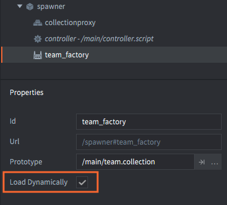
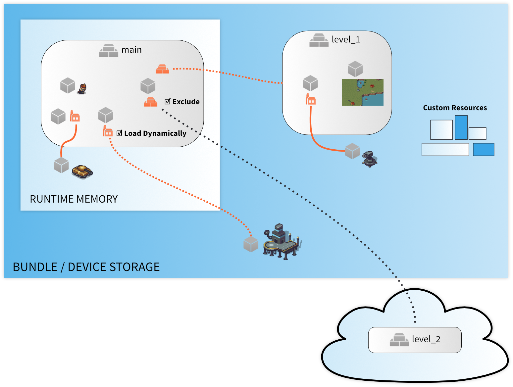

# Resource management

For smaller games, memory may not ever be an issue. However, when making larger games, and especially on handheld devices, memory problems will likely become a problem. Defold provides a range of features to help handle different scenarios.

## The static resource tree

When you build a game in Defold, you statically declare the resource tree. Every single part of the game is linked into the tree, starting with the bootstrap collection (usually called "main.collection"). The resource tree follows any reference and includes all resources associated with those references:

- Game object and component data (atlases, sounds etc).
- Factory component prototypes (game objects and collections).
- Collection proxy component references (collections).
- Custom resources declared in "game.project".

When the game is *bundled*, only what is in the resource tree will be included. Anything that is not referenced in the tree is left out. There is no need to manually select what to include or exclude from the bundle.

When the game is *run*, the engine starts at the bootstrap root of the tree and pulls resources into memory:

- Any referenced collection and its content.
- Game objects and component data.
- Factory component prototypes (game objects and collections).

However, the engine will not automatically follow and load the following types of references:

- Game world collections referenced through collection proxies. Game worlds are relatively large so you will need to manually trigger loading and unloading of these in code. See [the Collection proxy manual](/manuals/collection-proxy) for details.
- Files added via the *Custom Resources* setting in "game.project". These files are manually loaded with the [sys.load_resource()](/ref/sys/#sys.load_resource) function.

## Dynamically loading bundled resources

To postpone the loading of the resources referenced through a factory component (factory or collection factory), you can simply mark a factory with the *Load Dynamically* checkbox.

By checking this box, the engine will still include the referenced resources in the game bundle, but it will not be automatically loaded when the game object holding the component is loaded. Instead, you have two options:

1. Call `factory.create()` or `collectionfactory.create()` which will load the resources synchronously, then spawn new instances.
2. Call `factory.load()` or `collectionfactory.load()` to load the resources asynchronously. When the resources are ready, a callback is received and you can spawn new instances.

Read the [Factory manual](/manuals/factory) and the [Collection factory manual](/manual/collection-factory) for details on how this works.

## Unloading dynamically loaded resources

Defold keeps reference counters for all resources. If a resource's counter reaches zero it means that nothing refers to it anymore. The resource is then automatically unloaded from memory. For example, if you delete all objects spawned by a factory and you also delete the object holding the factory component, the resources previously referred to by the factory is unloaded from memory.

For factories that are marked *Load Dynamically* you can call the `factory.unload()` or `collectionfactory.unload()` function. This removes the factory component's reference to the resource. If nothing else refers to the resource (all spawned objects are deleted, for instance), thie resource is unloaded from memory.

## Excluding resources from bundle

With collection proxies, it is possible to leave out all the resources the component refers to from the bundling process.

