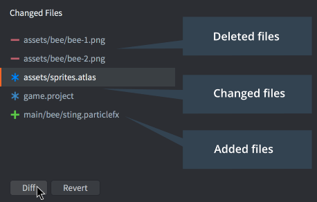
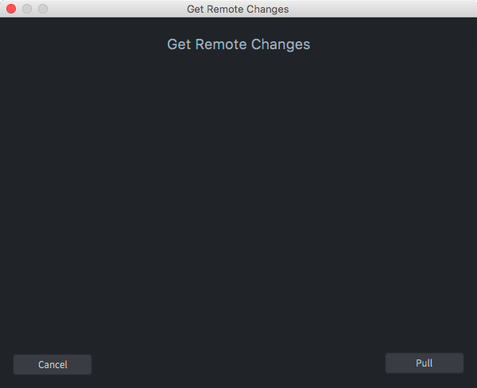

# Workflow

A game project usually consists of a large number of external assets that are produced in various specialized programs for producing graphics, 3D models, sound files, animations and so forth. Defold is built for a workflow where you to work in your external tools and then import the assets into Defold as they are finalized.

Defold is built intended for small teams that work in intense collaboration to create games. Team members can work in parallel on the same content with very little friction. Defold is built upon [Git](https://git-scm.com) that is designed for distributed collaborative work. Git is an extremely powerful tool that allows for a wide range of workflows and Defold uses it to provide built in simple and powerful functionality.

## Your local working copy

Before you can start working on a new project you need to get it to your local disk so the Defold editor can open it. Refer to the [Project Setup manual](/manuals/project_setup/) for more information.

## Changed files

When you save changes in your local working copy, Defold tracks all changes in the *Changed Files* editor pane, listing each file that has either been added, deleted or modified.

{srcset="images/workflow/changed_files@2x.png 2x"}

Select a file in the list and click <kbd>Diff</kbd> to view the changes that you have done to the file or <kbd>Revert</kbd> to undo all changes and restore the file to the state it had after the last synchronization.

## Synchronizing

::: important
Project synchronization is only available for projects hosted on the Defold Dashboard. Projects hosted on GitHub or in other Git repositories will not be able to use synchronization.
:::

To synchronize your project means that the project files are brought into sync with the project as it looks on the server. You should synchronize if:

1. You want to bring your project up to speed with what is stored on the server.
2. You want to share your local project changes with other team members by committing and pushing your changes to the server.

To start synchronizing, select <kbd>File ▸ Synchronize</kbd> in the menu. A series of dialogs guide you through the synchronization process.

Press <kbd>Pull</kbd> to pull changes from the server and merge them with your local changes. If there are conflicts, you are asked to resolve them:

Mark each conflicting file, right-click and select the action to take:

View Diff
: Bring up a textual diff view of your and the server version of the file.

  

  On the left hand side is the file pulled from the server. The right hand side shows your local version. Any differences are clearly highlighted so you can quickly review them.

  The built in file comparison tool works on text files only. However, since Defold stores all working files (game objects, collections, atlases, etc etc) in easily understandable JSON files, you can often figure out the meaning of the changes that have been made to such files:

Use Ours
: Discard the changes from the server and instead use your version.

Use Theirs
: Discard your version and instead use the server version.

::: sidenote
The editor does not allow you to pick changes from the two conflicting files. If you need to do this you can perform the Git operations from the command line and use a separate merge tool.
:::

When the editor is done pulling changes and any conflicts are resolved, a dialog asks you how to proceed.

* Press <kbd>Cancel</kbd> to abort and return the project to the state it was in prior to synchronization.
* Press <kbd>Push</kbd> to continue committing and pushing your changes to the server.
* Press <kbd>Done</kbd> to accept the server changes and conflict resolutions, but do not continue pushing. You can always push at a later stage.

If you continue pushing and have local changes, you are asked to commit them before pushing. A dialog allows you to select (stage) the files that should be included in the commit framed orange in the image below).

Press <kbd>Push</kbd> to commit and push your changes to the server.

## External editors and tools

Defold does not provide editing tools for creating images, sound files, models or animations. Such assets need to be created outside of Defold in specialized tools and imported into Defold. Defold automatically detects changes to any asset in the project hierarchy and updates the editor view accordingly.

There is currently no way to hook custom build steps into the in-editor builder, but we provide a stand-alone build pipeline (see [Bob the builder](/manuals/bob)) that can be incorporated in any pipeline.

The editor saves all Defold assets in text based files that are merge friendly. They are also easy to create and modify with simple scripts. See [this forum thread](https://forum.defold.com/t/deftree-a-python-module-for-editing-defold-files/15210) for more information. Note though that we do not publish our file format details since they do change once in a while.

Extra care should be taken when working with Defold asset files through a text editor or external tool. If you introduce errors those can prevent the file from opening in the Defold editor.

## Git

Git is built primarily to handle source code and text files and stores those types of files with a very low footprint. Only the changes between each version are stored, which means that you can keep an extensive history of changes to all your project files to a relatively small cost. Binary files such as image or sound files, however, does not benefit from Git's storage scheme. Each new version you check in and synchronize takes about the same space. That is usually not a major issue with final project assets (JPEG or PNG images, OGG sound files etc) but it can quickly become an issue with working project files (PSD files, Protools projects etc). These types of files often grow very large since you usually work in much higher resolution than the target assets. It is generally considered best to avoid putting large working files under the control of Git and instead use a separate storage and backup solution for those.

There are many ways you can use Git in a team workflow. The one Defold uses is as follows. When you synchronize, the following happens:

1. Any local changes are stashed so they can be restored if something fails later in the sync process.
2. Server changes are pulled.
3. The stash is applied (the local changes are restored), this may result in merge conflicts that need to be resolved.
4. The user gets the option to commit any local file changes.
5. If there are local commits, the user may choose to push these to the server. Again, it is possible that this leads to conflicts that need to be resolved.

If you prefer a different workflow you can run Git from command line or through a third party application to perform pulls, pushes, commits and merges, working on several branches and so on.
