# Magic Link tutorial

This game is a variation on the classic matching game in the vein of _Bejeweled_ and _Candy Crush_. The player drags and links blocks of the same color to remove them, but the objective of the game is not to remove long series of same colored blocks, clear the board or gather points, but to get a set of special "magic blocks" that are spread across the board to connect.

This tutorial is written as a step-by-step guide where we build the game on a complete design. In reality, it takes a lot of time and effort to find a design that works. You might start with a core idea and then find a way to prototype it to get a better understanding of what the idea could bring to the table. Even a simple game like "Magic Link" requires quite a lot of design work. This game went through a couple of iterations and some experimentation to arrive at its final (and still far from perfect) shape and set of game rules. But for this tutorial, we're gonna skip that process and start building on the final design.

<div id="game-container" class="game-container">
    
    <canvas id="game-canvas" tabindex="1" width="640" height="960">
    </canvas>
    <button id="game-button">
        START GAME <span class="icon"></span>
    </button>
    <script src="//storage.googleapis.com/defold-doc/assets/dmloader.js"></script>
    <script src="//storage.googleapis.com/defold-doc/assets/dmengine.js" async></script>
    <script>
        /* Load app on click in container. */
        document.getElementById("game-button").onclick = function (e) {
            var extra_params = {
                archive_location_filter: function( path ) {
                    return ("//storage.googleapis.com/defold-doc/assets/magic-link" + path + "");
                },
                load_done: function() {},
                game_start: function() {
                    var e = document.getElementById("game-preview");
                    e.parentElement.removeChild(e);
                }
            }
            Module.runApp("game-canvas", extra_params);
            document.getElementById("game-button").style.display = 'none';
            document.getElementById("game-button").onclick = null;
        };
    </script>
</div>

## Getting started

There are two ways you can follow this tutorial. Either you start a clean, empty project in Defold, download the asset package and build the game step-by-step.

* Go to the [Defold Dashboard](//dashboard.defold.com)
* Click *New Project*
* Choose a name for the project and select the "Empty Project" template
* Download the "Magic Link" asset package and unpack it on your hard drive (the package is a ZIP archive)

<a class="btn btn-primary btn-xs-block btn-icon" href="//storage.googleapis.com/defold-doc/assets/magic-link-assets.zip">Download asset package<span aria-hidden="true" class="icon icon-download"></span></a>

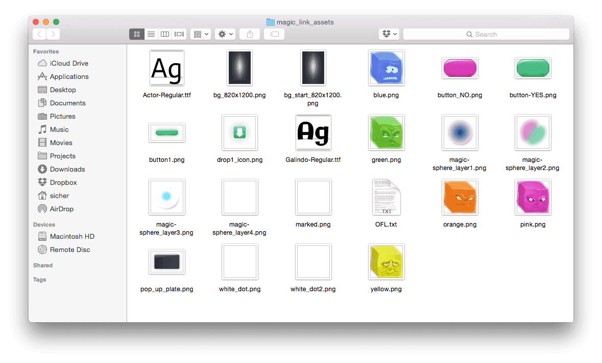

The other option is to create a new project based on the "Magic Link" project template.

* Go to the [Defold Dashboard](//dashboard.defold.com)
* Click *New Project*
* Choose a name for the project and select the "Magic Link" template

The new project will contain the fully functional game. You can browse the project files and use this tutorial as a guide to how everything is put together.

## Game rules

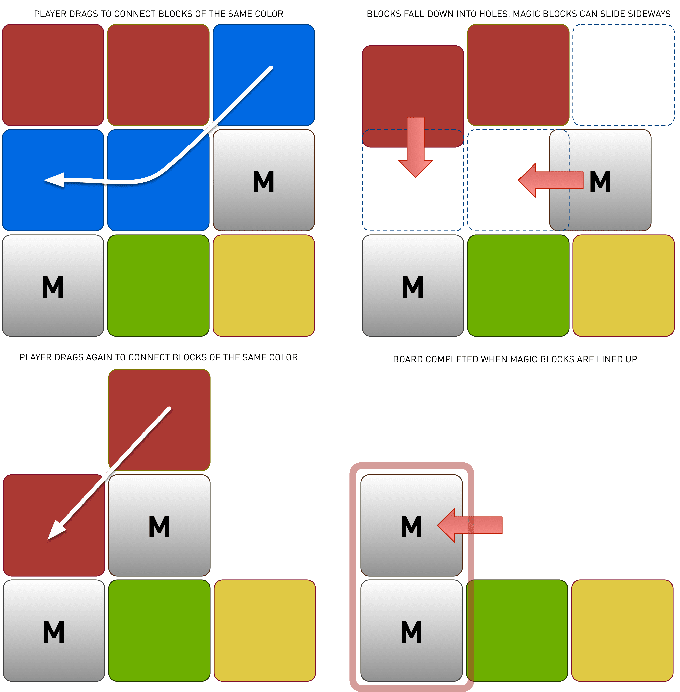

The board is randomly filled with colored blocks and a set of magic blocks each round. The colored blocks follow these rules:

* They disappear if the player connects them (by dragging) with same colored blocks.
* When blocks disappear, they leave holes below. Colored blocks simply fall vertically down into holes that has opened up below.
* The bottom of the screen stops all blocks from falling further.

The magic blocks behave differently, according to these rules:

* Magic blocks move _sideways_ if an opening appears on either side.
* If a hole appears below, they instead fall like regular colored blocks.

The player interacts with the game according to the following rules:

* The player can drag and link colored blocks that are adjacent horizontally, vertically and diagonally.
* Linked blocks disappear as soon as the player let go of touch input (lifts the finger).
* Magic blocks does not react to dragging and cannot be manually linked.
* Magic blocks, however, react to being connected horizontally or vertically. I.e. they auto-link under these circumstances.
* The level is completed if the player manages to auto-link all the magic blocks on the board.

The difficulty level govern the number of magic blocks that are put on the board.

## Overview

As with all projects, we need to device a plan how to approach the implementation in broad strokes.There are many ways the game could be structured and built. We could, technically, implement the whole game in the GUI system if we wanted. However, building the game with game objects and sprites and using the GUI APIs for on-screen GUI and heads-up display elements is most often the natural way to build a game so we're gonna take that path.

Since we're expecting the number of files to stay fairly low, we're gonna keep the project folder structure very simple:

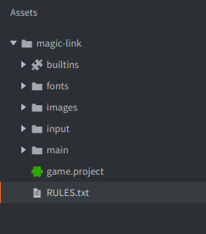

*main*
: This folder will hold all the logic for the game. All scripts, game object files, collection files, GUI files, so on and so forth will reside in this folder. If you want to split this folder into several, or keep sub-folders, that's perfectly fine.

*images*
: All image assets will live in this folder.

*fonts*
: The fonts used for text rendering are kept here.

*input*
: The input bindings are kept in this folder.

## Setting up the project

The *game.project* file is mostly kept with the default settings but there are some settings to decide. First of all, we need to select a resolution for the game. It's quite easy to change the resolution at a later stage, and for a final game we will need to do some work to make the game look good independently of the resolution or aspect ration of the target device.

We chose to set the resolution to 640x960 pixels, which is the native resolution of the iPhone 4. It's also a resolution that fits on many monitors, so playtesting on the computer becomes smooth. If you want to work on a different resolution, you will only have to tweak a few values differently.

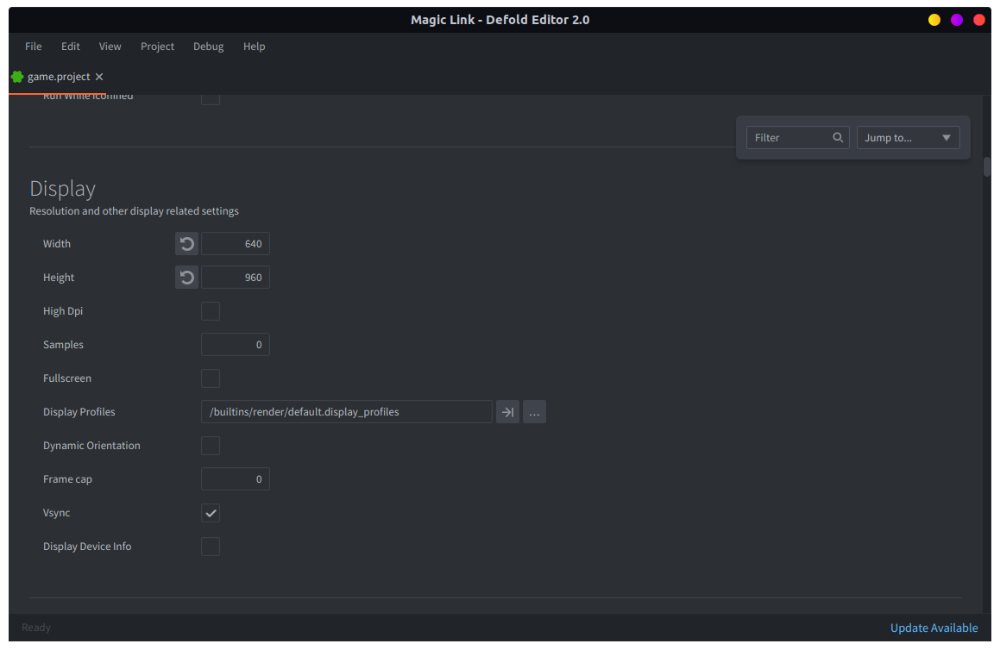

We're also gonna need to increase the maximum number of sprites rendered. If you want, you can skip to the next section and return here when you get notified in the console that you have hit the sprite limit.

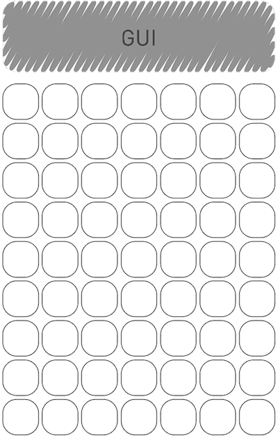

We can calculate a maximum number of sprites needed:

* The game board will hold 7x9 blocks. The board will need some margins around the edges as well as room at the top for some GUI elements. This means that the blocks will be around 90x90 pixels in size. Any smaller than that and they would be too tiny to interact with on a small phone's screen.
* Each block is one sprite. We're gonna use one-frame animations to set the color of the block.
* Some of the blocks will be magic blocks and we're gonna use 4 sprites for special effects on each of those.
* The linking graphics will need one sprite per element. In worst case, that is an additional 61 sprites, if the player somehow links the whole board (minus 2 magic blocks that cannot be drag-linked).

So, suppose we have a maximum of 30 magic blocks. The board is 63 blocks (sprites). Of these, the 30 magic blocks adds 4 sprites for special effects. That's an additional 120 sprites. So, with the linking graphics (which is max 33 in this case), we will need to draw at least 120 + 33 = 153 sprites each frame. The nearest power of two is 256.

However, setting the max to 256 is not enough. Each time we clear and reset the board we're gonna delete all current game objects and spawn new ones. The sprite count will have to cater for all objects that are alive through the frame. That includes any deleted objects because they are removed at the end of the frame. So, setting the maximum number of sprites to 512 will suffice.

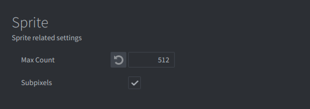

## Adding the graphics assets

All necessary assets for the game has been prepared in advance. We're adding them as 512x512 pixel images and let the engine scale them down to the target size.

::: sidenote
Enabling *hidpi* in the project settings mean that the backbuffer becomes high resolution. By drawing large images scaled down they will appear very crisp on retina screens.
:::


In addition to the blocks, a "connector" image is included plus effect sprites. We also have two background images. One that will be used as backdrop for the game board and one that will be used for the main menu. Add all images to the *images* folder, then create an atlas file *sprites.atlas*. Open the atlas file and add all images.


There are a set of GUI images that are used to create GUI elements, like buttons and pop ups. These are added to a separate atlas called *gui.atlas*.

## Generating the board

The first step is to build the board logic. The board will reside in its own collection that will contain everything on screen during gameplay. For now, the only thing necessary is the "blockfactory" factory component and the script. Later, we will add a factory for connections, a main menu GUI components and finally loading mechanics to start gameplay from the main menu and a way to exit to the menu.

1. Create *board.collection* in the *main* folder. Make sure to name it "board" so we can address it later. If you add the background sprite component, make sure to set its Z position to -1, or it won't be drawn behind all the blocks we'll spawn later.
2. Temporarily set *main_collection* in *game.project* to "/main/board.collectionc" so we can easily test.

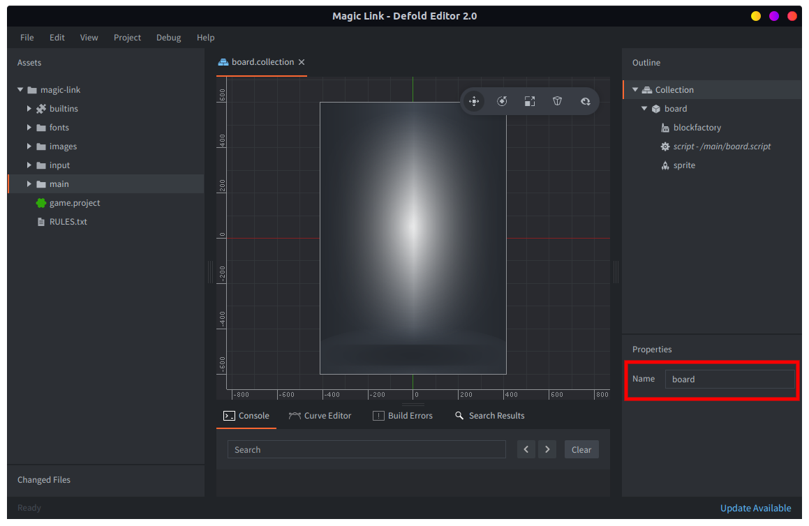


The script file *board.script* will contain all the logic for the board itself and the blocks in the board. Start by creating the board-building function and invoke it (temporarily) from `init()`. We're also adding two functions that we won't use now but that will come in handy later:

`filter()`
: This function will allow us to filter lists of items (blocks).

`build_blocklist()`
: Creates a list of all blocks on the board laid out as a flat list, which allows us to filter it.

After the board has been built, we will use two different data sets containing all the blocks, `self.blocks` and `self.board`:

```lua
-- board.script
go.property("timer", 0)     -- Use to time events
local blocksize = 80        -- Distance between block centers
local edge = 40             -- Left and right edge.
local bottom_edge = 50      -- Bottom edge.
local boardwidth = 7        -- Number of columns
local boardheight = 9       -- Number of rows
local centeroff = vmath.vector3(8, -8, 0) -- Center offset for connector gfx since there's shadow below in the block img
local dropamount = 3        -- The number of blocks dropped on a "drop"
local colors = { hash("orange"), hash("pink"), hash("blue"), hash("yellow"), hash("green") }

--
-- filter(function, table)
-- e.g: filter(is_even, {1,2,3,4}) -> {2,4}
--
local function filter(func, tbl)
    local new = {}
    for i, v in pairs(tbl) do
        if func(v) then
            new[i] = v
        end
    end
    return new
end

--
-- Build a list of blocks in 1 dimension for easy filtering
--
local function build_blocklist(self)
    self.blocks = {}
    for x, l in pairs(self.board) do
        for y, b in pairs(self.board[x]) do
            table.insert(self.blocks, { id = b.id, color = b.color, x = b.x, y = b.y })
        end
    end
end

--
-- INIT
--
function init(self)
    self.board = {}             -- Contains the board structure
    self.blocks = {}            -- List of all blocks. Used for easy filtering on selection.
    self.chain = {}             -- Current selection chain
    self.connectors = {}        -- Connector elements to mark the selection chain
    self.num_magic = 3          -- Number of magic blocks on the board
    self.drops = 1              -- Number of drops you have available
    self.magic_blocks = {}      -- Magic blocks that are lined up
    self.dragging = false       -- Drag touch input
    msg.post(".", "acquire_input_focus")
    msg.post("#", "start_level")
end

local function build_board(self)
    math.randomseed(os.time())
    local pos = vmath.vector3()
    local c
    local x = 0
    local y = 0
    for x = 0,boardwidth-1 do
        pos.x = edge + blocksize / 2 + blocksize * x
        self.board[x] = {}
        for y = 0,boardheight-1 do
            pos.y = bottom_edge + blocksize / 2 + blocksize * y
            -- Calc z
            pos.z = x * -0.1 + y * 0.01 -- <1>
            c = colors[math.random(#colors)]    -- Pick a random color
            local id = factory.create("#blockfactory", pos, null, { color = c })
            self.board[x][y] = { id = id, color = c,  x = x, y = y }
        end
    end

    -- Build 1d list that we can easily filter.
    build_blocklist(self)
end

function on_message(self, message_id, message, sender)
    if message_id == hash("start_level") then
        build_board(self)
    end
end
```
1. Note that since the block graphics overlap, we need to draw them in the correct order. This is done by setting the z coordinate for each block. The value will stay well above -1 where we have the background sprite.

The board logic spawns "block" game objects through the "blockfactory" factory component. We need to build the block game object for this to work. The block has a script and a sprite. We set the sprite's default animation to any of the colored blocks in *sprites.atlas*, then add code to *block.script* to make the block assume the right color when spawned:

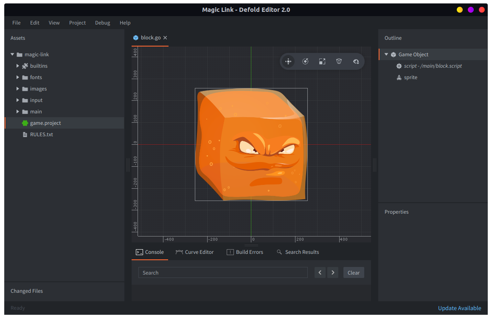

```lua
-- block.script
go.property("color", hash("none"))

function init(self)
    go.set_scale(0.18)        -- render scaled down

    if self.color ~= nil then
        msg.post("#sprite", "play_animation", { id = self.color })
    else
        msg.post("#sprite", "disable")
    end
end
```

Set the "blockfactory" factory component's *Prototype* to the new *block.go* gameobject file.

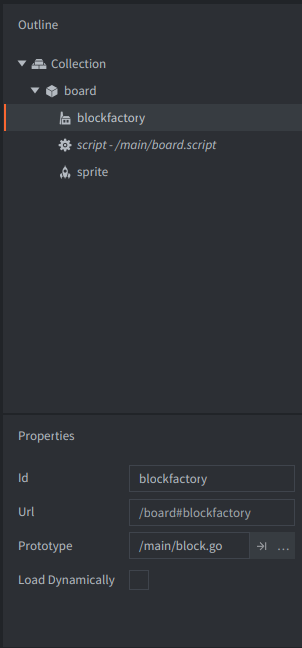

Now you should be able to run the game and see the board filled with randomly colored blocks:

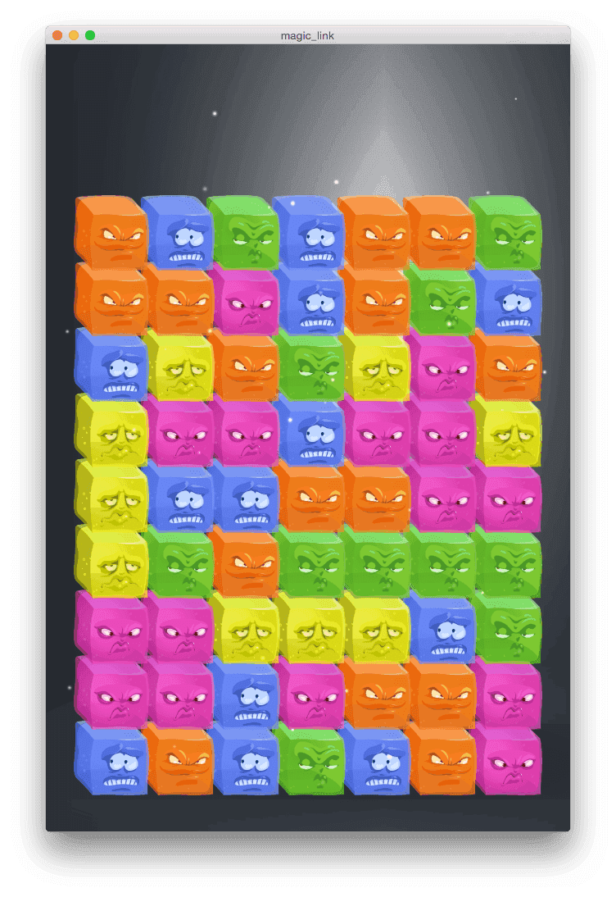

## Interactions

Now that we have a board, we should add user interaction. First, we define the input bindings in *game.input_binding* in the *input* folder. Make sure that the *game.project* settings use your input bindings file.


We only need one binding and we're assigning `MOUSE_BUTTON_LEFT` to the action name "touch". This game don't use multi touch and as a convenience, Defold translates one finger touch input into left mouse clicks.

The job of dealing with the input falls on the board, so we need to add code for that in *board.script*:

```lua
-- board.script
function on_input(self, action_id, action)
    if action_id == hash("touch") and action.value == 1 then
        -- What block was touched or dragged over?
        local x = math.floor((action.x - edge) / blocksize)
        local y = math.floor((action.y - edge) / blocksize)

        if x < 0 or x >= boardwidth or y < 0 or y >= boardheight or self.board[x][y] == nil then
            -- outside board.
            return
        end

        if action.pressed then
            -- Player started touch
            msg.post(self.board[x][y].id, "make_orange")

            self.dragging = true
        elseif self.dragging then
            -- then drag
            msg.post(self.board[x][y].id, "make_green")
        end
    elseif action_id == hash("touch") and action.released then
        -- Player released touch.
        self.dragging = false
    end
end
```

The messages `make_orange` and `make_green` are only temporary to get visual feedback that the code works. We need to add code to *block.script* to handle these messages:

```lua
-- block.script
function on_message(self, message_id, message, sender)
    if message_id == hash("make_orange") then
        msg.post("#sprite", "play_animation", { id = hash("orange") })
    elseif message_id == hash("make_green") then
        msg.post("#sprite", "play_animation", { id = hash("green") })
    end
end
```

Now, the blocks will be sprayed with first one `make_orange` message, then `make_green` messages for as long as you touch (or mouse-press) so chances are that the blocks will only flicker orange (if even that) before turning green. But we do know which block the player touches! If you want to trace how the input is handled in more detail, insert `print()` or `pprint()` calls into the code.

## Mark links

Now we need  assets for the marker that will be used to indicate when the blocks are linked by the player. The idea is to simply overlay a graphic on each block to show that it is linked.

We need to create a "connector" game object, that holds the connector sprite image as well as a "connectorfactory" factory component in the "board" game object:


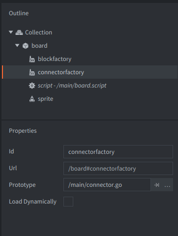

The script for this game object is minimal, it only needs to scale the graphics to make it match the rest of the game, and set the Z order correctly.

```lua
-- connector.script
function init(self)
    go.set_scale(0.18)              -- Set the scale of this game object.
    go.set(".", "position.z", 1)    -- Put on top.
end
```

The function `same_color_neighbors()` returns a list of blocks that are adjacent to a particular block (at position x, y) and of the same color. This function uses the `filter()` function that is applied to the full flat list of blocks in `self.blocks`.

```lua
-- board.script
--
-- Returns a list of neighbor blocks of the same color as the
-- block on x, y
--
local function same_color_neighbors(self, x, y)
    local f = function (v)
        return (v.id ~= self.board[x][y].id) and
               (v.x == x or v.x == x - 1 or v.x == x + 1) and
               (v.y == y or v.y == y - 1 or v.y == y + 1) and
               (v.color == self.board[x][y].color)
    end
    return filter(f, self.blocks)
end
```

A helper function `in_blocklist()` checks whether a block exist in a list of blocks:

```lua
-- board.script
--
-- Does the block exist in the list of blocks?
--
local function in_blocklist(blocks, block)
    for i, b in pairs(blocks) do
        if b.id == block then
            return true
        end
    end
    return false
end
```

We use these functions during touch and drag input in `on_input()` to construct the touched links of blocks. We'll test for and ignore magic blocks here even though there aren't any yet:

```lua
-- board.script
function on_input(self, action_id, action)

    ...

    -- If trying to manipulate magic blocks, ignore.
    if self.board[x][y].color == hash("magic") then
        return
    end

    if action.pressed then
        -- List of neighbors of the same color as touched block
        self.neighbors = same_color_neighbors(self, x, y)
        self.chain = {}
        table.insert(self.chain, self.board[x][y])

        -- Mark block.
        p = go.get_position(self.board[x][y].id)
        local id = factory.create("#connectorfactory", p + centeroff)
        table.insert(self.connectors, id)

        self.dragging = true
    elseif self.dragging then
        -- then drag
        if in_blocklist(self.neighbors, self.board[x][y].id) and not in_blocklist(self.chain, self.board[x][y].id) then
            -- dragging over a same-colored neighbor
            table.insert(self.chain, self.board[x][y])
            self.neighbors = same_color_neighbors(self, x, y)

            -- Mark block.
            p = go.get_position(self.board[x][y].id)
            local id = factory.create("#connectorfactory", p + centeroff)
            table.insert(self.connectors, id)
        end
    end
```

And finally, on touch release, remove all link connectors visually.

```lua
-- board.script
function on_input(self, action_id, action)

    ...

    elseif action_id == hash("touch") and action.released then
        -- Player released touch.
        self.dragging = false

        -- Empty chain of connector graphics.
        for i, c in ipairs(self.connectors) do
            go.delete(c)
        end
        self.connectors = {}
    end
end
```

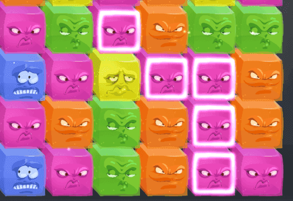

## Remove linked blocks

Now we have the logic in place to allow linking of blocks of the same colors and simply removing the linked blocks is easy. The reason we're setting the position on the board to `hash("removing")` instead of just `nil` is because later, when we do the magic block logic, we need to make sure that the magic blocks slide only into newly removed blocks. If we set the position on the board to `nil` here, we have no way of distinguishing between newly removed blocks and blocks that was previously removed.

```lua
-- board.script
-- Remove the currently selected block-chain
--
local function remove_chain(self)
    -- Delete all chained blocks
    for i, c in ipairs(self.chain) do
        self.board[c.x][c.y] = hash("removing")
        go.delete(c.id)
    end
    self.chain = {}
end
```

We'll also need a function to actually remove (set to `nil`) the positions on the board that has been set to `hash("removed")`:

```lua
-- board.script
--
-- Set removed blocks to nil
--
local function nilremoved(self)
    for y = 0,boardheight - 1 do
        for x = 0,boardwidth - 1 do
            if self.board[x][y] == hash("removing") then
                self.board[x][y] = nil
            end
        end
    end
end
```

We also create a function that slides the remaining blocks down as blocks below them are removed (set to `nil`). We iterate over the board column-wise left to right and go through each column bottom up. If we encounter an empty (`nil`) position, slide all blocks above that position down.

```lua
-- board.script
--
-- Apply shift-down logic to all blocks.
--
local function slide_board(self)
    -- Slide all remaining blocks down into blank spots.
    -- Going column by column makes this easy.
    local dy = 0
    local pos = vmath.vector3()
    for x = 0,boardwidth - 1 do
        dy = 0
        for y = 0,boardheight - 1 do
            if self.board[x][y] ~= nil then
                if dy > 0 then
                    -- Move down dy steps
                    self.board[x][y - dy] = self.board[x][y]
                    self.board[x][y] = nil
                    -- Calc new position
                    self.board[x][y - dy].y = self.board[x][y - dy].y - dy
                    go.animate(self.board[x][y-dy].id, "position.y", go.PLAYBACK_ONCE_FORWARD, bottom_edge + blocksize / 2 + blocksize * (y - dy), go.EASING_OUTBOUNCE, 0.3)
                    -- Calc new z
                    go.set(self.board[x][y-dy].id, "position.z", x * -0.1 + (y-dy) * 0.01)
                end
            else
                dy = dy + 1
            end
        end
    end
    -- blocklist needs updating
    build_blocklist(self)
end
```

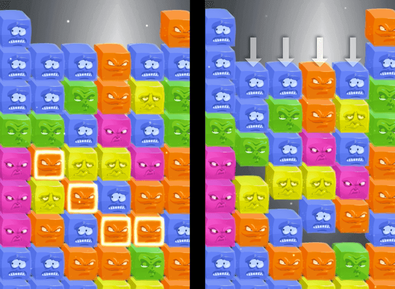

Now we can simply add calls to these functions in `on_input()` when touch has been released and there are blocks in `self.chain`.

```lua
-- board.script
function on_input(self, action_id, action)

    ...

    elseif action_id == hash("touch") and action.released then
        -- Player released touch.
        self.dragging = false

        if #self.chain > 1 then
            -- There is a chain of blocks. Remove it from board and slide the remaining blocks down.
            remove_chain(self)
            nilremoved(self)
            slide_board(self)
        end

        -- Empty chain of connector graphics.
        for i, c in ipairs(self.connectors) do
            go.delete(c)
        end
        self.connectors = {}
    end
```

## Magic block logic

Now it's time to add the magic blocks to the mix. First of all, let's add the ability for a block to become a magic block. That way we can just do a separate path on the filled board and convert the blocks we want into magic ones. To spice the magic blocks up a bit, let's create an animated magic effect first in the form of a game object *magic_fx.go* that we can spawn from the magic block.


This game object contains two sprites. One is the "magic" color (a sprite using the *magic-sphere_layer2.png* image) and the other is a "light" effect (a sprite using the *magic-sphere_layer3.png* image). The object is set to rotate when the object spawns, depending on the value of property "direction". We also make the object listen to two messages: "lights_on" and "lights_off" that control the light effect sprite.

Create a new script and add it as a script component to "magic_fx.go":

```lua
-- magic_fx.script
go.property("direction", hash("left"))

function init(self)
    msg.post("#", "lights_off")
    if self.direction == hash("left") then
        go.set(".", "euler.z", 0)
        go.animate(".", "euler.z", go.PLAYBACK_LOOP_FORWARD, 360,  go.EASING_LINEAR, 3 + math.random())
    else
        go.set(".", "euler.z", 0)
        go.animate(".", "euler.z", go.PLAYBACK_LOOP_FORWARD, -360,  go.EASING_LINEAR, 2 + math.random())
    end
end

function on_message(self, message_id, message, sender)
    if message_id == hash("lights_on") then
        msg.post("#light", "enable")
    elseif message_id == hash("lights_off") then
        msg.post("#light", "disable")
    end
end
```

Now, the magic block will spawn two "magic_fx" game objects upon message "make_magic". Each will rotate in opposite direction creating a nice color dance inside the blocks. We also add an additional sprite to *block.go* with the image *magic-sphere_layer4.png*. This image is put at a Z higher than the spawned effect and draw the shell or "cover" of the magic sphere.


Note that we must add a *Factory* component to the block game object and tell it to use our *magic_fx.go* game object as *Prototype*. The block script need also to listen to messages `lights_on` and `lights_off` and propagate them down to the spawned objects. Note that the spawned objects need to be deleted when the block is deleted. This is taken care of in the block's `final()` function. All this happens in *block.script*.

```lua
-- block.script
function init(self)
    go.set_scale(0.18) -- render scaled down

    self.fx1 = nil
    self.fx2 = nil

    msg.post("#cover", "disable")

    if self.color ~= nil then
        msg.post("#sprite", "play_animation", { id = self.color })
    else
        msg.post("#sprite", "disable")
    end
end

function final(self)
    if self.fx1 ~= nil then
        go.delete(self.fx1)
    end

    if self.fx2 ~= nil then
        go.delete(self.fx2)
    end
end

function on_message(self, message_id, message, sender)
    if message_id == hash("make_magic") then
        self.color = hash("magic")
        msg.post("#cover", "enable")
        msg.post("#sprite", "enable")
        msg.post("#sprite", "play_animation", { id = hash("magic-sphere_layer1") })

        self.fx1 = factory.create("#fxfactory", p, nil, { direction = hash("left") })
        self.fx2 = factory.create("#fxfactory", p, nil, { direction = hash("right") })

        msg.post(self.fx1, "set_parent", { parent_id = go.get_id() })
        msg.post(self.fx2, "set_parent", { parent_id = go.get_id() })

        go.set(self.fx1, "position.z", 0.01)
        go.set(self.fx1, "scale", 1)
        go.set(self.fx2, "position.z", 0.02)
        go.set(self.fx2, "scale", 1)
    elseif message_id == hash("lights_on") or message_id == hash("lights_off") then
        msg.post(self.fx1, message_id)
        msg.post(self.fx2, message_id)
    end
end
```

Now we are able to make magic blocks and also to light those up, an effect that we'll use to indicate that a magic block is sitting next to another magic block.

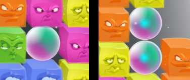

The code that fills the board with blocks now needs to be altered so we get some magic blocks there:

```lua
-- board.script
local function build_board(self)

    ...

    -- Distribute magic blocks.
    local rand_x = 0
    local rand_y
    for y = 0, boardheight - 1, boardheight / self.num_magic do
        local set = false
        while not set do
            rand_y = math.random(math.floor(y), math.min(boardheight - 1, math.floor(y + boardheight / self.num_magic)))
            rand_x = math.random(0, boardwidth - 1)
            if self.board[rand_x][rand_y].color ~= hash("magic") then
                msg.post(self.board[rand_x][rand_y].id, "make_magic")
                self.board[rand_x][rand_y].color = hash("magic")
                set = true
            end
        end
    end

    -- Build 1d list that we can easily filter.
    build_blocklist(self)
end
```

The main mechanic of the magic blocks is their ability to slide sideways when another block disappears beside them. We reflect all details of that mechanic in the `slide_magic_blocks()` function in *board.script*. The algorithm is simple:

1. For each row on the board, create a list `M` of magic blocks.
2. Iterate through each magic block in the list `M` until it does not shrink. For each iteration:
    1. If the magic block has a `hash("removing")` block location below, just remove it from the list `M`.
    2. If the magic block has a hole to the side marked `hash("removing")`, slide it there, set its old position to `hash("removing")` and then remove it from the list `M`.

```lua
-- board.script
-- Apply the shifting logic to magic blocks. Only slide to positions
-- marked for removal with hash("removing")
--
local function slide_magic_blocks(self)
    -- Slide all magic blocks to the side that should slide first.
    -- This works best going row by row!
    local row_m
    for y = 0,boardheight - 1 do
        row_m = {}
        -- Build list of magic blocks on this row.
        for x = 0,boardwidth - 1 do
            if self.board[x][y] ~= nil and self.board[x][y] ~= hash("removing") and self.board[x][y].color == hash("magic") then
                table.insert(row_m, self.board[x][y])
            end
        end

        local mc = #row_m + 1
        -- Go through list, slide and remove if possible. Reiterate until the list does not shrink.
        while #row_m < mc do
            mc = #row_m
            for i, m in pairs(row_m) do
                local x = m.x
                if y > 0 and self.board[x][y-1] == hash("removing") then
                    -- Hole below, do nothing.
                    row_m[i] = nil
                elseif x > 0 and self.board[x-1][y] == hash("removing") then
                    -- Hole to the left! Slide magic block there
                    self.board[x-1][y] = self.board[x][y]
                    self.board[x-1][y].x = x - 1
                    go.animate(self.board[x][y].id, "position.x", go.PLAYBACK_ONCE_FORWARD, edge + blocksize / 2 + blocksize * (x - 1), go.EASING_OUTBOUNCE, 0.3)
                    -- Calc new z
                    go.set(self.board[x][y].id, "position.z", (x - 1) * -0.1 + y * 0.01)
                    self.board[x][y] = hash("removing") -- Will be nilled later
                    row_m[i] = nil
                elseif x < boardwidth - 1 and self.board[x + 1][y] == hash("removing") then
                    -- Hole to the right. Slide magic block there
                    self.board[x+1][y] = self.board[x][y]
                    self.board[x+1][y].x = x + 1
                    go.animate(self.board[x+1][y].id, "position.x", go.PLAYBACK_ONCE_FORWARD, edge + blocksize / 2 + blocksize * (x + 1), go.EASING_OUTBOUNCE, 0.3)
                    -- Calc new z
                    go.set(self.board[x+1][y].id, "position.z", (x + 1) * -0.1 + y * 0.01)
                    self.board[x][y] = hash("removing") -- Will be nilled later
                    row_m[i] = nil
                end
            end
        end
    end
end
```

We can try the mechanic by adding a call to the function in `on_input()`:

```lua
-- board.script
function on_input(self, action_id, action)

    ...

    elseif action_id == hash("touch") and action.released then
        -- Player released touch.
        self.dragging = false

        if #self.chain > 1 then
            -- There is a chain of blocks. Remove it from board
            remove_chain(self)
            slide_magic_blocks(self)
            nilremoved(self)
            -- Slide remaining blocks down.
            slide_board(self)
        end
        self.chain = {}
        -- Empty chain clears connector graphics.
        connect_chain(self, x, y)
    end
```

Now we see clearly why we did use the intermediate `hash("removing")` "tag" on positions when removing them. Without it, magic blocks would slide back and forth into any empty position to the side. Maybe an interesting mechanic, but not the one intended for this little game.

Now we need logic to detect if magic blocks are connected (sitting left, right, above or below each other), and we need to know if all the magic blocks on the board are connected. The algorithm used is pretty straightforward:

1. Make a list `M` of all magic blocks on the board.
2. For each block in the list `M`:
    1. If the block has no `region` set, assign it region number `R` (initially `1`).
    2. Mark the block's all unmarked neighbors with the same region number `R` and iterate to their neighbors, their neighbors neighbors and so on.
    3. Increase the region number `R` by `1`.

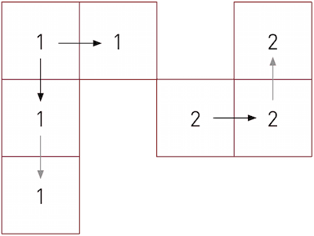

Here's the implementation of the algorithm:

```lua
-- board.script
--
-- Build list of all current magic blocks.
--
local function magic_blocks(self)
    local magic = {}
    for x = 0,boardwidth - 1 do
        for y = 0,boardheight - 1 do
            if self.board[x][y] ~= nil and self.board[x][y].color == hash("magic") then
                table.insert(magic, self.board[x][y])
            end
        end
    end
    return magic
end

--
-- Filter out adjacent magic blocks
--
local function adjacent_magic_blocks(blocks, block)
    return filter(function (e)
        return (block.x == e.x and math.abs(block.y - e.y) == 1) or
            (block.y == e.y and math.abs(block.x - e.x) == 1)
    end, blocks)
end

--
-- Spread region to neighbors
--
local function mark_neighbors(blocks, block, region)
    local neighbors = adjacent_magic_blocks(blocks, block)
    for i, m in pairs(neighbors) do
        if m.region == nil then
            m.region = region
            mark_neighbors(blocks, m, region)
        end
    end
end

--
-- Mark all magic block regions
--
local function mark_magic_regions(self)
    local m_blocks = magic_blocks(self)
    -- 1. Clear all region marks and count neighbors
    for i, m in pairs(m_blocks) do
        m.region = nil
        local n = 0
        for _ in pairs(adjacent_magic_blocks(m_blocks, m)) do n = n + 1 end
        m.neighbors = n
    end

    -- 2. Assign regions and spread them
    local region = 1
    for i, m in pairs(m_blocks) do
        if m.region == nil then
            m.region = region
            mark_neighbors(m_blocks, m, region)
            region = region + 1
        end
    end
    return m_blocks
end
```

We also create functions that allows us to count the number of regions among the magic blocks. If the number of regions is 1, we know that all magic blocks are connected. Furthermore, we add a function that shuts down the lights in all magic blocks and one that turns on the light effects in the magic blocks that have neighbor magic blocks:

```lua
-- board.script
--
-- Count the number of connected regions among the magic blocks.
--
local function count_magic_regions(blocks)
    local maxr = 0
    for i, m in pairs(blocks) do
        if m.region > maxr then
            maxr = m.region
        end
    end
    return maxr
end

--
-- Shut off lights on all listed magic blocks
--
local function shutdown_lined_up_magic(self)
    for i, m in ipairs(self.lined_up_magic) do
        msg.post(m.id, "lights_off")
    end
end

--
-- Set highlight for all magic blocks
--
local function highlight_magic(blocks)
    for i, m in pairs(blocks) do
        if m.neighbors > 0 then
            msg.post(m.id, "lights_on")
        else
            msg.post(m.id, "lights_off")
        end
    end
end
```

Now we can insert these bits of logic into the overall flow. First, since the board generation is random there is a slight chance that it will begin in the winning state. If that happens, we just discard the board and build it again:

```lua
-- board.script
--
-- Clear the board
--
local function clear_board(self)
    for y = 0,boardheight - 1 do
        for x = 0,boardwidth - 1 do
            if self.board[x][y] ~= nil then
                go.delete(self.board[x][y].id)
                self.board[x][y] = nil
            end
        end
    end
end

local function build_board(self)

    ...

    -- Build 1d list that we can easily filter.
    build_blocklist(self)

    local magic_blocks = mark_magic_regions(self)
    if count_magic_regions(magic_blocks) == 1 then
        -- "Win" from start. Make new board.
        clear_board(self)
        build_board(self)
    end
    highlight_magic(magic_blocks)
end
```

The rest of the logic fits in `on_input()`. There's still no code for dealing with the `level_completed` message, but that's fine for now:

```lua
-- board.script
function on_input(self, action_id, action)

    ...

    elseif action_id == hash("touch") and action.released then
        -- Player released touch.
        self.dragging = false

        if #self.chain > 1 then
            -- There is a chain of blocks. Remove it from board and refill board.
            remove_chain(self)
            slide_magic_blocks(self)
            nilremoved(self)
            -- Slide remaining blocks down.
            slide_board(self)

            local magic_blocks = mark_magic_regions(self)
            -- Highlight adjacent magic blocks.
            if count_magic_regions(magic_blocks) == 1 then
                -- Win!
                msg.post("#", "level_completed")
            end
            highlight_magic(magic_blocks)
        end
        self.chain = {}
        -- Empty chain clears connector graphics.
        connect_chain(self, x, y)
    end
```

Now it's possible to play the game and reach the winning state, even though nothing happens yet when you link all the magic blocks.

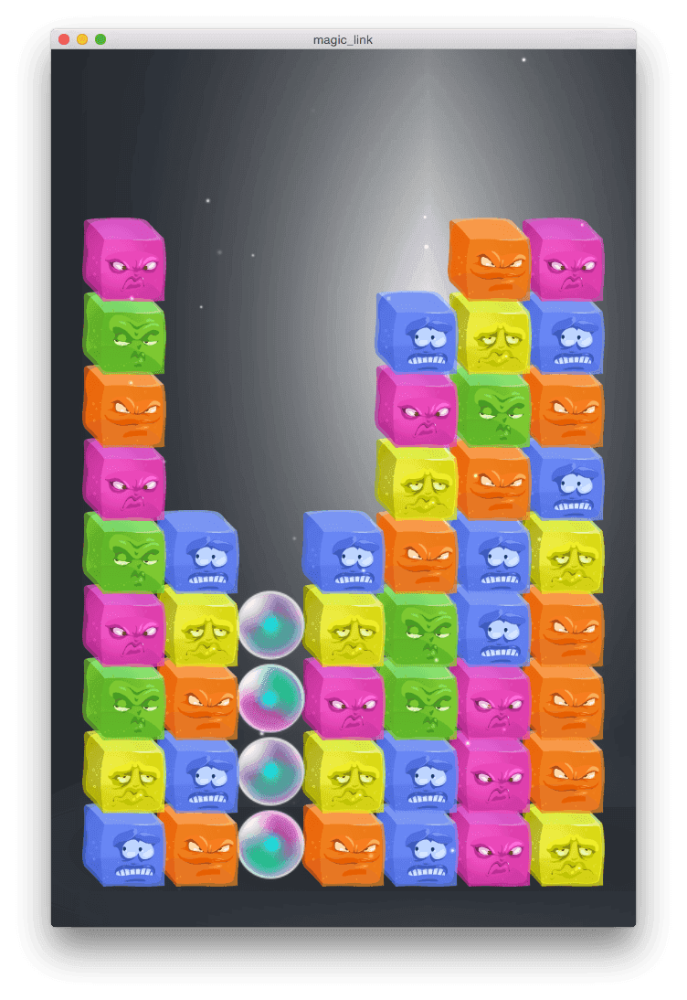

## Drops

The idea with the "drop" is to add a simple progression mechanic. The player can perform a limited number of "drop", which simply drops a couple of new random pieces down onto the board, by pressing the *DROP* button. The player starts with one drop and each time a level is cleared, an additional drop is awarded. The code for the drop mechanic fits in two functions. One that returns a list of possible spots where drops can end up, and one that does the actual drop with animation and all.

```lua
-- board.script
--
-- Find spots for a drop.
--
local function dropspots(self)
    local spots = {}
    for x = 0, boardwidth - 1 do
        for y = 0, boardheight - 1 do
            if self.board[x][y] == nil then
                table.insert(spots, { x = x, y = y })
                break
            end
        end
    end
    -- If more than dropamount, randomly remove a slot until dropamount
    for c = 1, #spots - dropamount do
        table.remove(spots, math.random(#spots))
    end
    return spots
end

--
-- Perform the drop
--
local function drop(self, spots)
    for i, s in pairs(spots) do
        local pos = vmath.vector3()
        pos.x = edge + blocksize / 2 + blocksize * s.x
        pos.y = 1000
        c = colors[math.random(#colors)]    -- Pick a random color
        local id = factory.create("#blockfactory", pos, null, { color = c })
        go.animate(id, "position.y", go.PLAYBACK_ONCE_FORWARD, bottom_edge + blocksize / 2 + blocksize * s.y, go.EASING_OUTBOUNCE, 0.5)
        -- Calc new z
        go.set(id, "position.z", s.x * -0.1 + s.y * 0.01)

        self.board[s.x][s.y] = { id = id, color = c,  x = s.x, y = s.y }
    end

    -- Rebuild blocklist
    build_blocklist(self)
end
```

We can test drops by running the following in, for instance `on_reload()`, or my tying it to a temporary input action:

```lua
s = dropspots(self)
if #s > 0 then
    -- Do the drop
    drop(self, s)
end
```

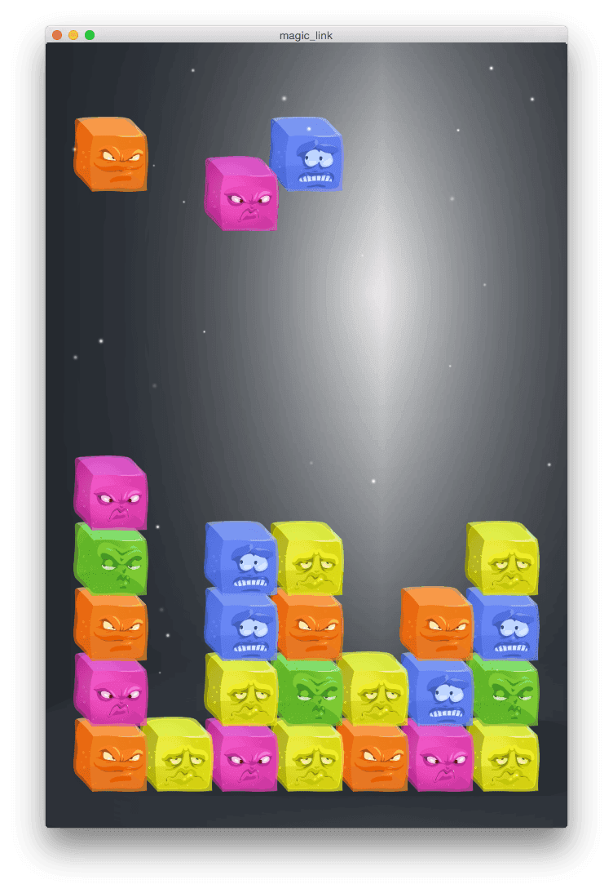

## The main menu

Now it's time to put the whole thing together. First of all, let's create a start-screen and separate it from the board. Step 1 is to create a *main_menu.gui* and set it up with a *Start* button (a text node and a textured box node), a title text node and some decorative blocks (textured box nodes). The script *main_menu.gui_script* that we attach to the GUI animates the decorative blocks in `init()`. It also contains an `on_input()` that sends a `start_game` message to a main script. We'll create that script in a minute.

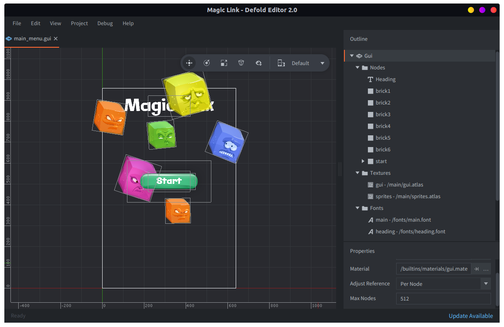

```lua
-- main_menu.gui_script
function init(self)
    msg.post(".", "acquire_input_focus")

    local bs = { "brick1", "brick2", "brick3", "brick4", "brick5", "brick6" }
    for i, b in ipairs(bs) do
        local n = gui.get_node(b)
        local rt = (math.random() * 3) + 1
        local a = math.random(-45, 45)
        gui.set_color(n, vmath.vector4(1, 1, 1, 0))

        gui.animate(n, "position.y", -100 - math.random(0, 50), gui.EASING_INSINE, 1 + rt, 0, nil, gui.PLAYBACK_LOOP_FORWARD)
        gui.animate(n, "color.w", 1, gui.EASING_INSINE, 1 + rt, 0, nil, gui.PLAYBACK_LOOP_FORWARD)
        gui.animate(n, "rotation.z", a, gui.EASING_INSINE, 1 + rt, 0, nil, gui.PLAYBACK_LOOP_FORWARD)
    end

    gui.animate(gui.get_node("start"), "color.x", 1, gui.EASING_INOUTSINE, 1, 0, nil, gui.PLAYBACK_LOOP_PINGPONG)
end

function on_input(self, action_id, action)
    if action_id == hash("touch") and action.pressed then
        local start = gui.get_node("start")

        if gui.pick_node(start, action.x, action.y) then
            msg.post("/main#script", "start_game")
        end
    end
end
```

Since the job of starting the game is soon going to be done by the main menu script, remove the temporary board setup call in `init()` in *board.script*:

```lua
-- board.script
--
-- INIT
--
function init(self)
    self.board = {}                -- Contains the board structure
    self.blocks = {}            -- List of all blocks. Used for easy filtering on selection.

    self.chain = {}                -- Current selection chain
    self.connectors = {}        -- Connector elements to mark the selection chain
    self.num_magic = 3            -- Number of magic blocks on the board

    self.drops = 1                -- Number of drops you have available

    self.magic_blocks = {}        -- Magic blocks that are lined up

    self.dragging = false        -- Drag touch input
end
```

The main script will keep the overall game state and start the game on request. What we want to do here is to make the *main.collection* contain only the minimum amount of assets that we need to show on startup. We do that by letting *main.collection* contain a "main" game object that holds the main menu GUI, a script component and, most importantly, a *Collection Proxy* component.

The collection proxy allows us to dynamically load and unload collections into the running game. It acts on behalf of a specified collection file and we load, init, enable, disable and unload the dynamic collection by sending messages to the proxy. For a complete description on how to use them, see the [Collection Proxy documentation](/manuals/collection-proxy).

In our case we set the *Collection* property of the collection proxy component to *board.collection* that contains the "level".

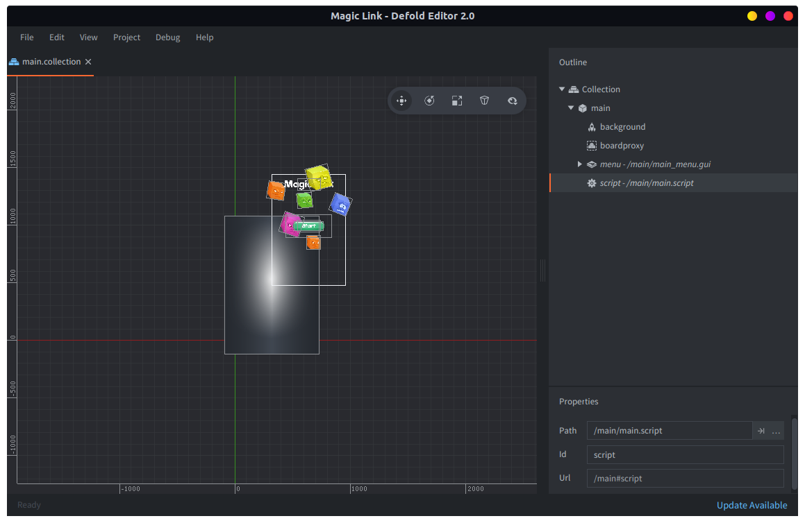

We should now open *game.project* and change the bootstrap *main_collection* to "/main/main.collectionc".

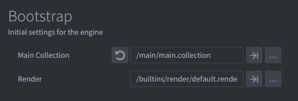

Now, starting a game means messaging our collection proxy to load, init and enable the board, and then to disable the main menu (to make it not show). Coming back to the main menu does the reverse (given that the proxy has loaded the collection).

```lua
-- main.script
function init(self)
    msg.post("#", "to_main_menu")
    self.state = "MAIN_MENU"
end

function on_message(self, message_id, message, sender)
    if message_id == hash("to_main_menu") then
        if self.state ~= "MAIN_MENU" then
            msg.post("#boardproxy", "unload")
        end
        msg.post("main:/main#menu", "enable") -- <1>
        self.state = "MAIN_MENU"
    elseif message_id == hash("start_game") then
        msg.post("#boardproxy", "load")
        msg.post("#menu", "disable")
    elseif message_id == hash("proxy_loaded") then
        -- Board collection has loaded...
        msg.post(sender, "init")
        msg.post("board:/board#script", "start_level", { difficulty = 1 }) -- <2>
        msg.post(sender, "enable")
        self.state = "GAME_RUNNING"
    end
end
```
1. Note that we call the socket "main", which is a name we need to make sure we have set on *main.collection*. Select the root node and check that the *Name* property is "main".
2. Similarly, we send messages to the loaded collection through its socket, named through the *Name* property in the collection.

## The in-game GUI

Before we add the final piece of logic to the board script, we should add a set of GUI elements to the board. First, on top of the board, we add a *RESTART* button and a *DROP* button.

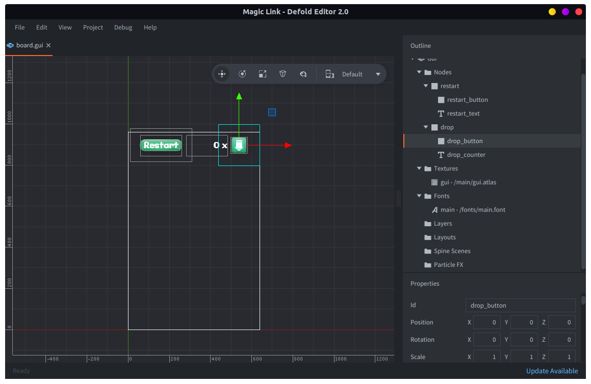

The script for the board GUI sends messages to the restart GUI dialog element on click and back to the board script itself when clicking *DROP*:

```lua
-- board.gui_script
function init(self)
    msg.post("#", "show")
    msg.post("/restart#gui", "hide")
    msg.post("/level_complete#gui", "hide")
end

function on_message(self, message_id, message, sender)
    if message_id == hash("hide") then
        msg.post("#", "disable")
    elseif message_id == hash("show") then
        msg.post("#", "enable")
    elseif message_id == hash("set_drop_counter") then
        local n = gui.get_node("drop_counter")
        gui.set_text(n, message.drops .. " x")
    end
end

function on_input(self, action_id, action)
    if action_id == hash("touch") and action.pressed then
        local restart = gui.get_node("restart")
        local drop = gui.get_node("drop")

        if gui.pick_node(restart, action.x, action.y) then
            -- Show the restart dialog box.
            msg.post("/restart#gui", "show")
            msg.post("#", "hide")
        elseif gui.pick_node(drop, action.x, action.y) then
            msg.post("/board#script", "drop")
        end
    end
end
```

The *RESTART* dialog is simple. We build it as *restart.gui* and attach a simple script that does nothing if the player clicks *NO*, sends a `restart_level` message to the board script if the player clicks *YES* and a `to_main_menu` message to the main script if the player clicks *Quit to main menu*:


```lua
-- restart.gui_script
function on_message(self, message_id, message, sender)
    if message_id == hash("hide") then
        msg.post("#", "disable")
        msg.post(".", "release_input_focus")
    elseif message_id == hash("show") then
        msg.post("#", "enable")
        msg.post(".", "acquire_input_focus")
    end
end

function on_input(self, action_id, action)
    if action_id == hash("touch") and action.pressed then
        local yes = gui.get_node("yes")
        local no = gui.get_node("no")
        local quit = gui.get_node("quit")

        if gui.pick_node(no, action.x, action.y) then
            msg.post("#", "hide")
            msg.post("/board#gui", "show")
        elseif gui.pick_node(yes, action.x, action.y) then
            msg.post("board:/board#script", "restart_level")
            msg.post("/board#gui", "show")
            msg.post("#", "hide")
        elseif gui.pick_node(quit, action.x, action.y) then
            msg.post("main:/main#script", "to_main_menu")
            msg.post("#", "hide")
        end
    end
    -- Consume all input until we're gone.
    return true
end
```

We also construct a simple GUI dialog for level completion in *level_complete.gui* with a simple script that sends a `next_level` message to the board script when the player clicks *CONTINUE*:

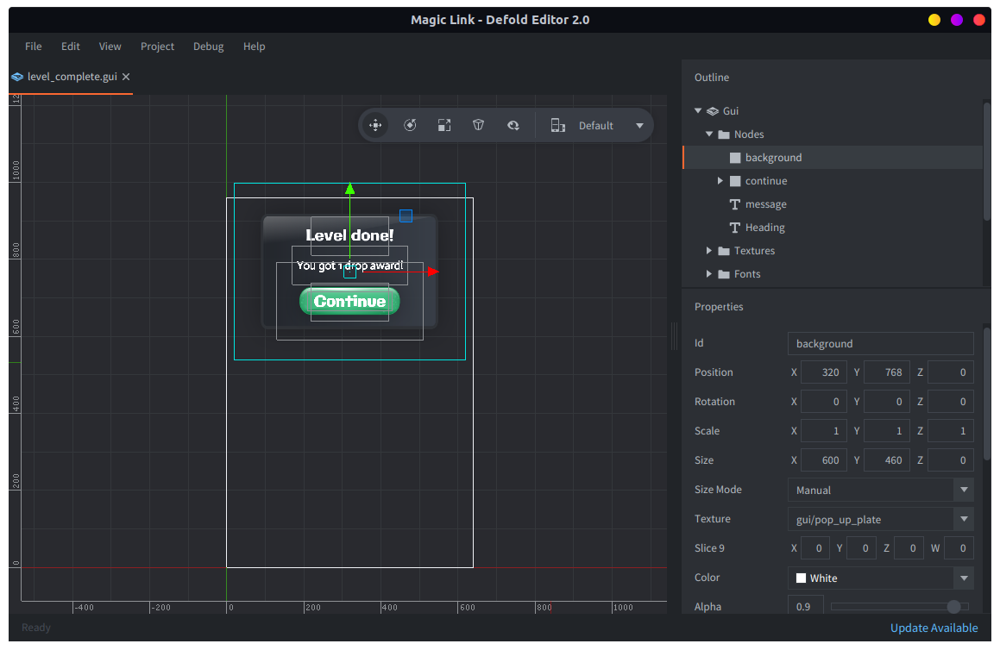

```lua
-- level_complete.gui_script
function init(self)
    msg.post("#", "hide")
end

function on_message(self, message_id, message, sender)
    if message_id == hash("hide") then
        msg.post("#", "disable")
        msg.post(".", "release_input_focus")
    elseif message_id == hash("show") then
        msg.post("#", "enable")
        msg.post(".", "acquire_input_focus")
    end
end

function on_input(self, action_id, action)
    if action_id == hash("touch") and action.pressed then
        local continue = gui.get_node("continue")

        if gui.pick_node(continue, action.x, action.y) then
            msg.post("board#script", "next_level")
            msg.post("#", "hide")
        end
    end
    -- Consume all input until we're gone.
    return true
end
```

A dialog that is used to present the current level, with a script that just includes hiding and showing the dialog. When showing, the dialog message is set to a message including the current difficulty level:


```lua
-- present_level.gui_script
function init(self)
    msg.post("#", "hide")
end

function on_message(self, message_id, message, sender)
    if message_id == hash("hide") then
        msg.post("#", "disable")
    elseif message_id == hash("show") then
        local n = gui.get_node("message")
        gui.set_text(n, "Level " .. message.level)
        msg.post("#", "enable")
    end
end
```

We also add a dialog that shows if the player tries to do a drop but there is no room for it.


```lua
-- no_drop_room.gui_script
function init(self)
    msg.post("#", "hide")
    self.t = 0
end

function update(self, dt)
    if self.t < 0 then
        msg.post("#", "hide")
    else
        self.t = self.t - dt
    end
end

function on_message(self, message_id, message, sender)
    if message_id == hash("hide") then
        msg.post("#", "disable")
    elseif message_id == hash("show") then
        self.t = 1
        msg.post("#", "enable")
    end
end
```

Finally, we add these GUI components to *board.collection* and add the necessary code to *board.script*:

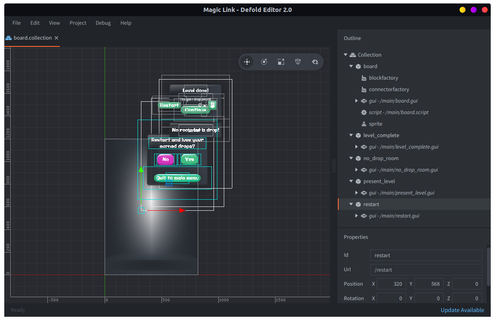

We need code for all messages that are sent to and from the board in `on_message()`.

`start_level`
: Set the number of magic blocks according to the difficulty parameter, build the board and then show the "present_level" GUI dialog for 2 seconds before starting the game (removing the dialog and acquiring input focus). Note that we use `go.animate()` as a timer by animating the value of "timer", which is not used for anything else.

`restart_level`
: This is what happens when the player presses and confirms the *RESTART* GUI button. Clear and rebuild the board and reset the drop counter.

`level_completed`
: Sent as soon as the board is in a winning state. Turn off input, animate the magic blocks and show the "level_complete" GUI dialog. The dialog will send back a `next_level` message when the player clicks the *CONTINUE* button in the dialog.

`next_level`
: When this message is received, clear the board, increase the drop counter and send `start_level` with the next difficulty level set.

`drop`
: Check where drops can be made. If there are no possible spots, show the "no_drop_room" GUI dialog, otherwise perform the drop (if the player has drops left), decrease the drop counter and update the visual representation of the counter.

```lua
-- board.script
function on_message(self, message_id, message, sender)
    if message_id == hash("start_level") then
        self.num_magic = message.difficulty + 1
        build_board(self)

        msg.post("#gui", "set_drop_counter", { drops = self.drops } )

        msg.post("present_level#gui", "show", { level = message.difficulty } )
        -- Wait some...
        go.animate("#", "timer", go.PLAYBACK_ONCE_FORWARD, 1, go.EASING_LINEAR, 2, 0, function ()
            msg.post("present_level#gui", "hide")
            msg.post(".", "acquire_input_focus")
        end)
    elseif message_id == hash("restart_level") then
        clear_board(self)
        build_board(self)
        self.drops = 1
        msg.post("#gui", "set_drop_counter", { drops = self.drops } )
        msg.post(".", "acquire_input_focus")
    elseif message_id == hash("level_completed") then
        -- turn off input
        msg.post(".", "release_input_focus")

        -- Animate the magic!
        for i, m in ipairs(magic_blocks(self)) do
            go.set_scale(0.17, m.id)
            go.animate(m.id, "scale", go.PLAYBACK_LOOP_PINGPONG, 0.19, go.EASING_INSINE, 0.5, 0)
        end

        -- Show completion screen
        msg.post("level_complete#gui", "show")
    elseif message_id == hash("next_level") then
        clear_board(self)
        self.drops = self.drops + 1
        -- Difficulty level is number of magic blocks - 1
        msg.post("#", "start_level", { difficulty = self.num_magic })
    elseif message_id == hash("drop") then
        s = dropspots(self)
        if #s == 0 then
            -- Can't perform drop
            msg.post("no_drop_room#gui", "show")
        elseif self.drops > 0 then
            -- Do the drop
            drop(self, s)
            self.drops = self.drops - 1
            msg.post("#gui", "set_drop_counter", { drops = self.drops } )
        end
    end
end
```

There you go! The game, and this tutorial, is now completed! Go enjoy playing this game!

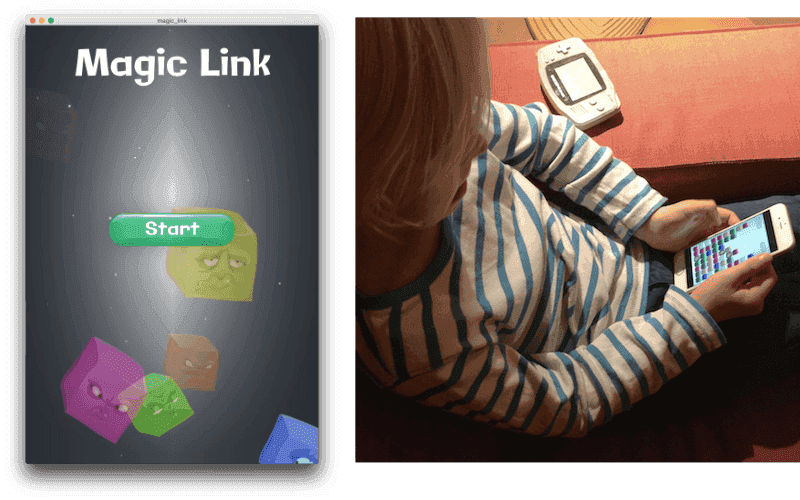

## Moving on

This little game has some interesting properties and you are encouraged to experiment with it.Here is a list of exercises that you can do to become more familiar with Defold:

* Clarify interaction. A new player may have a hard time understanding how the game works and what she can interact with. Spend some time making the game more clear, without inserting tutorial elements.
* Add sounds. The game is currently totally silent and would benefit from a nice soundtrack and interaction sounds.
* Auto detect game over.
* High score. Add a high score functionality that is persistent.
* Re-implement the game using only the GUI APIs.
* Currently, the game continues by adding one magic block for each level increase. That is not sustainable forever. Find a satisfying solution to this problem.
* Optimize the game and bring the maximum sprite count down by reusing sprites instead of deleting and re-spawning them.
* Implement resolution independent rendering of the game so it looks equally good on screens with different resolutions and aspect ratios.
