# Runner tutorial

In this tutorial we start with an empty project and build a complete runner game with an animated character, physics collision, pickups and scoring. Before we begin, take a moment and try the game and get a feel for what we are about to create:

<div id="game-container" class="game-container">
  
  <canvas id="game-canvas" tabindex="1" width="1280" height="720">
  </canvas>
  <button id="game-button">
    START GAME <span class="icon"></span>
  </button>
  <script type='text/javascript' src="//storage.googleapis.com/defold-doc/assets/dmloader.js"></script>
  <script type='text/javascript' src="//storage.googleapis.com/defold-doc/assets/dmengine_1_2_106.js" async></script>
  <script type='text/javascript'>
      /* Load app on click in container. */
      document.getElementById("game-button").onclick = function (e) {
          var extra_params = {
              archive_location_filter: function( path ) {
                  return ("//storage.googleapis.com/defold-doc/assets/runner" + path + "");
              },
              load_done: function() {},
              game_start: function() {
                  var e = document.getElementById("game-preview");
                  e.parentElement.removeChild(e);
              }
          }
          Module.runApp("game-canvas", extra_params);
          document.getElementById("game-button").style.display = 'none';
          document.getElementById("game-button").onclick = null;
      };
  </script>
</div>

There is a lot to take in when learning a new game engine, so we have created this tutorial to get you started. It is a fairly complete tutorial that walks through how the engine and the editor works. We assume that you have some famililiarity with programming.

If you need an introduction to Lua programming, check out our [Lua in Defold manual](/manuals/lua).

If you feel that this tutorial is a bit too much to begin with, please check out our [tutorials page](//www.defold.com/tutorials) where we have a selection of tutorials of varied difficulty.

If you prefer to watch video tutorials, please check out [the video version on Youtube](https://www.youtube.com/playlist?list=PLXsXu5srjNlxtYPQ_YJQSxJG2AN9OVS5b).

We use game assets from two other tutorials, with some small modifications. The tutorial is divided into several steps, with each part taking us a significant step towards the final game.

The end result will be a game where you control a frog that runs through an environments, collecting coins and avoiding obstacles. The frog runs at fixed speed and the player controls only the frog's jumping by the press of a single button (or screen touch on a mobile device). The level consists of an endless stream of platforms to jump on - and of coins to collect.

If you at any point get stuck on this tutorial or when creating your game don't hesitate to ask us for help at the [Defold Forum](//forum.defold.com). In the forum you can discuss Defold, ask for help from the Defold team, see how other game developers solved their problems and find new inspiration. Get started now.

::: sidenote
Throughout the tutorial, detailed descriptions on concepts and how to do certain moments are marked like this paragraph. If you feel that these section go into too much detail, please skip them.
:::

So let's begin. We hope you will have a lot of fun going through this tutorial and that it helps you getting going with Defold.

<a name="part-1"></a>
## STEP 1 - Installation and setup

The first step is to download the following package. It is a zip package that contains all content that you need to create the tutorial game.

<a class="btn btn-primary btn-xs-block btn-icon" href="//storage.googleapis.com/defold-doc/assets/runner-assets.zip">Download asset package<span aria-hidden="true" class="icon icon-download"></span></a>

Now it's time to create a new project and getting it ready. If you are familiar with the process, head over to [www.defold.com](//www.defold.com) and log in to the dashboard. If you are not familiar with the steps, here they are.

* If you haven't yet signed up to be a Defold developer, do so!
* When you signed up a "Getting Started Tutorial" project was created for you. Use this project for the tutorial.
* Alternativly you can create a new project on the [Defold Dashboard](//www.defold.com/dashboard/). In this tutorial we choose to start from a blank slate.


Now, if you haven't already downloaded and installed the Defold editor, it's time to do that. You find the download link on the [Defold Dashboard](//www.defold.com/dashboard/). Then start the program.


## The editor

The first time you start the editor, you will be prompted to log in to the Defold server where all your project data is stored. The editor starts blank, without any project open so choose <kbd>File ▸ Open Project</kbd> from the menu and select your newly created project. You will also be prompted to create a "branch" for the project.

::: sidenote
Defold uses Git to store and sync your code between different computers or team members. A branch is a local copy of the code that is stored on your computer and you can can have multiple branches if you are working on multiple versions of your game. You can name your branch anything, but we recommend naming it "master".

For the Git savvy people---the branches you create in the editor are local branches only.

When you do that a local copy of the whole project will be created on your computer. Any changes you do to the project will be saved in the branch. Whenever you select <kbd>File ▸ Synchronize</kbd> from the menu, your branch will be synchronized with the project on the Defold server. This means that your changes will be sent to the server and any changes that may have happened on the server is brought to your branch. If you're working in a team this is very powerful for collaboration.

The [Workflow documentation](//www.defold.com/manuals/workflow) explains how all this works in more detail.
:::

Now, in the *Project Explorer* you will see all files that are part of the project. If you double-click the file "main/main.collection" the file will open up in the editor view in the center:


The editor consists of the following main areas:

Project Explorer
: This is a view of all files in your project. Different file types have different icons. Double click on a file to open in in a designated editor for that file type. The special read-only folder *builtins* is common for all projects and include useful items like a default render script, a font, materials for rendering various components and other things.

Main Editor View
: Depending on which filetype you're editing, this view will show an editor for that type. Most commonly used is the Scene editor that you see here. Each open file is shown in a separate tab.

Changed Files
: Contains a list of all the edits you have made in your branch since last synchronization. So if you see anything in this pane, you have changes that are not on the server yet. You can open a text-only diff and revert changes through this view.

Outline
: The content of the currently edited file in a hierarchical view. You can add, delete, modify and select objects and components through this view.

Properties
: The properties set on the currently selected object or component.

Console
: When running the game, this view captures output (logging, errors, debug info etc) coming from the game engine, and also any custom `print()` and `pprint()` debug messages from your scripts. If your app or game won't start the console is the first thing to check. Behind the console are a set of tabs displaying error information as well as a curve editor that is used when building particle effects.

## Running the game

The "Empty" project template actually isn't completely empty. As you've already seen, it contains one game object with a simple image. Select <kbd>Project ▸ Build and Launch</kbd> to build the project and launch the game.

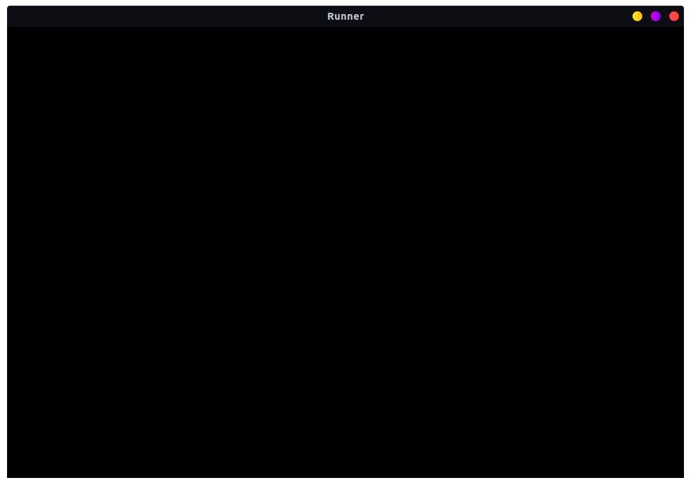

It's perhaps not very exciting, but it's a running Defold game application and we can easily modify it into something more interesting. So let's do that.

First of all, let's clean the *main.collection* file of the one game object it contains.

* Double click the file *main.collection* to open it in the editor.
* Select (click) "logo" in the *Outline* view to the right.
* Right-click and select <kbd>Delete</kbd> from the pop up menu.
* Save the file. Select <kbd>File ▸ Save</kbd> in the main menu.
That's it!

::: sidenote
The Defold editor works on files. By double-clicking a file in the *Project Explorer* you open it in a suitable editor. You can then work with the contents of the file.

When you are done editing a file you have to save it. Select <kbd>File ▸ Save</kbd> in the main menu. The editor gives a hint by adding an asterisk '\*' to the filename in the tab for any file that contain unsaved changes.
  

:::


If you run the game again, the application window will be totally black.

<a name="part-2"></span></a>
## STEP 2 - Creating the ground

Let's take the first baby steps and create an arena for our character, or rather a piece of scrolling ground. We do this in a few steps. If you haven't already, download the following zip package containing all the assets you need.

<a class="btn btn-primary btn-xs-block btn-icon" href="//storage.googleapis.com/defold-doc/assets/runner-assets.zip">Download asset package<span aria-hidden="true" class="icon icon-download"></span></a>

1. Import the image assets into the project by dragging the files "ground01.png" and "ground02.png" image files (from the sub-folder "level-images" in the asset package) into a suitable location in the project, for instance the folder "images" inside the "main" folder.
2. Create a new *Atlas* file to hold the ground textures (right-click a suitable folder, for instance the *main* folder, in the *Project Explorer* and select <kbd>New ▸ Atlas File</kbd>). Name the atlas file *level.atlas*.

  ::: sidenote
  An *Atlas* is a file that combines a set of separate images into one larger image file. The reason for doing that is to save space and also to gain performance. You can read more about Atlases and other 2D graphics features in the [2D graphics documentation](/manuals/2dgraphics).
  :::

3. Add the ground images to the new atlas by right-clicking the atlas root in the *Outline* and select <kbd>Add Images</kbd>. Select the imported images and click *OK*. Each image in the atlas is now accessible as a one-frame animation (still image) to use in sprites, particle effects and other visual elements. Save the file.

  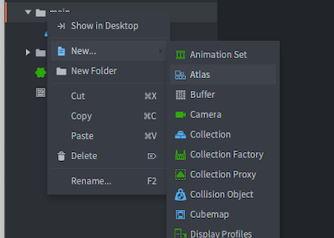

  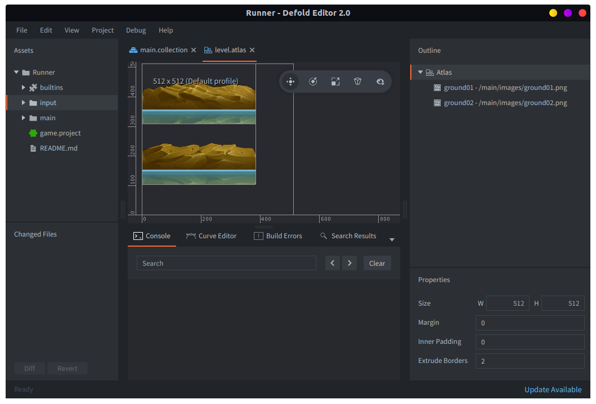

  ::: sidenote
  *Why doesn't it work!?* A common problem people have when they starting with Defold is forgetting to save! After adding images to an atlas you need to save the file before you can access that image.
  :::

4. Create a collection file *ground.collection* for the ground and add 7 game objects to it (right-click the root of the collection in the *Outline* view and select <kbd>Add Game Object</kbd>). Name the objects "ground0", "ground1", "ground2" etc by changing the *Id* property in the *Properties* view. Note that Defold automatically assigns new game objects a unique id.

5. In each object, add a sprite component (right-click the game object in the *Outline* view and select <kbd>Add Component</kbd>, then select *Sprite* and click *OK*), set the *Image* property of the sprite component to the atlas you just created and set the default animation of the sprite to one of the two ground images. Set the X position of the _sprite component_ (not the game object) to 190. Since the width of the image is 380 pixels and we shift it sideways half as many pixels, the pivot of the game object will be at the leftmost edge of the sprite image.

  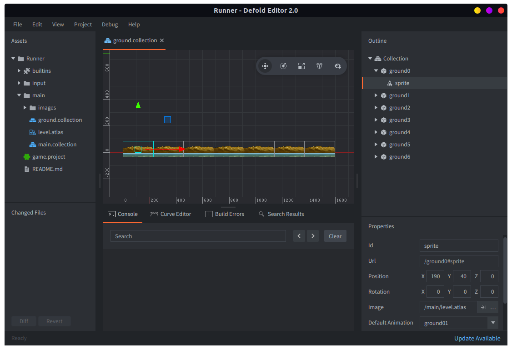

6. The graphics we're using is a bit too large so scale each game object to 60% (0.6 scaling in X and Y, resulting in 228 pixel wide ground pieces).

  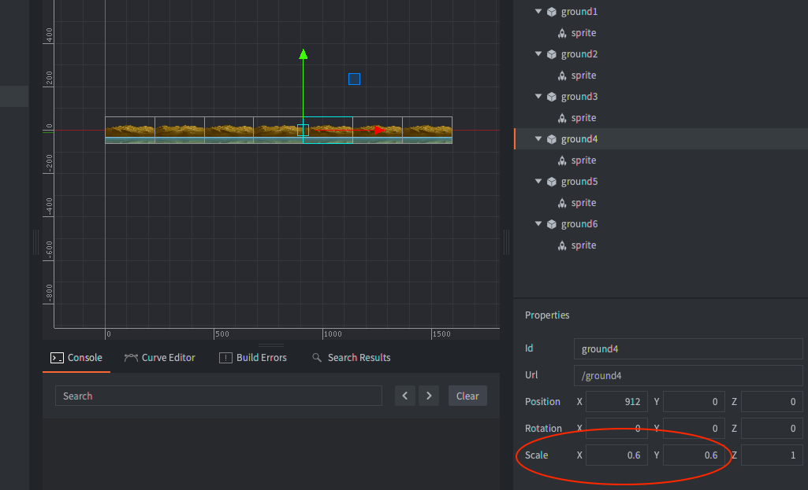

7. Position all the _game objects_ in line. Set the X positions of the _game objects_ (not sprite components) to 0, 228, 456, 684, 912, 1140 and 1368 (multiples of the width 228 pixels).

  ::: sidenote
  It's probably easiest to create one complete scaled game object with a sprite component and then copy it. Mark it in the *Outline* view, then select <kbd>Edit ▸ Copy</kbd> and then <kbd>Edit ▸ Paste</kbd>.

  It is worth noticing that if you want larger or smaller tiles you can just change the scaling. However, doing so will also require that you change the X positions of all ground game objects to multiples of the new width.
  :::

8. Save the file, then add *ground.collection* to the *main.collection* file: first double click the *main.collection* file, then right-click the root object in the *Outline* view and select <kbd>Add Collection From File</kbd>. In the dialog, select *ground.collection* and click *OK*. Make sure you place *ground.collection* in position 0, 0, 0 or it will be offset visually. Save it.

9. Start up the game (<kbd>Project ▸ Build and Launch</kbd> to see that everything is in place.

  

By now you might be confused and wonder about what all these things that we have been creating really are, so let us take a moment and look at the most basic building blocks in any Defold project:

Game objects
: These are things that exist in the running game. Each game object has a location in 3D space, a rotation and scaling. It doesn't necessarily have to be visible. A game object holds any number of _components_ that adds abilities like graphics (sprites, tilemaps, models, spine models and particle effects), sounds, physics, factories (for spawning) and more. Lua _script components_ can also be added to give a game object behaviors. Each game object that exist in your games has an *id* that you need in order to communicate with it, through message passing.

Collections
: Collections do not exist by themselves in a running game but are used to enable static naming of game object and at the same time allowing multiple instances of the same game object. In practice, collections are used as containers for game objects and other collections. You can use collections much like "prefabs" or "blueprints" of complex hiearchies of game objects and collections. At startup, the engine loads a main collection and breathes life to anything you have put inside it. By default this is the *main.collection* file in the *main* folder of your project, but you can change that in the project settings.

For the time being these description probably suffices. However, a much more comprehensive dive through these things can be found in the [Building blocks manual](/manuals/building-blocks). It is a good idea to visit that manual at a later stage to get a deeper understanding on how things work in Defold.

<a name="part-3"></span></a>
## STEP 3 - Making the ground move

Now that we have all ground pieces in place, it is rather simple to get them moving. The idea is this: move the pieces right-to-left and when a piece reach the leftmost edge outside of the screen, move it to the rightmost position. To move all these game objects requires a Lua script so let's create one:

1. Right-click the *main* folder in the *Project Explorer*  and select <kbd>New ▸ Script File</kbd>. Name the new file *ground.script*.
2. Double click the new file to bring up the Lua script editor.
3. Delete the default content of the file and copy the following Lua code into it, then save the file.

```lua
-- ground.script
local pieces = { "ground0", "ground1", "ground2", "ground3",
                    "ground4", "ground5", "ground6" } -- <1>

function init(self) -- <2>
    self.speed = 360  -- Speed in pixels/s
end

function update(self, dt) -- <3>
    for i, p in ipairs(pieces) do -- <4>
        local pos = go.get_position(p)
        if pos.x <= -228 then -- <5>
            pos.x = 1368 + (pos.x + 228)
        end
        pos.x = pos.x - self.speed * dt -- <6>
        go.set_position(pos, p) -- <7>
    end
end
```
1. Store the id:s of the ground game objects in a Lua table so we can iterate over them.
2. The `init()` function is called when the game object comes to life in the game. We initiate a object local member variable that contains the speed of the ground.
3. `update()` is called once each frame, typically 60 times per second. `dt` contains the number of seconds since the last call.
4. Iterate over all the ground game objects.
5. Store the current position in a local variable, then if the current object is on the leftmost edge, move it to the rightmost edge.
6. Decrease the current X-position with the set speed. Multiply with `dt` to get framerate independent speed in pixels/s.
7. Update the object's position with the new speed.


::: sidenote
Defold is a fast engine core that manages your data and game objects. Any logic or behavior that you need for your game is created in the Lua language. Lua is a fast and light-weight programming language that is great for writing game logic. There are great resources available to learn the language, like the book http://www.lua.org/pil/[Programming in Lua] and the official http://www.lua.org/manual/5.3/[Lua reference manual].

Defold adds a set of API:s on top of Lua, as well as a _message passing_ system that allows you to program communications between game objects. See the [Message passing manual](/manuals/message-passing) for details on how this works.
:::

Now that we have a script file, we should add a reference to it to a component in a game object. That way, the script will be executed as part of the game object lifecycle. We do this by creating a new game object in *ground.collection* and add a *Script* component to the object that refers to the Lua script file we just created:

1. Right-click the root of the collection and select <kbd>Add Game Object</kbd>. Set the object's *id* to "controller".
2. Right-click the "controller" object and select <kbd>Add Component from file</kbd>, then select the *ground.script* file.


Now when you run the game, the "controller" game object will run the script in its *Script* component, causing the ground to scroll smoothly across the screen.

## STEP 4 - Creating a hero character

The hero character will be a game object consisting of the following components:

A *Spine Model*
: This gives us a paper-doll like little frog whose body parts can be smoothly (and cheaply) animated.

A *Collision Object*
: This will detect collisions between the hero frog and things in the level that it can run on, that are dangerous or that can be picked up.

A *Script*
: This acquires user input and reacts to that, makes the hero frog jump, animate and deal with collisions.

Start by importing the body part images, then add them to a new atlas that we call *hero.atlas*:

1. Create a new folder by right-clicking in the *Project Explorer* and selecting <kbd>New ▸ Folder</kbd>. Make sure to not select a folder before clicking or the new folder will be created inside the marked one. Name the folder "hero".
2. Create a new atlas file by right-clicking the *hero* folder and selecting <kbd>New ▸ Atlas File</kbd>. Name the file *hero.atlas*.
3. Create a new subfolder *images* in the *hero* folder. Right-click the *hero* folder and select <kbd>New ▸ Folder</kbd>.
4. Drag the bodypart images from the *hero-images* folder in the asset package to the *images* folder you just created in the *Project Explorer*.
5. Open *hero.atlas*, right-click the root node in the *Outline* and select <kbd>Add Images</kbd>. Mark all body part images and click *OK*.
6. Save the atlas file.

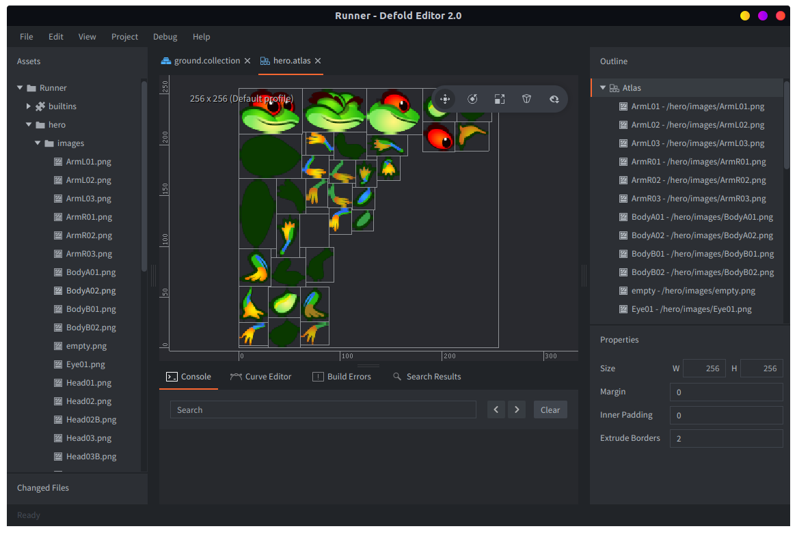

We also need to import the Spine animation data and set up a *Spine Scene* for it:

1. Drag the file *hero.json* (it is included in the asset package) to the *hero* folder in the *Project Explorer*.
2. Create a *Spine Scene* file. Right-click the *hero* folder and select <kbd>New ▸ Spine Scene File</kbd>. Name the file *hero.spinescene*.
3. Double-click the new file to open and edit the *Spine Scene*.
4. Set the *spine_json* property to the imported JSON file *hero.json*. Click the property, then click the file selector button *...* to open the resource browser.
5. Set the *atlas* property to refer to the *hero.atlas* file.
6. Save the file.


::: sidenote
The file *hero.json* has been exported in Spine JSON format. You will need the Spine or Dragon Bones animation software to be able to create such files. If you want to use other animation software you can export your animations as sprite-sheets and use them as flip-book animations either from *Tile Source* or *Atlas* resources. See the manual on [Animation](/manuals/animation) for more information.
:::

### Building the game object

Now we can start constructing the hero gameobject:

1. Create a new file *hero.go* (Right-click the *hero* folder and select <kbd>New ▸ Game Object File</kbd>.
2. Open the game object file.
3. Add a *Spine Model* component to it. (Right-click the root in the *Outline* and select <kbd>Add Component</kbd>, then select "Spine Model".)
4. Set the *Spine Scene* property of the component to the file *hero.spinescene* that you just created and select "run_right" as the default animation (we'll fix animation properly later)
5. Save the file.

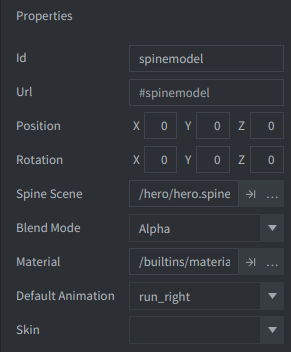

Now it's time to add physics for collision to work:

1. Add a *Collision Object* component to the hero game object. (Right-click the root in the *Outline* and select <kbd>Add Component</kbd>, then select "Collision Object")
2. Right-click the new component and select <kbd>Add Shape</kbd>. Add two shapes to cover the frog's body. A sphere and a box will do.
3. Click the shapes and use the *Move Tool* (<kbd>Scene ▸ Move Tool</kbd>) to move the shapes into good positions.
4. Mark the *Collision Object* component and set the *Type* property to "Kinematic".

::: sidenote
"Kinematic" collision means that we want collisions to register, but the physics engine won't solve collisions automatically and simulate the objects. The physics engine supports a number of different types of collision objects. You can read more about them in the [Physics documentation](/manuals/physics).
:::

It is important that we specify what the collision object should interact with:

1. Set the *Group* property to a new collision group called "hero".
2. Setting the *Mask* property to another group "geometry" that this collision object should register collisions with. Note that the "geometry" group does not yet exist, but we will soon add collision objects belonging to it.

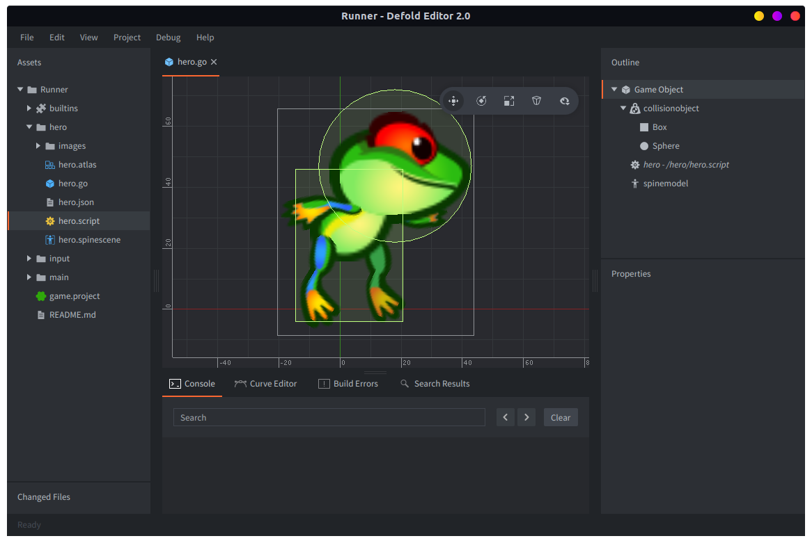

Finally, create a new *hero.script* file and add it to the game object.

1. Right-click the *hero* folder in the *Project Explorer*  and select <kbd>New ▸ Script File</kbd>. Name the new file *hero.script*.
2. Open the new file, then copy and paste the following code into the script file, then save it. (The code is pretty straightforward apart from the solver that separates the hero collision shape from what it collides with. That is done by the `handle_geometry_contact()` function.)

::: sidenote
The reason we are handling the collision ourselves is that if we instead set the type on the frog's collision object to dynamic, the engine will peform a Newtonian simulation of the bodies involved. For a game like this, such a simulation is far from optimal so instead of fighting the physics engine with various forces, we take full control.

Now, to do that and handle collision properly requires a little bit of vector mathematics. A thorough explanation on how to solve kinematic collisions is given in the [Physics documentation](/manuals/physics#_resolving_kinematic_collisions).
:::

```lua
-- gravity pulling the player down in pixel units/sˆ2
local gravity = -20

-- take-off speed when jumping in pixel units/s
local jump_takeoff_speed = 900

function init(self)
    -- this tells the engine to send input to on_input() in this script
    msg.post(".", "acquire_input_focus")

    -- save the starting position
    self.position = go.get_position()

    -- keep track of movement vector and if there is ground contact
    self.velocity = vmath.vector3(0, 0, 0)
    self.ground_contact = false
end

function final(self)
    -- Return input focus when the object is deleted
    msg.post(".", "release_input_focus")
end

function update(self, dt)
    local gravity = vmath.vector3(0, gravity, 0)

    if not self.ground_contact then
        -- Apply gravity if there's no ground contact
        self.velocity = self.velocity + gravity
    end

    -- apply velocity to the player character
    go.set_position(go.get_position() + self.velocity * dt)

    -- reset volatile state
    self.correction = vmath.vector3()
    self.ground_contact = false
end

local function handle_geometry_contact(self, normal, distance)
    -- project the correction vector onto the contact normal
    -- (the correction vector is the 0-vector for the first contact point)
    local proj = vmath.dot(self.correction, normal)
    -- calculate the compensation we need to make for this contact point
    local comp = (distance - proj) * normal
    -- add it to the correction vector
    self.correction = self.correction + comp
    -- apply the compensation to the player character
    go.set_position(go.get_position() + comp)
    -- check if the normal points enough up to consider the player standing on the ground
    -- (0.7 is roughly equal to 45 degrees deviation from pure vertical direction)
    if normal.y > 0.7 then
        self.ground_contact = true
    end
    -- project the velocity onto the normal
    proj = vmath.dot(self.velocity, normal)
    -- if the projection is negative, it means that some of the velocity points towards the contact point
    if proj < 0 then
        -- remove that component in that case
        self.velocity = self.velocity - proj * normal
    end
end

function on_message(self, message_id, message, sender)
    if message_id == hash("contact_point_response") then
        -- check if we received a contact point message. One message for each contact point
        if message.group == hash("geometry") then
            handle_geometry_contact(self, message.normal, message.distance)
        end
    end
end

local function jump(self)
    -- only allow jump from ground
    if self.ground_contact then
        -- set take-off speed
        self.velocity.y = jump_takeoff_speed
    end
end

local function abort_jump(self)
    -- cut the jump short if we are still going up
    if self.velocity.y > 0 then
        -- scale down the upwards speed
        self.velocity.y = self.velocity.y * 0.5
    end
end

function on_input(self, action_id, action)
    if action_id == hash("jump") or action_id == hash("touch") then
        if action.pressed then
            jump(self)
        elseif action.released then
            abort_jump(self)
        end
    end
end
```

3. Add the script as a *Script* component to the hero object (right-click the root of *hero.go* in the *Outline* and select <kbd>Add Component from File</kbd>, then select the *hero.script* file).

If you want you can now try and temporarily add the hero frog to the main collection and run the game to see it fall through the world.

The last thing we need for the hero to be functional is input. The script above already contains an `on_input()` function that responds to actions "jump" and "touch" (for touch screens). Let's add input bindings for these actions.

1. Open "input/game.input_bindings"
2. Add a key trigger for "KEY_SPACE" and name the action "jump"
3. Add a touch trigger for "TOUCH_MULTI" and name the action "touch". (The action names are arbitrary but should match the names in your script. Note that you cannot have the same action name on multiple triggers)
4. Save the file.

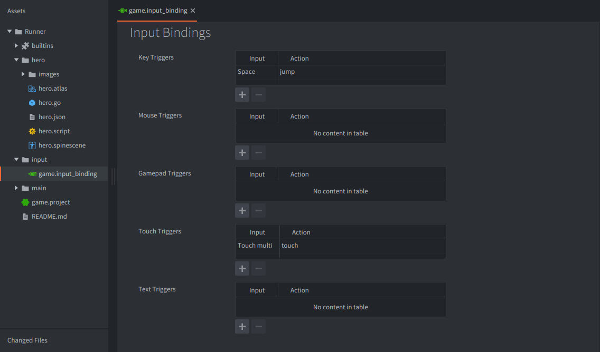

<a name="part-5"></a>
## STEP 5 - Refactoring the level

Now that we have a hero character set up with collision and all, we need to also add collision to the ground so the frog has got something to collide with (or run on). We'll do that in a second, but first, we should do a little refactoring and put all level stuff in a separate collection and clean up the file structure a bit:

1. Create a new *level.collection* file (right-click *main* in the *Project Explorer* and select <kbd>New ▸ Collection File</kbd>).
2. Open the new file, right-click the root in the *Outline* and select <kbd>Add Collection from File</kbd> and choose *ground.collection*.
3. In *level.collection*, right-click the root in the *Outline* and select <kbd>Add Game Object File</kbd> and choose *hero.go*.
4. Now, create a new folder called *level* in the project root (right-click the white space below *game.project* and select <kbd>New ▸ Folder</kbd>), then move the level assets you have created so far to it: the files *level.collection*, *level.atlas*, the "images" folder holding the images for the level atlas, and the files *ground.collection* and *ground.script*.
5. Open *main.collection*, delete *ground.collection* and instead add *level.collection* (right-click and <kbd>Add Collection from File</kbd>) which now contains the *ground.collection*. Make sure that you place the collection at position 0, 0, 0.

::: sidenote
As you might have noticed by now, the file hierarchy seen in the *Project Explorer* is decoupled from the content structure you build in your collections. Individual files are referenced from collection- and game object files, but their location is completely arbitrary.

If you want to move a file to a new location Defold helps by automatically updating references to the file (refactoring). When making a complex piece of software, like a game, it is extremely helpful to be able to change the structure of the project as it grows and changes. Defold encourages that and makes the process smooth so don't be afraid to move your files around!
:::

We should also add a controller game object with a script component to the level collection:

1. Create a new script file. Right-click the *level* folder in the *Project Explorer* and select <kbd>New ▸ Script File</kbd>. Name the file *controller.script*.
2. Open the script file, copy the following code into it and save the file:

    ```lua
    -- controller.script
    go.property("speed", 360) -- <1>

    function init(self)
        msg.post("ground/controller#script", "set_speed", { speed = self.speed })
    end
    ```
    1. This is a script property. We set it to a default value but any placed instance of the script can override this value, directly in the properties view in the editor.

3. Open the *level.collection* file.
4. Right-click the root in the *Outline* and select <kbd>Add Game Object</kbd>.
5. Set the *Id* to "controller".
6. Right-click the "controller" game object in the *Outline* and select <kbd>Add Component from File</kbd> and select the *controller.script* file in the *level* folder.
7. Save the file.

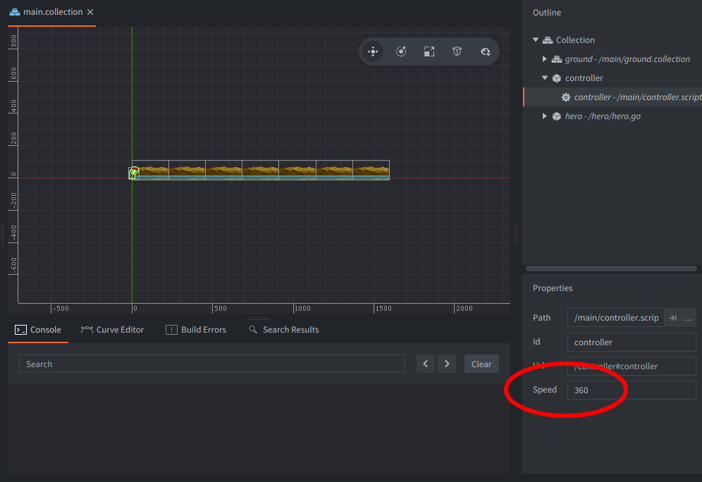

::: sidenote
The "controller" game object does not exist in a file but is created in-place in the level collection. This means that the game object instance is created from the in-place data. That is fine for single purpose game objects like this one. If you need multiple instances of some game object and want to be able to modify the prototype/template used to create each instance, just create a game object file and add the game object from file to the collection. That creates a game object with a reference to the file as prototype/template.

Now, the purpose of this "controller" game object is to control everything that relates to the running level. Soon, this script will be in charge of spawning platforms and coins for the hero to interact with, but for now it will only set the speed of the level.
:::

In the level controller script's `init()` function, it sends a message to the ground controller object's script component, addressed by its id:

```lua
msg.post("ground/controller#script", "set_speed", { speed = self.speed })
```

The id of the controller game object is set to `"ground/controller"` since it lives in the "ground" collection. Then we add the component id `"script"` after the hash character `"#"` that separates the object id from the component id. Note that the ground script does not yet have any code to react to the "set_speed" message so we have to add an `on_message()` function to *ground.script* and add logic for that.

1. Open *ground.script*.
2. Add the following code and save the file:

```lua
-- ground.script
function on_message(self, message_id, message, sender)
    if message_id == hash("set_speed") then -- <1>
        self.speed = message.speed -- <2>
    end
end
```
1. All messages are hashed internally when sent and must be compared to the hashed value.
2. The message data is a Lua table with the data that is sent with the message.

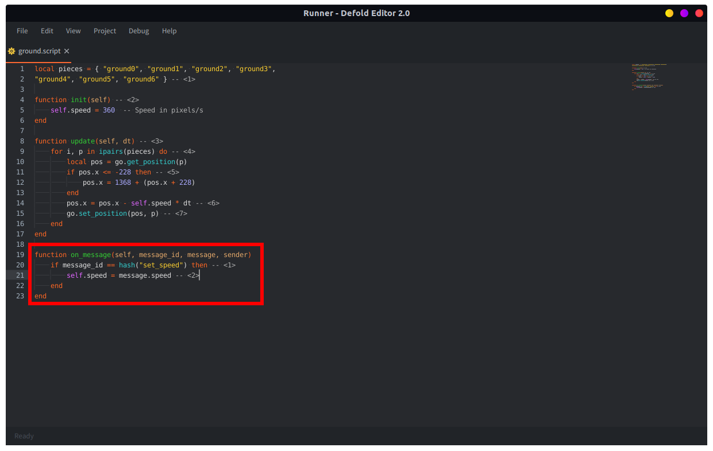

<a name="part-6"></span></a>
## STEP 6 - Ground physics and platforms

At this point we should add physics collision for the ground:

1. Open the *ground.collection* file.
2. Add a new *Collision Object* component to a suitable game object. Since the ground script doesn't respond to collisions (all that logic is in the hero script) we can put it in any _stationary_ game object (the ground tile objects are not stationary so avoid those). One good candidate is the "controller" game object but you can make a separate object for it if you like. Right-click the game object and select <kbd>Add Component</kbd> and select *Collision Object*.
3. Add a box shape by right-clicking the *Collision Object* component and selecting <kbd>Add Shape</kbd> and then *Box*.
4. Use the *Move Tool* and the *Scale Tool* (<kbd>Scene ▸ Move Tool</kbd> and <kbd>Scene ▸ Scale Tool</kbd>) to make the box cover all ground tiles.
5. Set the collision object's *Type* property to "Static" since the ground physics is not going to move.
6. Set the collision object's *Group* property to "geometry" and the *Mask* to "hero". Now the hero's collision object and this one will register collisions between them.
7. Save the file.


Now you should be able to try running the game (<kbd>Project ▸ Build and Launch</kbd>). The frog should run on the ground and it should be possible to jump with the  kbd:[Space] button. If you run the game on a mobile device, you can jump by tapping on the screen.

To make life in frog-world a little less dull, we should add platforms to jump on.

1. Drag the image file *rock_planks.png* from the asset package to the *level/images* subfolder.
2. Open *level.atlas* and add the new image to the atlas (right-click the root in the *Outline* and select <kbd>Add Images</kbd>).
3. Save the file.
4. Create a new *Game Object* file called *platform.go* in the *level* folder. (Right-click *level*
 in the *Project Explorer* then select <kbd>New ▸ Game Object File</kbd>)
5. Add a *Sprite* component to the game object (right-click the root in the *Outline* view and select <kbd>Add Component</kbd> and then *Sprite*).
6. Set the *Image* property to refer to the file *level.atlas* and set *Default Animation* to "rock_planks". For convenience, keep level objects in a subfolder "level/objects".
7. Add a *Collision Object* component to the platform game object (right-click the root in the *Outline* view and select <kbd>Add Component</kbd>).
8. Make sure to set the component's *Type* to "Kinematic" and the *Group* and *Mask* to "geometry" and "hero" respectively
9. Add a *Box Shape* to the *Collision Object* component. (Right-click the component in the *Outline* and select <kbd>Add Shape</kbd>, then choose *Box*).
10. Use the *Move Tool* and the *Scale Tool* (<kbd>Scene ▸ Move Tool</kbd> and <kbd>Scene ▸ Scale Tool</kbd>) to make the shape in the *Collision Object* component cover the platform.
11. Create a *Script* file *platform.script* (Right-click in the *Project Explorer* then select <kbd>New ▸ Script File</kbd>) and put the following code in the file, then save it:

    ```lua
    -- platform.script
    function init(self)
        self.speed = 540      -- Default speed in pixels/s
    end

    function update(self, dt)
        local pos = go.get_position()
        if pos.x < -500 then
            go.delete() -- <1>
        end
        pos.x = pos.x - self.speed * dt
        go.set_position(pos)
    end

    function on_message(self, message_id, message, sender)
        if message_id == hash("set_speed") then
            self.speed = message.speed
        end
    end
    ```
    1. Just delete the platform when it has been moved off the right edge of the screen

12. Open *platform.go* and add the new script as a component (right-click the root in the *Outline* view and select <kbd>Add Component From File</kbd> and select *platform.script*).
13. Copy *platform.go* to a new file (right-click the file in the *Project Explorer* and select <kbd>Copy</kbd>, then right-click again and  select <kbd>Paste</kbd>) and call the new file *platform_long.go*.
14. Open *platform_long.go* and add a second *Sprite* component (right-click the root in the *Outline* view and select <kbd>Add Component</kbd>). Alternatively you can copy the existing *Sprite*.
15. Use the *Move Tool* (<kbd>Scene ▸ Move Tool</kbd>) to place the *Sprite* components side by side.
16. Use the *Move Tool* and the *Scale Tool* to make the shape in the *Collision Object* component cover both platforms.

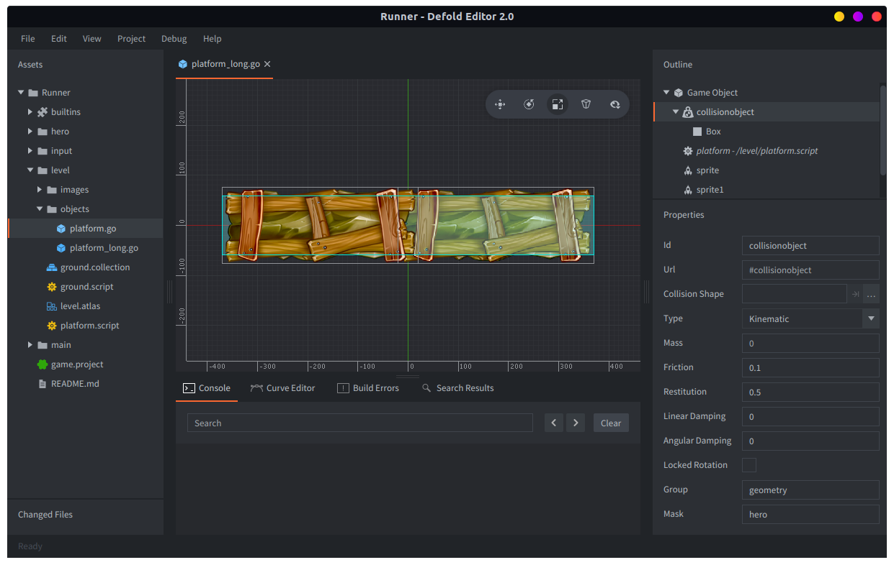

::: sidenote
Note that both *platform.go* and *platform_long.go* has *Script* components that refer to the same script file. This is a good thing since any script changes we make to the script file will affect the behavior of both regular and long platforms.
:::

## Spawning platforms

The idea with the game is that it should be a simple endless runner. This means that the platform game objects cannot be placed in a collection in the editor. Instead we must spawn them dynamically:

1. Open *level.collection*.
2. Add two *Factory* components to the "controller" game object (right-click it and select <kbd>Add Component</kbd> then select *Factory*)
3. Set the *Id* properties of the components to "platform_factory" and "platform_long_factory".
4. Set the *Prototype* property of "platform_factory" to the */level/objects/platform.go* file.
5. Set the *Prototype* property of "platform_long_factory" to the */level/objects/platform_long.go* file.
6. Save the file.
7. Open the *controller.script* file, that manages the level.
8. Modify the script so it contains the following and then save the file:

```lua
-- controller.script
go.property("speed", 360)

local grid = 460
local platform_heights = { 100, 200, 350 } -- <1>

function init(self)
    msg.post("ground/controller#script", "set_speed", { speed = self.speed })
    self.gridw = 0
end

function update(self, dt) -- <2>
    self.gridw = self.gridw + self.speed * dt

    if self.gridw >= grid then
        self.gridw = 0

        -- Maybe spawn a platform at random height
        if math.random() > 0.2 then
            local h = platform_heights[math.random(#platform_heights)]
            local f = "#platform_factory"
            if math.random() > 0.5 then
                f = "#platform_long_factory"
            end

            local p = factory.create(f, vmath.vector3(1600, h, 0), nil, {}, 0.6)
            msg.post(p, "set_speed", { speed = self.speed })
        end
    end
end
```
1- Predefined values for the Y position to spawn platforms on.
2- The `update()` function is called once every frame and we use that to decide whether to spawn a regular or long platform at certain intervals (to avoid overlaps) and heights. It's easy to experiment with various spawning algorithms to create different gameplay.

Now run the game (<kbd>Project ▸ Build and Launch</kbd>).

Wow, this is starting to turn into something (almost) playable...


<a name="part-7"></span></a>
## STEP 7 - Animation and death

The first thing we're gonna do is to bring life to the frog. Right now the poor thing is stuck in a run-loop and does not respond well to jumps or anything. The spine file that we added from the asset package actually contains a set of animations for just that.

1. Open the *hero.script* file and add the following functions _before_ the existing `update()` function:

    ```lua
    -- hero.script
    local function play_animation(self, anim)
        -- only play animations which are not already playing
        if self.anim ~= anim then
            -- tell the spine model to play the animation
            spine.play("#spinemodel", anim, go.PLAYBACK_LOOP_FORWARD, 0.15)
            -- remember which animation is playing
            self.anim = anim
        end
    end

    local function update_animation(self)
        -- make sure the right animation is playing
        if self.ground_contact then
            play_animation(self, hash("run_right"))
        else
            if self.velocity.y > 0 then
                play_animation(self, hash("jump_right"))
            else
                play_animation(self, hash("fall_right"))
            end
        end
    end
    ```

2. Find the function `update()` and add a call to `update_animation`:

    ```lua
    ...
    -- apply it to the player character
    go.set_position(go.get_position() + self.velocity * dt)

    update_animation(self)
    ...
    ```

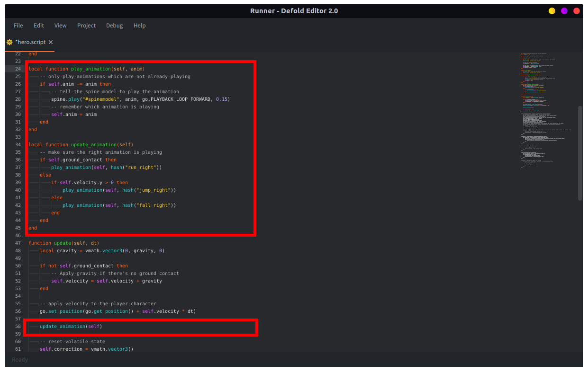

::: sidenote
Lua has "lexical scope" for local variables and is sensitive about the order that you place `local` functions in. The function `update()` calls the local functions `update_animation()` and `play_animation()` which means that the runtime must have seen the local functions to be able to call it. That is why we must put the functions before `update()`. If you switch order of the functions you will get an error. Note that this applies to `local` variables only. You can read more about Lua's scoping rules and local functions on http://www.lua.org/pil/6.2.html
:::

That's all that's needed to add jump and fall animations to the hero. If you run the game you will notice that it feels much better to play. You might also realize that the platforms unfortunately can push the hero off the screen. That is a side-effect of the collision handling but the remedy is easy--add violence and make the edges of the platforms dangerous!

1. Drag *spikes.png* from the asset package to the "level/images" folder in the *Project Explorer*.
2. Open *level.atlas* and add the image (right-click and select <kbd>Add Images</kbd>)
3. Open *platform.go* and add a few *Sprite* components. Set the *Image* to *level.atlas* and the *Default Animation* to "spikes".
4. Use the *Move Tool* and the *Rotate Tool* to place the spikes along the edges of the platform.
5. To make the spikes render behind the platform, set the *Z* position of the spike sprites to -0.1.
6. Add a new *Collision Object* component to the platforms (right-click the root in the *Outline* and select <kbd>Add Component</kbd>). Set the *Group* property to "danger". Also set *Mask* to "hero".
7. Add a box shape to the *Collision Object* (right-click and select <kbd>Add Shape</kbd>) and use the *Move Tool* (<kbd>Scene ▸ Move Tool</kbd>) and the *Scale Tool* to place the shape so the frog will collide with the "danger" object when hitting the platform from the side or from below.
8. Save the file.

    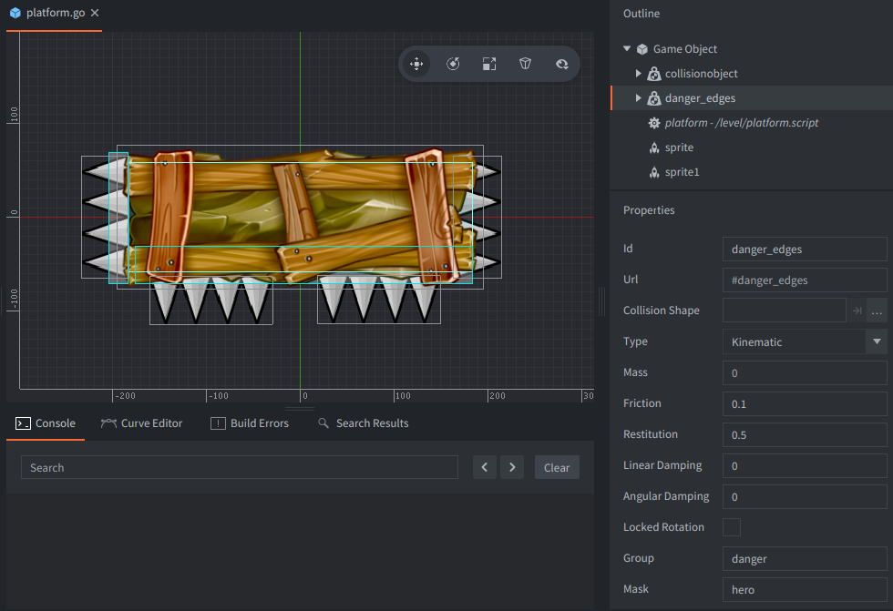

9. Open *hero.go*, mark the *Collision Object* and add the "danger" name to the *Mask* property. Then save the file.

    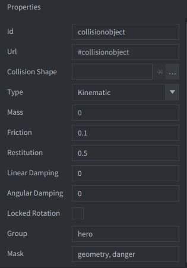

10. Open *hero.script* and change the `on_message()` function so we get a reaction if the frog collides with a "danger" egde:

    ```lua
    -- hero.script
    function on_message(self, message_id, message, sender)
        if message_id == hash("reset") then
            self.velocity = vmath.vector3(0, 0, 0)
            self.correction = vmath.vector3()
            self.ground_contact = false
            self.anim = nil
            go.set(".", "euler.z", 0)
            go.set_position(self.position)
            msg.post("#collisionobject", "enable")

        elseif message_id == hash("contact_point_response") then
            -- check if we received a contact point message
            if message.group == hash("danger") then
                -- Die and restart
                play_animation(self, hash("die_right"))
                msg.post("#collisionobject", "disable")
                -- <1>
                go.animate(".", "euler.z", go.PLAYBACK_ONCE_FORWARD, 160, go.EASING_LINEAR, 0.7)
                go.animate(".", "position.y", go.PLAYBACK_ONCE_FORWARD, go.get_position().y - 200, go.EASING_INSINE, 0.5, 0.2,
                    function()
                        msg.post("#", "reset")
                    end)
            elseif message.group == hash("geometry") then
                handle_geometry_contact(self, message.normal, message.distance)
            end
        end
    end
    ```
    1. Add rotation and fall movement to hero as it dies. This can be greatly improved!

11. Change the `init()` function to send a "reset" message to initialize the object, then save the file:

    ```lua
    -- hero.script
    function init(self)
        -- this lets us handle input in this script
        msg.post(".", "acquire_input_focus")
        -- save position
        self.position = go.get_position()
        msg.post("#", "reset")
    end
    ```

<a name="part-8"></span></a>
## STEP 8 - Resetting the level

If you try the game now it quickly becomes apparent that the reset mechanism doesn't work. The hero reset is fine, but you can easily reset into a situation where you will instantly fall onto a platform edge and die again. What we want to do is to properly reset the whole level on death. Since the level is just a series of spawned platforms, we just need to track all spawned platforms and then delete them at reset:

1. Open the *controller.script* file and edit the code to store the id:s of all spawned platforms:

    ```lua
    -- controller.script
    go.property("speed", 360)

    local grid = 460
    local platform_heights = { 100, 200, 350 }

    function init(self)
        msg.post("ground/controller#script", "set_speed", { speed = self.speed })
        self.gridw = 0
        self.spawns = {} -- <1>
    end

    function update(self, dt)
        self.gridw = self.gridw + self.speed * dt

        if self.gridw >= grid then
            self.gridw = 0

            -- Maybe spawn a platform at random height
            if math.random() > 0.2 then
                local h = platform_heights[math.random(#platform_heights)]
                local f = "#platform_factory"
                if math.random() > 0.5 then
                    f = "#platform_long_factory"
                end

                local p = factory.create(f, vmath.vector3(1600, h, 0), nil, {}, 0.6)
                msg.post(p, "set_speed", { speed = self.speed })
                table.insert(self.spawns, p) -- <1>
            end
        end
    end

    function on_message(self, message_id, message, sender)
        if message_id == hash("reset") then -- <2>
            -- Tell the hero to reset.
            msg.post("hero#script", "reset")
            -- Delete all platforms
            for i,p in ipairs(self.spawns) do
                go.delete(p)
            end
            self.spawns = {}
        elseif message_id == hash("delete_spawn") then -- <3>
            for i,p in ipairs(self.spawns) do
                if p == message.id then
                    table.remove(self.spawns, i)
                    go.delete(p)
                end
            end
        end
    end
    ```
    1. We use a table to store all spawned platforms
    2. The "reset" message deletes all platforms stored in the table
    3. The "delete_spawn" message deletes a particular platform and removes it from the table

2. Save the file.
3. Open *platform.script* and modify it so that instead of just deleting a platform that has reached the leftmost edge, send a message to the level controller asking to remove the platform:

    ```lua
    -- platform.script
    ...
    if pos.x < -500 then
        msg.post("/level/controller#script", "delete_spawn", { id = go.get_id() })
    end
    ...
    ```

    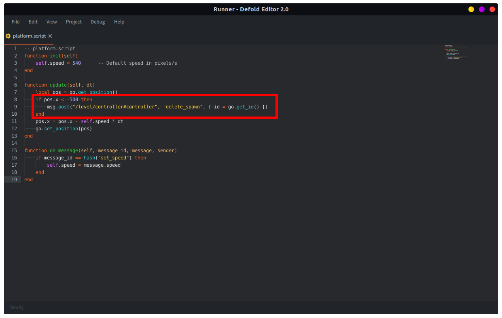

4. Save the file.
5. Open *hero.script*. Now, the last thing we need to do is to tell the level to do the reset. We have moved the message asking the hero to reset to the level controller script. It makes sense to centralize control of resetting like this because it allows us to, for instance, introduce a longer timed death sequence with greater ease:

```lua
-- hero.script
...
go.animate(".", "position.y", go.PLAYBACK_ONCE_FORWARD, go.get_position().y - 200, go.EASING_INSINE, 0.5, 0.2,
    function()
        msg.post("controller#script", "reset")
    end)
...
```


And now the main restart-die loop is in place!

Next up - something to live for: coins!

<a name="part-9"></span></a>
## STEP 9 - Coins to collect

The idea is to put coins in the level for the player to collect. The first questions to ask is how to put them into the level. We can, for instance, develop a spawning scheme that is somehow in tune with the platform spawning algorithm. However, we chose a much easier approach in the end and just have the platforms themselves spawn coins:

1. Drag the *coin.png* image from the asset package to "level/images" in the *Project Explorer*.
2. Open *level.atlas* and add the image (right-click and select <kbd>Add Images</kbd>).
3. Create a *Game Object* file named *coin.go* in the *level* folder (right-click *level* in the *Project Explorer* and select <kbd>New ▸ Game Object File</kbd>).
4. Open *coin.go* and add a *Sprite* component (right-click and select <kbd>Add Component</kbd> in the *Outline*). Set the *Image* to *level.atlas* and *Default Animation* to "coin".
5. Add a *Collision Object* (right-click in the *Outline* and select <kbd>Add Component</kbd>)
and add a *Sphere* shape that covers the image (right-click the component and select <kbd>Add Shape</kbd>).
6. Use the *Move Tool* (<kbd>Scene ▸ Move Tool</kbd>) and the *Scale Tool* to make the sphere cover the coin image.
7. Set the collision object *Type* to "Kinematic", its *Group* to "pickup" and its *Mask* to "hero".
8. Open *hero.go* and add "pickup" to the *Collision Object* component's *Mask* property, then save the file.
9. Create a new script file *coin.script* (right-click *level* in the *Project Explorer* and select <kbd>New ▸ Script File</kbd>). Replace the template code with the following:

    ```lua
    -- coin.script
    function init(self)
        self.collected = false
    end

    function on_message(self, message_id, message, sender)
        if self.collected == false and message_id == hash("collision_response") then
            self.collected = true
            msg.post("#sprite", "disable")
        elseif message_id == hash("start_animation") then
            pos = go.get_position()
            go.animate(go.get_id(), "position.y", go.PLAYBACK_LOOP_PINGPONG, pos.y + 24, go.EASING_INOUTSINE, 0.75, message.delay)
        end
    end
    ```

10. Add the script file as a *Script* component to the coin object (right-click the root in *Outline* and select <kbd>Add Component from File</kbd>).

    

The plan is to spawn the coins from the platform objects so put factories for the coins in *platform.go* and *platform_long.go*.

1. Open *platform.go* and add a *Factory* component (right-click in the *Outline* and select <kbd>Add Component</kbd>).
2. Set the *Id* of the *Factory* to "coin_factory" and set its *Prototype* to the file *coin.go*.
3. Now open *platform_long.go* and create an identical *Factory* component.
4. Save the two files.


Now we need to modify *platform.script* so it spawns and deletes the coins:

```lua
-- platform.script
function init(self)
    self.speed = 540     -- Default speed in pixels/s
    self.coins = {}
end

function final(self)
    for i,p in ipairs(self.coins) do
        go.delete(p)
    end
end

function update(self, dt)
    local pos = go.get_position()
    if pos.x < -500 then
        msg.post("/level/controller#script", "delete_spawn", { id = go.get_id() })
    end
    pos.x = pos.x - self.speed * dt
    go.set_position(pos)
end

function create_coins(self, params)
    local spacing = 56
    local pos = go.get_position()
    local x = pos.x - params.coins * (spacing*0.5) - 24
    for i = 1, params.coins do
        local coin = factory.create("#coin_factory", vmath.vector3(x + i * spacing , pos.y + 64, 1))
        msg.post(coin, "set_parent", { parent_id = go.get_id() }) -- <1>
        msg.post(coin, "start_animation", { delay = i/10 }) -- <2>
        table.insert(self.coins, coin)
    end
end

function on_message(self, message_id, message, sender)
    if message_id == hash("set_speed") then
        self.speed = message.speed
    elseif message_id == hash("create_coins") then
        create_coins(self, message)
    end
end
```
1. By setting the parent of the spawned coin to the platform it will move along with the platform.
2. The animation causes the coins to dance up and down, relative to the platform that is now the parent of the coins.

::: sidenote
Parent-child relations are strictly a modification of the _scene graph_. A child will be transformed (moved, scaled or rotated) along with its parent. If you need additional "ownership" relations between game objects, you need to track that specifically in code.
:::

The last step in this tutorial is to add a couple of lines to *controller.script*:

```lua
-- controller.script
...
local platform_heights = { 100, 200, 350 }
local coins = 3 -- <1>
...
```
1. The number of coins to spawn on a regular platform.

```lua
-- controller.script
...
local coins = coins
if math.random() > 0.5 then
    f = "#platform_long_factory"
    coins = coins * 2 -- Twice the number of coins on long platforms
end
...
```

```lua
-- controller.script
...
msg.post(p, "set_speed", { speed = self.speed })
msg.post(p, "create_coins", { coins = coins })
table.insert(self.spawns, p)
...
```


And now we have a simple, but functional game! If you make it this far you might want to continue on your own and add the following:

1. Scoring and life counters
2. Particle effects for the pickups and death
3. Nice background imagery

That concludes this introductory tutorial. Now go ahead and dive into Defold. We have lots of [manuals and tutorials](//www.defold.com/learn) prepared to guide you, and if you get stuck, your're welcome to the [forum](//forum.defold.com).

Happy Defolding!
