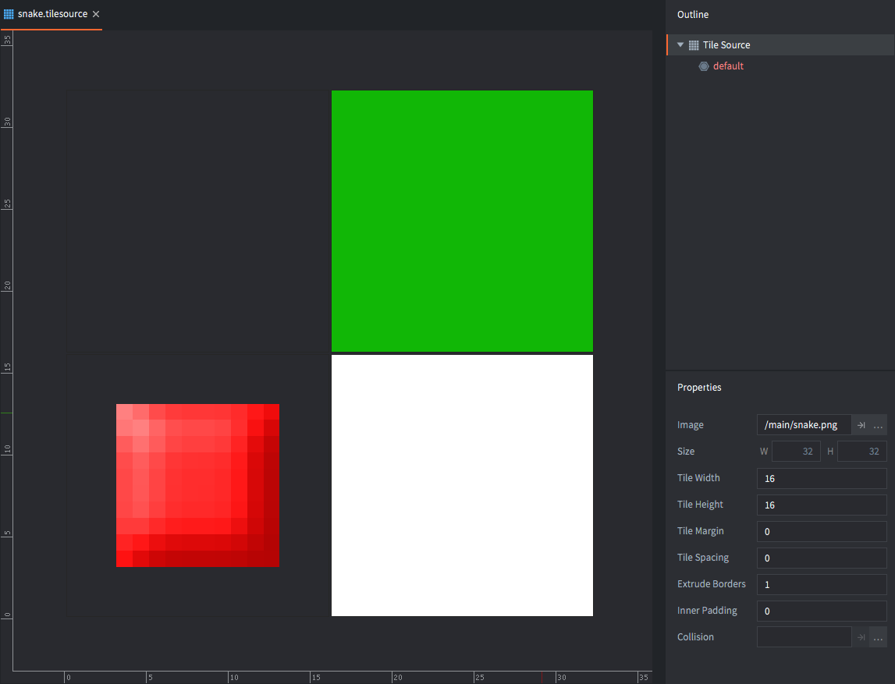
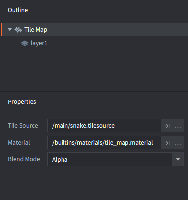
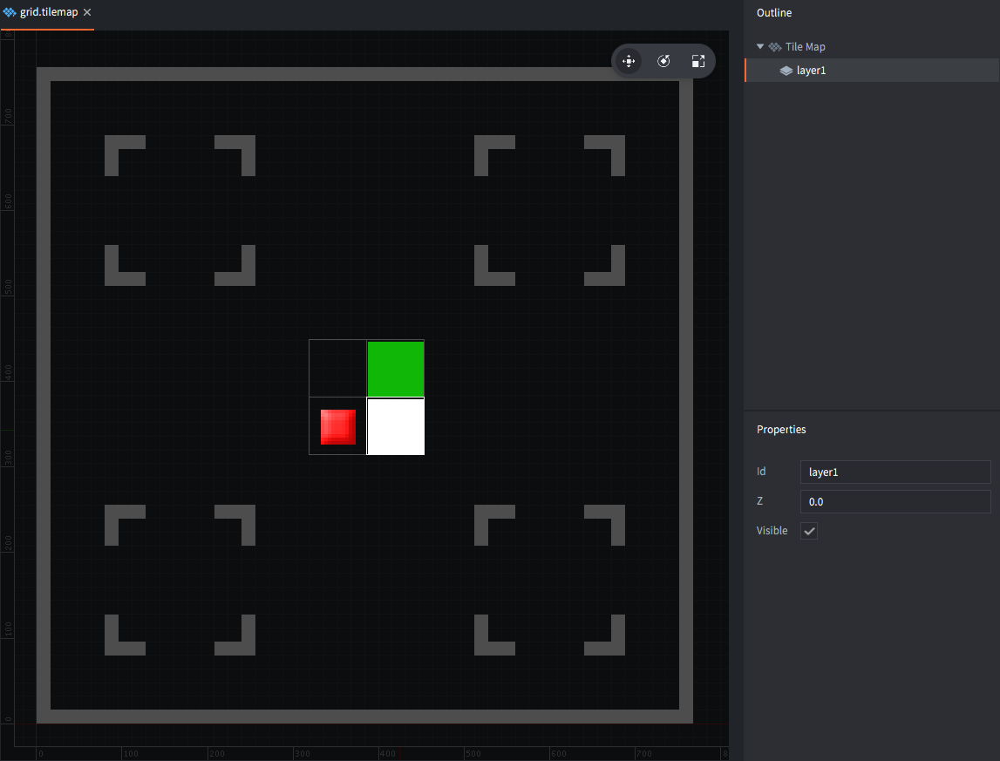
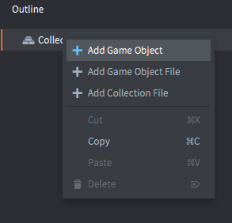
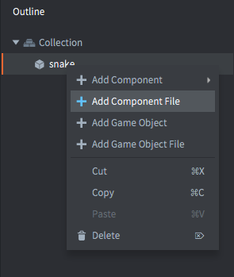
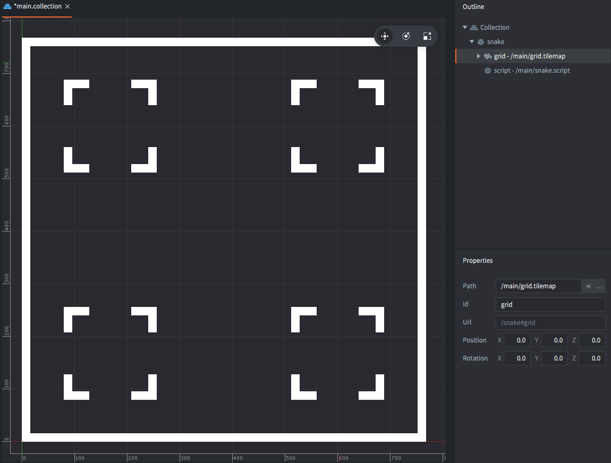
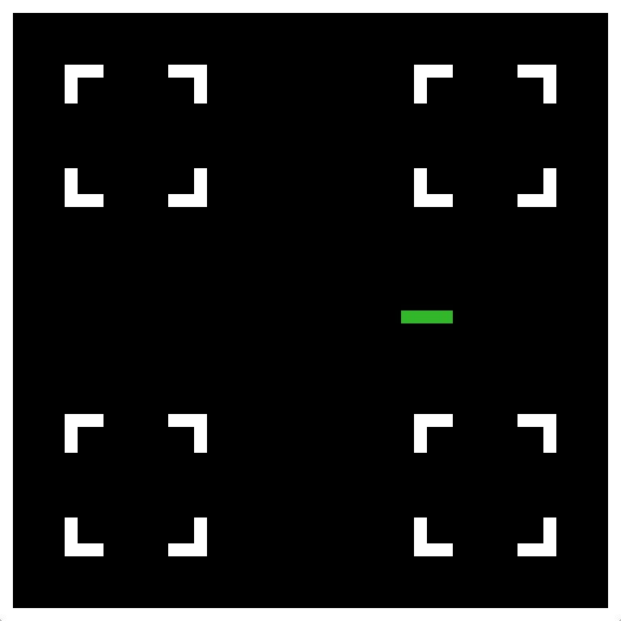
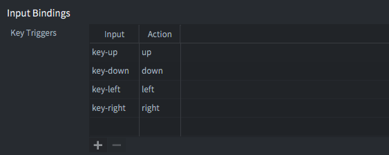

# Snake

This tutorial walks you through the process of creating one of the most common classic games you can attempt to recreate. There are a lot of variations on this game, this one features a snake that eats "food" and that only grows when it eats. This snake also crawls on a playfield that contains obstacles.

Before beginning, take a minute and try the game:

<div id="game-container" class="game-container">
  
  <canvas id="game-canvas" tabindex="1" width="768" height="768">
  </canvas>
  <button id="game-button">
    START GAME <span class="icon"></span>
  </button>
  <script src="//storage.googleapis.com/defold-doc/assets/dmloader.js"></script>
  <script src="//storage.googleapis.com/defold-doc/assets/dmengine_1_2_112.js" async></script>
  <script>
      /* Load app on click in container. */
      document.getElementById("game-button").onclick = function (e) {
          var extra_params = {
              archive_location_filter: function( path ) {
                  return ("//storage.googleapis.com/defold-doc/assets/snake" + path + "");
              },
              load_done: function() {},
              game_start: function() {
                  var e = document.getElementById("game-preview");
                  e.parentElement.removeChild(e);
              }
          }
          Module.runApp("game-canvas", extra_params);
          document.getElementById("game-button").style.display = 'none';
          document.getElementById("game-button").onclick = null;
      };
  </script>
</div>

## Setting up the project

Create a new project and do a quick clean up. If you already know how to do that, great. If you don’t, head over to the [war battles](/tutorials/war-battles) tutorial and read the sections “Setting up the project” through “Cleaning the project”. There is also an overview of the editor there that will help you find your way around if you are totally new to Defold.

With the project cleaned up, open the *game.project* settings file and set the dimensions of the game to 768⨉768 or some other multiple of 16. The reason why you want to do this is because the game will be drawn on a grid where each segment is going to be 16x16 pixels, and this way the game screen won't cut off any partial segments.

## Adding graphics to the game

Very little is needed in terms of graphics. One 16x16 segment for the snake, one for obstacles and one for the food. Here is an image containing the graphics. Download it and drag it to a location in the project folder.


Defold provides a built in *Tilemap* component that you will use to create the playfield. A tilemap allows you to set and read individual tiles, which suits this game perfectly. Since tilemaps fetch their graphics from a *Tilesource* so you need to create one:

<kbd>Right click</kbd> the *main* folder and select <kbd>New ▸ Tile Source</kbd>. Name the new file "snake.tilesource".

Set the *Image* property to the graphics file you just imported.

The *Width* and *Height* properties should be kept at 16. This will split the 32⨉32 pixel image into 4 tiles, numbered 1–4.



Note that the *Extrude Borders* property is set to 1 pixel. This is to prevent visual artifacts around the tiles that have graphics all the way out to the edge.

## Creating the play field tilemap

Now you have a tilesource ready for use so it's time to create the playfield tilemap component:

<kbd>Right click</kbd> the *main* folder and select <kbd>New ▸ Tile Map</kbd>. Name the new file "grid.tilemap".



Set the *Tile Source* property of the new tile map to "snake.tilesource".

Defold only stores the area of the tilemap that is actually used so you need to add enough tiles to fill the boundaries of the screen.

Select the "layer1" layer.

Choose the menu option <kbd>Scene ▸ Tile Map ▸ Show Palette</kbd> to display the tile palette, then click the tile you want to use when painting.

Paint a border around the edge of the screen and some obstacles.



Save the tilemap when you are done.

## Adding the tilemap and a script to the game

Now open *main.collection*. This is the bootstrap collection that is loaded on engine start. <kbd>Right click</kbd> the root in the *Outline* and select <kbd>Add Game Object</kbd> which creates a new game object in the collection that is loaded when the game starts.



Then <kbd>Right click</kbd> then new game object and select <kbd>Add Component File</kbd>. Choose the file "grid.tilemap" that you just created.



<kbd>Right click</kbd> the folder *main* in the *Assets* browser and select <kbd>New ▸ Script</kbd>. Name the new script file "snake.script". This file will hold all the logic for the game.

Go back to *main.collection* and <kbd>right click</kbd> then game object holding the tilemap. Select <kbd>Add Component File</kbd> and choose the file "snake.script".

Now you have the tilemap component and the script in place. If you run the game you should see the playfield as you drew it on the tilemap.



## The game script - initialization

The script you are going to write will drive all of the game. The idea for how that is going to work is the following:

1. The script keeps a list of tile positions that the snake currently occupies.
2. If the player presses a directional key, store the direction the snake should be moving.
3. At a regular interval, move the snake one step in the current movement direction.

Open *snake.script* and locate the `init()` function. This function is called by the engine when the script is initialized on game start. Change the code to the following.

```lua
function init(self)
    self.segments = {
        {x = 7, y = 24},
        {x = 8, y = 24},
        {x = 9, y = 24},
        {x = 10, y = 24} } -- <1>
    self.dir = {x = 1, y = 0} -- <2>
    self.speed = 7.0 -- <3>

    self.t = 0 -- <4>
end
```
1. Store the segments of the snake as a Lua table containing a list of tables, each holding a X and Y position for a segment.
2. Store the current direction as a table holding an X and Y direction.
3. Store the current movement speed, expressed as tiles per second.
4. Store a timer value that will be used to keep track of movement speed.

The script code above is written in the Lua language. There are a few things to note about the code:

- Defold reserves a set of built in callback *functions* that are called during the lifetime of a script component. These are *not* methods but plain functions. The runtime passes a reference to the current script component instance through the parameter `self`. The `self` reference is used to store instance data.
- The name `msg.post` resolves to a function `post` residing in a Lua table named `msg`. The dot notation is used to indicate intries in Lua tables, *not* methods on an object "msg"!
- Lua table literals are written surrounded with curly braces. Table entries can be key/value pairs (`{x = 10, y = 20}`), nested Lua tables (`{{a = 1}, {b = 2}}`) or other data types. 
- The `self` reference can be used as a Lua table that you can store data in. Just use the dot notation as you would with any other table: `self.data = "value"`. The reference is valid throughout the lifetime of the script, in this case from game start until you quit it.

If you didn't understand any of the above, don't worry about it. Just tag along, experiment and give it time---you will get it eventually.

## The game script - update

The `init()` function is called exactly once, when the script component is instanciated into the running game. The function `update()`, however, is called once each frame, 60 times a second. That makes the function ideal for real time game logic.

The idea for the update is this:

1. At some set interval do the following:
2. Look at the head of the snake, then make a new head that is offset from the current head by the current movement direction. So, if the snake is moving by X=-1 and Y=0 and the current head is at location X=32 and Y=10, then the new head should be at X=31 and Y=10.
3. Add the new head to the list of segments that constitutes the snake.
4. Remove the tail from the segment table.
5. Clear the tail tile.
6. Draw the snake segments.

Find the `update()` function in *snake.script* and change the code to the following:

```lua
function update(self, dt)
    self.t = self.t + dt -- <1>
    if self.t >= 1.0 / self.speed then -- <2>        
        local head = self.segments[#self.segments] -- <3>
        local newhead = {x = head.x + self.dir.x, y = head.y + self.dir.y} -- <4>

        table.insert(self.segments, newhead) -- <5>

        local tail = table.remove(self.segments, 1) -- <6>
        tilemap.set_tile("#grid", "layer1", tail.x, tail.y, 0) -- <7>

        for i, s in ipairs(self.segments) do -- <8>
            tilemap.set_tile("#grid", "layer1", s.x, s.y, 2) -- <9>
        end
        
        self.t = 0 -- <10>
    end
end
```
1. Advance the timer with the time difference (in seconds) since the last time `update()` was called.
2. If the timer has advanced enough.
3. Get the current head segment. `#` is the operator used to get the lenght of a table given that it is used as an array, which it is---all the segments are table values with no key specified.
4. Create a new head segment based on the current head location and the movement direction (`self.dir`).
5. Add the new head to the (end of the) segments table.
6. Remove the tail from the (beginning of the) segments table.
7. Clear the tile at the position of the removed tail.
8. Loop through the elements in the segments table. Each iteration will have `i` set to the position in the table (starting from 1) and `s` set to the current segment.
9. Set the tile at the position of the segment to the value 2 (which is the green snake tile color).
10. When done, reset the timer to zero.

If you run the game now you should see the 4 segment long snake crawl from left to right over the play field.



## Player input

Before you add code to react to player input, you need to set up the input connections. Find the file *input/game.input_binding* in the *Assets* browser and <kbd>double click</kbd> to open it. Add a set of *Key Trigger* bindings for movement up, down, left and right.



The input binding file maps actual user input (keys, mouse movements etc) to action *names* that are fed to scripts that have requested input. With bindings in place, open *snake.script* and add the following code:

```lua
function init(self)
    msg.post(".", "acquire_input_focus") -- <1>

    self.segments = {
        {x = 7, y = 24},
        {x = 8, y = 24},
        {x = 9, y = 24},
        {x = 10, y = 24} }
    self.dir = {x = 1, y = 0}
    self.speed = 7.0

    self.t = 0
end
```
1. Send a message to the current game object ("." is shorthand for the current game object) telling it to start receiving input from the engine.

```lua
function on_input(self, action_id, action)
    if action_id == hash("up") and action.pressed then -- <1>
        self.dir.x = 0 -- <2>
        self.dir.y = 1
    elseif action_id == hash("down") and action.pressed then
        self.dir.x = 0
        self.dir.y = -1
    elseif action_id == hash("left") and action.pressed then
        self.dir.x = -1
        self.dir.y = 0
    elseif action_id == hash("right") and action.pressed then
        self.dir.x = 1
        self.dir.y = 0
    end 
end
```
1. If the input action "up" is received, as set up in the input bindings, and the `action` table has the `pressed` field set to `true` (player pressed the key) then:
2. Set the movement direction.

Run the game again and check that you are able to steer the snake.

Now, notice that if you press two keys simultaneously, that will result in two calls to `on_input()`, one for each press. As the code is written above, only the call that happens last will have an effect on the snake's direction since subsequent calls to `on_input()` will overwrite the values in `self.dir`.

Also note that if the snake moves left and you press the <kbd>right</kbd> key, the snake will steer into itself. The *apparently* obvious fix to this problem is by adding an additional condition to the `if` clauses in `on_input()`:

```lua
if action_id == hash("up") and self.dir.y ~= -1 and action.pressed then
    ...
elseif action_id == hash("down") and self.dir.y ~= 1 and action.pressed then
    ...
```

However, if the snake is moving left and the playes *quickly* presses first <kbd>up</kbd>, then <kbd>right</kbd> before the next movement step happens, only the <kbd>right</kbd> press will have an effect and the snake will move into itself. With the conditions added to the `if` clauses shown above, the input will be ignored. *Not good!*

A proper solution to this problem is to store the input in a queue and pull entries from that queue as the snake moves:

```lua
function init(self)
    self.segments = {
        {x = 7, y = 24},
        {x = 8, y = 24},
        {x = 9, y = 24},
        {x = 10, y = 24} }
    self.dir = {x = 1, y = 0}
    self.dirqueue = {} -- <1>
    self.speed = 7.0

    self.t = 0
end

function update(self, dt)
    self.t = self.t + dt
    if self.t >= 1.0 / self.speed then
        local newdir = table.remove(self.dirqueue, 1) -- <2>
        if newdir then
            local opposite = newdir.x == -self.dir.x or newdir.y == -self.dir.y -- <3>
            if not opposite then
                self.dir = newdir -- <4>
            end
        end

        local head = self.segments[#self.segments]
        local newhead = {x = head.x + self.dir.x, y = head.y + self.dir.y}

        table.insert(self.segments, newhead)

        local tail = table.remove(self.segments, 1)
        tilemap.set_tile("#grid", "layer1", tail.x, tail.y, 0)

        for i, s in ipairs(self.segments) do
            tilemap.set_tile("#grid", "layer1", s.x, s.y, 2)
        end
        
        self.t = 0
    end
end

function on_input(self, action_id, action)
    if action_id == hash("up") and action.pressed then
        table.insert(self.dirqueue, {x = 0, y = 1}) -- <5>
    elseif action_id == hash("down") and action.pressed then
        table.insert(self.dirqueue, {x = 0, y = -1})
    elseif action_id == hash("left") and action.pressed then
        table.insert(self.dirqueue, {x = -1, y = 0})
    elseif action_id == hash("right") and action.pressed then
        table.insert(self.dirqueue, {x = 1, y = 0})
    end 
end
```
1. Initialize an empty table that will hold the input direction queue.
2. Pull the first item from the direction queue.
3. If there is an item (`newdir` is not null) then check if `newdir` is pointing opposite to `self.dir`.
4. Only set new direction if it does not point opposite.
5. Add input direction to the direction queue instead of setting `self.dir` directly.

Start the game and check that it plays as expected.

## Food and collision with obstacles

The snake needs food on the map so it can grow long and fast. Let's add that!

```lua
local function put_food(self) -- <1>
    self.food = {x = math.random(2, 47), y = math.random(2, 47)} -- <2>
    tilemap.set_tile("#grid", "layer1", self.food.x, self.food.y, 3) -- <3>
end

function init(self)
    msg.post(".", "acquire_input_focus")

    self.segments = {
        {x = 7, y = 24},
        {x = 8, y = 24},
        {x = 9, y = 24},
        {x = 10, y = 24} }
    self.dir = {x = 1, y = 0}
    self.dirqueue = {}
    self.speed = 7.0
    self.t = 0
    
    math.randomseed(socket.gettime()) -- <4>
    put_food(self) -- <5>
end
```
1. Declare a new function called `put_food()` that puts a piece of food on the map.
2. Store a random X and Y position in a variable called `self.food`.
3. Set the tile at position X and Y to the value 3, which is the tile graphics for the food.
4. Before starting to pull random values with `math.random()`, set the random seed, otherwise the same series of random values will be generated. This seed should only be set once.
5. Call the function `put_food()` at game start so the player begins with a food item on the map.

Now, detecting if the snake has collided with something is just a matter of looking at what's on the tilemap where snake is heading and react. Add a variable that keeps track of whether the snake is alive or not:

```lua
function init(self)
    msg.post(".", "acquire_input_focus")

    self.segments = {
        {x = 7, y = 24},
        {x = 8, y = 24},
        {x = 9, y = 24},
        {x = 10, y = 24} }
    self.dir = {x = 1, y = 0}
    self.dirqueue = {}
    self.speed = 7.0
    self.alive = true -- <1>
    self.t = 0
    
    math.randomseed(socket.gettime())
    put_food(self)
end
```
1. A flag telling if the snake is alive or not.

Then add logic that tests for collision with wall/obstacle and food:

```lua
function update(self, dt)
    self.t = self.t + dt
    if self.t >= 1.0 / self.speed and self.alive then -- <1>
        local newdir = table.remove(self.dirqueue, 1)
        
        if newdir then
            local opposite = newdir.x == -self.dir.x or newdir.y == -self.dir.y
            if not opposite then
                self.dir = newdir
            end
        end

        local head = self.segments[#self.segments]
        local newhead = {x = head.x + self.dir.x, y = head.y + self.dir.y}

        table.insert(self.segments, newhead)

        local tile = tilemap.get_tile("#grid", "layer1", newhead.x, newhead.y) -- <2>

        if tile == 2 or tile == 4 then
            self.alive = false -- <3>
        elseif tile == 3 then
            self.speed = self.speed + 1 -- <4>
            put_food(self)
        else
            local tail = table.remove(self.segments, 1) -- <5>
            tilemap.set_tile("#grid", "layer1", tail.x, tail.y, 1)
        end

        for i, s in ipairs(self.segments) do
            tilemap.set_tile("#grid", "layer1", s.x, s.y, 2)            
        end
        
        self.t = 0
    end
end
```
1. Only advance the snake if it's alive.
2. Before drawing to the tilemap, read what's at the position where the new snake head will be.
3. If the tile is an obstacle or another part of the snake, game over!
4. If the tile is food, increase the speed, then put out a new food item.
5. Note that the removal of the tail only happens if there is no collision. This means that if the player eats food, the snake will grow by one segment since no tail is removed that move.

Now try the game and make sure it plays well!

This concludes the tutorial but please continue experimenting with the game and work through some of the exercises below!

## The complete script

Here is the complete script code for reference:

```lua
local function put_food(self)
    self.food = {x = math.random(2, 47), y = math.random(2, 47)}
    tilemap.set_tile("#grid", "layer1", self.food.x, self.food.y, 3)        
end

function init(self)
    msg.post(".", "acquire_input_focus")

    self.segments = {
        {x = 7, y = 24},
        {x = 8, y = 24},
        {x = 9, y = 24},
        {x = 10, y = 24} }
    self.dir = {x = 1, y = 0}
    self.dirqueue = {}
    self.speed = 7.0
    self.alive = true
    self.t = 0
    
    math.randomseed(socket.gettime())
    put_food(self)
end

function update(self, dt)
    self.t = self.t + dt
    if self.t >= 1.0 / self.speed and self.alive then
        local newdir = table.remove(self.dirqueue, 1)
        
        if newdir then
            local opposite = newdir.x == -self.dir.x or newdir.y == -self.dir.y
            if not opposite then
                self.dir = newdir
            end
        end

        local head = self.segments[#self.segments]
        local newhead = {x = head.x + self.dir.x, y = head.y + self.dir.y}

        table.insert(self.segments, newhead)

        local tile = tilemap.get_tile("#grid", "layer1", newhead.x, newhead.y)

        if tile == 2 or tile == 4 then
            self.alive = false
        elseif tile == 3 then
            self.speed = self.speed + 1
            put_food(self)
        else
            local tail = table.remove(self.segments, 1)
            tilemap.set_tile("#grid", "layer1", tail.x, tail.y, 1)
        end

        for i, s in ipairs(self.segments) do
            tilemap.set_tile("#grid", "layer1", s.x, s.y, 2)            
        end
        
        self.t = 0
    end
end

function on_input(self, action_id, action)
    if action_id == hash("up") and action.pressed then
        table.insert(self.dirqueue, {x = 0, y = 1})
    elseif action_id == hash("down") and action.pressed then
        table.insert(self.dirqueue, {x = 0, y = -1})
    elseif action_id == hash("left") and action.pressed then
        table.insert(self.dirqueue, {x = -1, y = 0})
    elseif action_id == hash("right") and action.pressed then
        table.insert(self.dirqueue, {x = 1, y = 0})
    end 
end
```

## Exercises

The playable game at the top of this tutorial contains some additional improvements. It is a good exercise to try to implement those improvements:

1. Add scoring and a score counter.
2. The function `put_food()` does not take into account the position of the snake, nor where obstacles are. Fix that.
3. If the game is over, show a "game over" message, then allow the player to try again.
4. Extra points: add a player 2 snake.
