# War battles tutorial

This tutorial goes through all the steps needed to create a small playable game in Defold. You do not need to have any prior experience with Defold, but if you have done some programming in Lua, Javascript, Python or similar, that will help.

## Setting up the project

You need to create an empty project in Defold and download the asset package.

1. Go to the [Defold Dashboard](//dashboard.defold.com)
2. Click *New Project*
3. Choose a name for the project and select "Start from a blank slate"

   

4. Start Defold.
5. Click to open project "From Dashboard".

   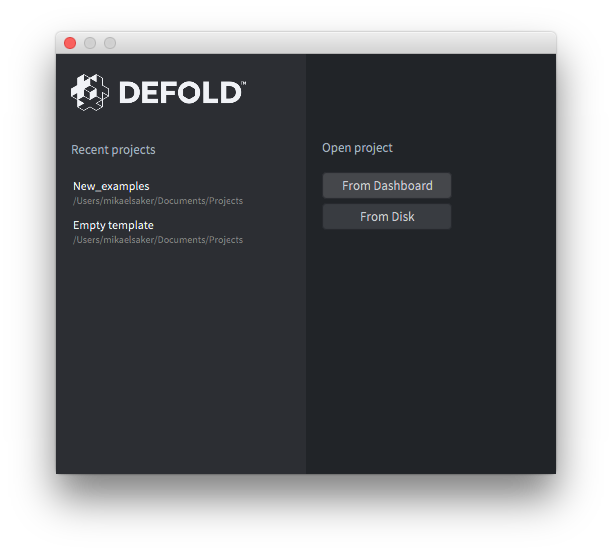

6. Select your newly created project and choose a suitable location on your hard drive for your local working copy.

   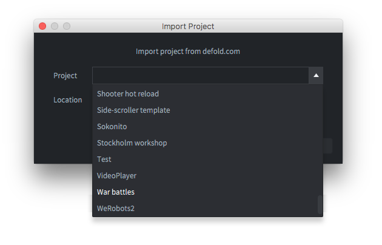

The editor now opens.

## Editor overview

Let's take a moment to familiarize ourselves with the various views in the editor.

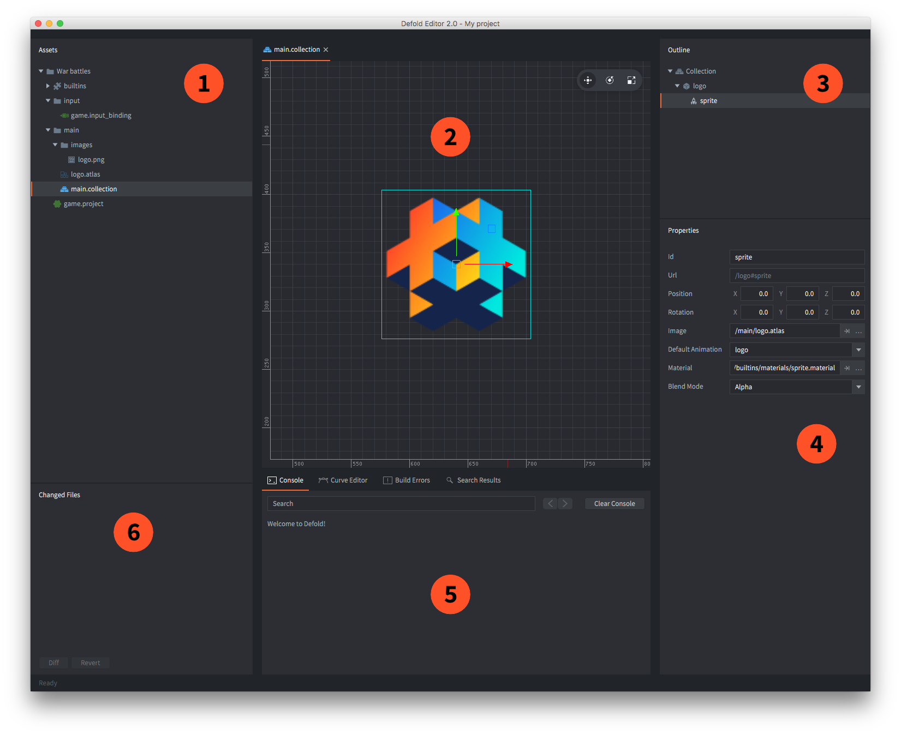

1. The *Assets* view lists all the files that are part of your project. You click and scroll to navigate the list. All file oriented operations can be made in this view:

    * <kbd>Double click</kbd> a file to open it in a suitable editor.
    * <kbd>Drag and drop</kbd> to move files and folders to new locations.
    * <kbd>Right click</kbd> to open a pop up menu from where you can create new files or folders, rename, delete see dependencies and more.

2. The *Editor* view in the center shows the currently open file in a suitable editor. Defold includes editors for all its file types. A toolbar is visible in the top right. There you find tools to move, rotate and scale the currently selected item. For all visual editors you can also alter the camera view:

    * <kbd>Scroll</kbd> to zoom in and out.
    * <kbd>Alt + left mouse button</kbd> to pan around.
    * <kbd>Ctrl + left mouse button</kbd> to rotate in 3D.
    * The menu <kbd>Scene ▸ Camera</kbd> includes tools to frame and realign the camera.

3. The *Outline* shows the content of the currently open file in a hierarchial tree structure. The outline reflects the editor view and allows you to perform many operations on your items:

    * <kbd>Click</kbd> to select an item. Hold <kbd>Shift</kbd> or <kbd>Option</kbd> to expand the selection.
    * <kbd>Drag and drop</kbd> to change the hierarchy.
    * <kbd>Right click</kbd> to open a pop up menu from where you can add items, delete selected items etc.

4. The *Properties* view shows properties associated with the currently selected item, like *Position*, *Rotation*, *Animation* etc etc.

5. The *Console* shows any output that is printed when you run the game. Alongside the console is the *Curve editor* which is used when editing curves in the particle editor, the *Build errors* view that shows build errors and the *Search results* view that displays search results.

6. The *Changed files* view lists any files that has been changed, added or deleted in your project. By synchronizing the project regularly you can upload all file changes to the project Git repository, that way you won't lose your work if unfortune strikes. Some file oriented operations can be performed in this view:

    * <kbd>Double click</kbd> a file to open it in a suitable editor, just like in the assets view.
    * <kbd>Right click</kbd> to open a pop up menu from where you can open a diff view or revert all changes done to the file.

## Cleaning the project

The empty project template is not 100% empty so we should fix that:

1. Open the file *main/main.collection*.
2. Mark the game object "logo" in either the outline or the editor.
3. Delete the game object.
4. Delete the file *main/images/logo.png* (you find it in the assets view).
5. Delete the file *main/logo.atlas* (you find it in the assets view).

Now the project is totally empty. You can verify this by selecting <kbd>Project ▸ Build</kbd> from the menu. This will launch the game and you should see nothing but a black window.

## Drawing a map

The map that you are going to draw will be made out of tiles, small images that are put together like a mosaic into a larger image. In Defold, such an image is called a *Tile map*. In order to create a tile map, you need to import an image with the various tiles, and also set up the sizes, margins etc of that image. This setup is done in a file called a *Tile source*.

1. Download the "War Battles" asset package. The file is a ZIP archive that you have to unpack on your hard drive.

   <a class="btn btn-primary btn-xs-block btn-icon" href="//storage.googleapis.com/defold-doc/assets/war-battles-assets.zip">Download asset package<span aria-hidden="true" class="icon icon-download"></span></a>

2. Drag the file *map.png*, which contains all tiles, to the folder *main* in the *Assets* view of your project.
3. <kbd>Right click</kbd> the folder *main* and select <kbd>New ▸ Tile source</kbd>. This will create a new tile source file. Name the file *map.tilesource*.

   

4. The new tilesource opens in the editor. Set the *Image* property of the tile source to "/main/map.png". Easiest is to click the resource selector by the *Image* property to bring up the resource selector. Then select the file */main/map.png*:

    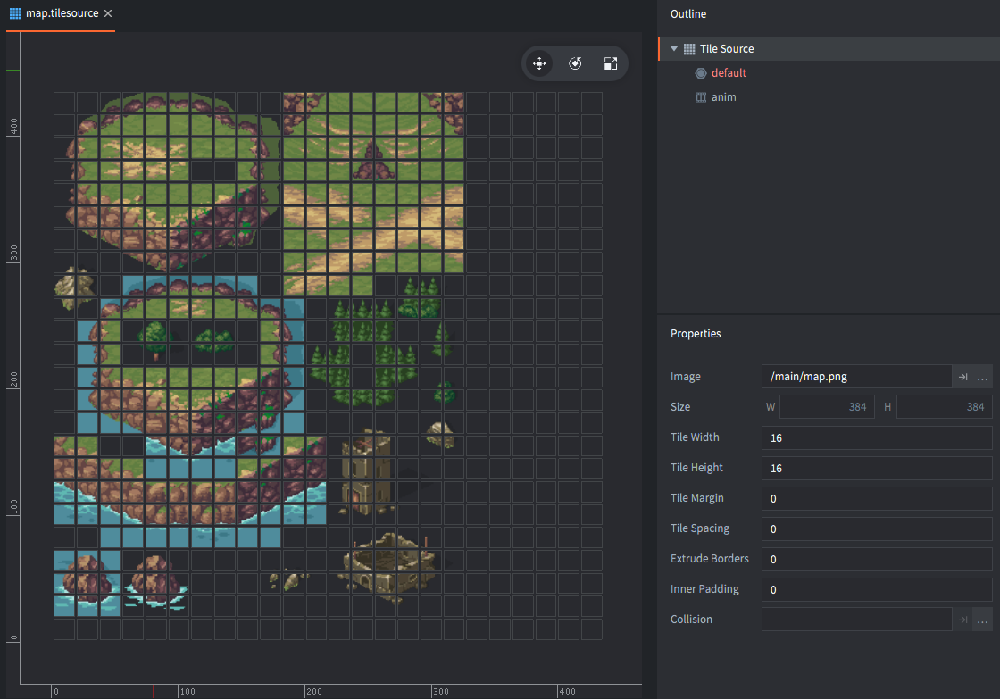

    The tiles are 16⨉16 pixels in the source image so there is no need to alter the properties of the tile source.

5. <kbd>Right click</kbd> the folder *main* and select <kbd>New ▸ Tile map</kbd>. Name the file *map.tilemap*.

6. Set the *Tile source* property of the new tile map to "/main/map.tilesource".

7. Select "layer1" in the *Outline*.

8. Select <kbd>Scene ▸ Tile map ▸ Show palette</kbd>. This brings up the tile palette.

    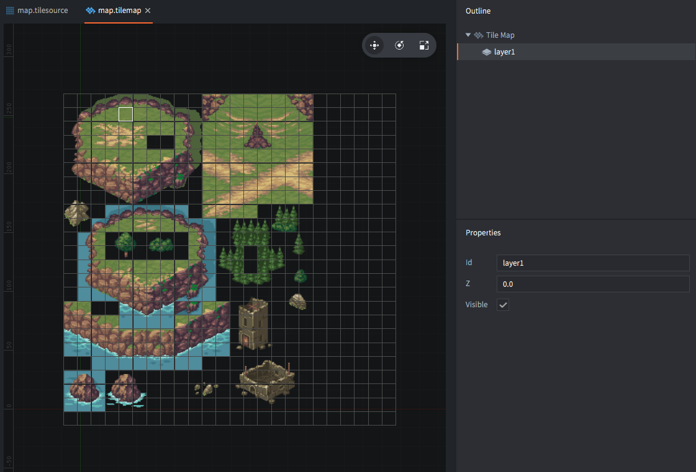

9. Click on a grass tile to select the tile as brush. Now paint the tile map layer as you see fit. You can hold <kbd>Shift</kbd> and click to make a selection on the layer. The selection then becomes your new brush. This is useful to copy rectangular areas.

    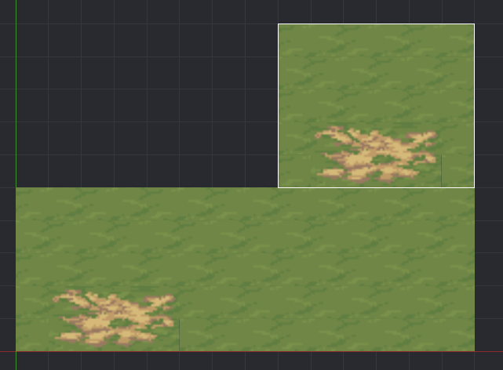

When you are happy with the map, it is time to add it to the game.

## Add the map to the game

1. Open *main.collection*. A collection is a container of game objects and other collections. You use collections to organize your game objects. In *game.project* you specify the collection that is loaded when the game starts up. This is initially set to "/main/main.collection".

2. <kbd>Right click</kbd> the root node of the collection in the *Outline* and select <kbd>Add game object</kbd>.

    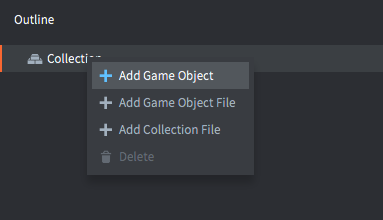

3. Change the *Id* property of the game object to "map". The id does not really matter for this game object but it is a good habit to set identifiers that are descriptive---it makes it easier to find your way around when you have many game objects.

4. <kbd>Right click</kbd> the new game object and select <kbd>Add component file</kbd>.

    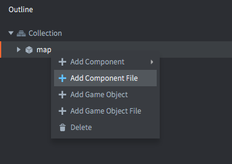

5. In the resource selector, pick "/main/map.tilemap". This adds a new tilemap component to the game object. The tile map should now appear in the editor view.

    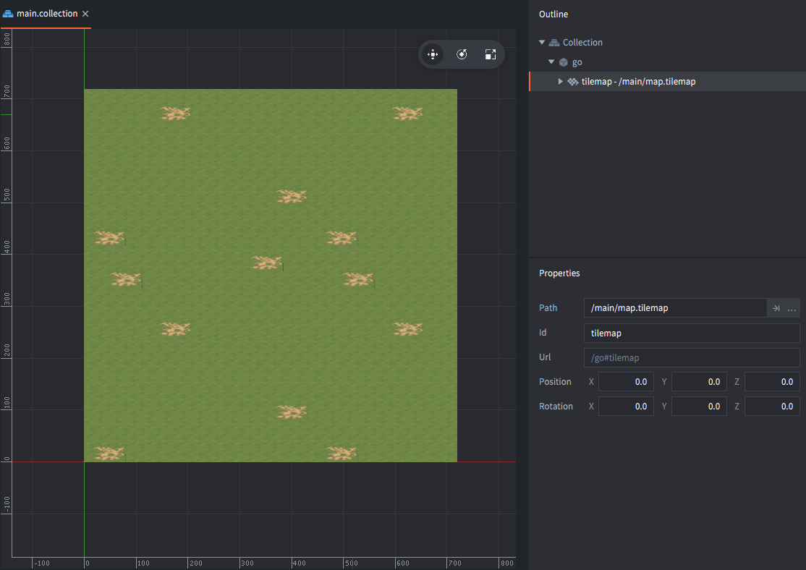

6. Run the game by selecting <kbd>Project ▸ Build</kbd> and check that everything looks good. If you feel that the window is a bit large you can open *game.project* in the project root and alter the display width and height:

    

## The player animation

1. Drag the folder *infantry* (it's in the folder *units*) from the asset package to the folder *main* in the *Assets* view. This copies a set of flip book animation frame images to your project. The images are divided into one folder for each movement direction: up, down, up-diagonally, down-diagonally and side.

2. <kbd>Right click</kbd> the folder *main* in the *Assets* view and select <kbd>New ▸ Atlas</kbd>. An atlas is a collection of images (PNG or JPEG) that are baked into a larger texture. Atlases are used instead of single image files for performance and memory reasons. The new atlas should open in the editor.

3. <kbd>Right click</kbd> the root node of the atlas in the *Outline* and select <kbd>New ▸ Animation group</kbd>.

4. Select the new animation group and change its *Id* property to "player-down".

5. <kbd>Right click</kbd> the "player-down" animation group and select <kbd>Add images...</kbd>. In the resource selector, pick the images */main/infantry/down/1.png* to */main/infantry/down/4.png*.

    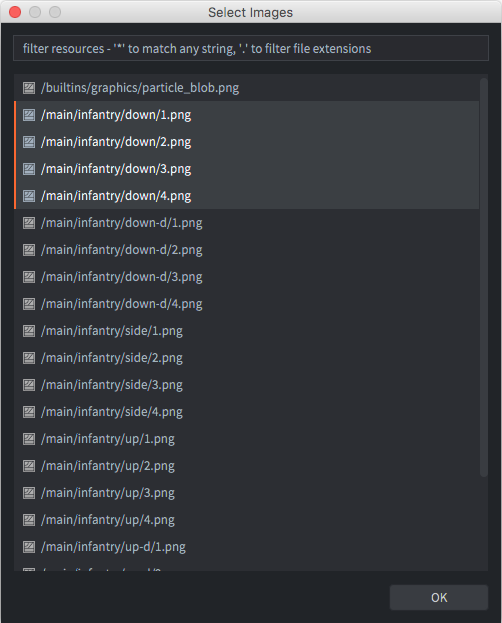

6. With the animation group marked, select <kbd>Scene ▸ Play</kbd> from the menu to preview the animation. It will play back at full 60 FPS which is way too fast. Set the playback speed (*Fps* property) to 8.

    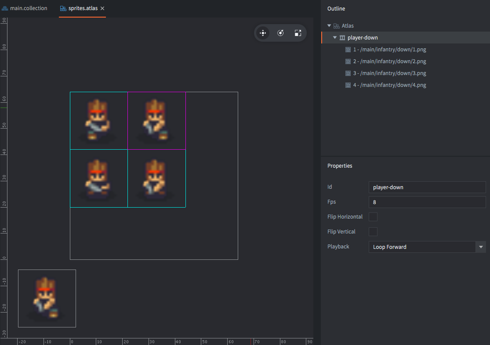

Now you have an atlas with a single flipbook animation for the player. You will add more animations later, but first, let's create the player game object.

## The player game object

1. Open *main.collection*.

2. <kbd>Right click</kbd> the root node of the collection in the *Outline* and select <kbd>Add game object</kbd>. Set the *Id* property of the new game object to "player".

3. Change the Z *Position* property of the game object to 1.0. Since the "map" game object is at the default Z position 0 the "player" game object needs to be at a higher value so it's drawn on top.

4. <kbd>Right click</kbd> the game object "player" and select <kbd>Add component ▸ Sprite</kbd>. This creates a new sprite component in the "player" game object that can show graphics.

5. Set the *Image* property of the sprite to "/main/sprites.atlas".

6. Set the *Animation* property of the sprite to "player-down".

    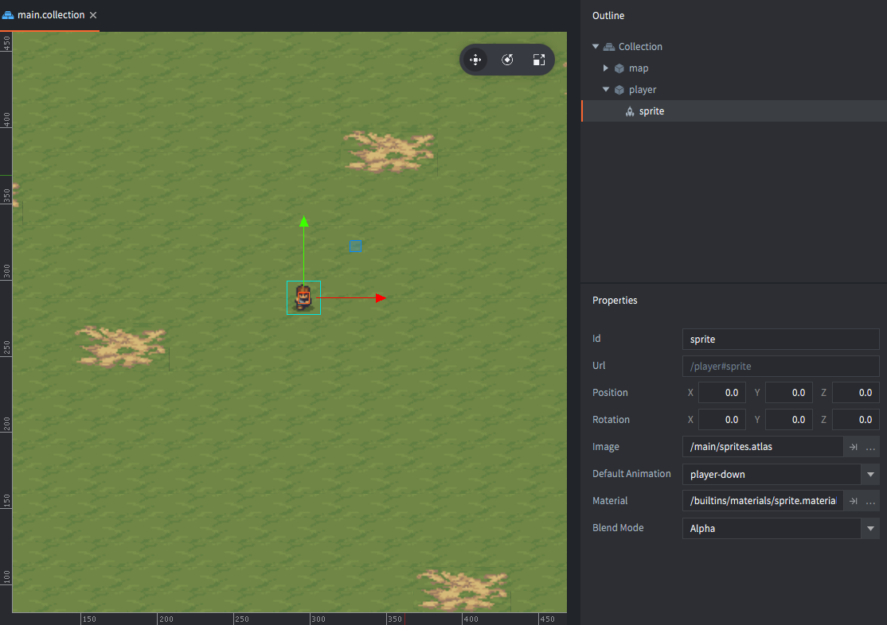

7. Run the game and check that the player character is animating.

The player game object now has a sprite component that gives it visual representation in the game world. The next step is to add a script component that gives the player game object behavior. The player game object's behavior, however, is depending on user input, so that needs to be set up first.

## Player input

1. Open the file */input/game.input_binding*. This file contains mappings from input sources (keyboard, touch screen, game pads etc) to input *actions*. Actions are just names that we want certain input being associated with.

2. Add *Key triggers* for the four arrow keys.

    

## The player script

Unlike the sprite component, which you added inline into the "player" game object, a script component requires that you create a separate file.

1. <kbd>Right click</kbd> the folder *main* in the *Assets* view and select <kbd>New ▸ Script</kbd>. Name the new script file "player.script". The script file should open in the editor. It is pre-filled with functions from a template.

    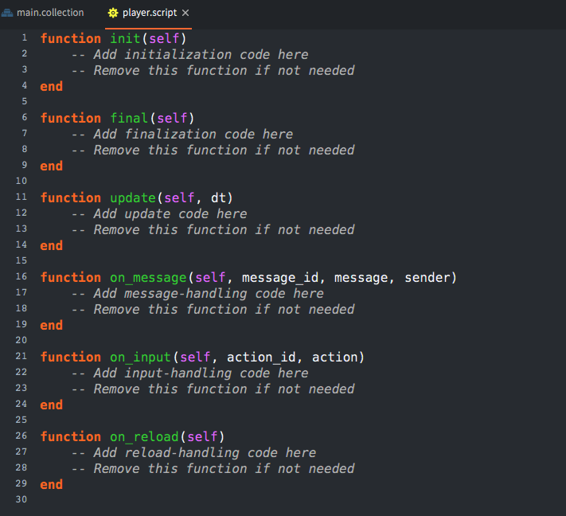

2. Open *main.collection*, <kbd>Right click</kbd> the game object "player" and select <kbd>Add component file</kbd>. Pick the new file */main/player.script* for the component.

You now have a script that runs in the "player" game object. It does not do anything though so let's start by adding player movement.

## Player movement

The Lua code needed to create character movement in 8 directions is not long, but may require some time to understand completely. Take your time and read through the extensive code notes as you copy the below script code into *player.script*.

```lua
function init(self) -- <1>
    msg.post("#", "acquire_input_focus") -- <2>

    self.moving = false -- <3>    
    self.input = vmath.vector3() -- <4>
    self.dir = vmath.vector3(0, 1, 0) -- <5>
    self.speed = 50 -- <6>
end

function final(self) -- <7>
    msg.post("#", "release_input_focus") -- <8>
end

function update(self, dt) -- <9>
    if self.moving then
        local pos = go.get_position() -- <10>
        pos = pos + self.dir * self.speed * dt -- <11>
        go.set_position(pos) -- <12>
    end
    
    self.input.x = 0 -- <13>
    self.input.y = 0
    self.moving = false
end

function on_input(self, action_id, action) -- <14>
    if action_id == hash("up") then
        self.input.y = 1  -- <15>
    elseif action_id == hash("down") then
        self.input.y = -1
    elseif action_id == hash("left") then
        self.input.x = -1
    elseif action_id == hash("right") then
        self.input.x = 1
    end
        
    if vmath.length(self.input) > 0 then
        self.moving = true -- <16>
        self.dir = vmath.normalize(self.input) -- <17>
    end
end
```

1. The `init()` function is called when the script component is brought to life in the game engine.
2. This posts a message named "acquire_input_focus" to the current component ("#" is shorthand for the current component). This is a system message that tells the engine to send input actions to this script component.
3. `self` is a reference to the current component instance. You can keep state data that is local to the component instance by storing it in self. The flag `moving` is used to track if the player is moving or not.
4. `input` is a vector3 that will point in any of the current 8 input directions. It changes as the player presses the arrow keys. The Z component of this vector is unused.
5. `dir` is a vector3 that indicates the direction the player faces. The direction vector is separate from the input vector because if there is no input, the player character should still face in a direction, even if not moving.
6. `speed` is the movement speed expressed in pixels per second.
7. The `final()` function is called when the script component is deleted from the game. This happens either when the container game object ("player") is deleted or when the game shuts down.
8. The script explicitly releases input focus, telling the engine that it wants no more input. Input focus is automatically released when the game object is deleted so this line is not necessary but is included for clarity.
9. The `update()` function is called once each frame. The game is running at 60 frames per second so the function is called at an interval of 1/60 seconds. The argument variable `dt` contains the current interval.
10. If the `moving` flag is true, get the current game object position. The function `go.get_position()` takes an optional argument which is the id of the game object to get the position of. If no argument is given, the current game object position is returned.
11. Add the current direction vector (scaled to speed and frame interval) to the position.
12. Set the position of the game object to the new position.
13. After the calculations have been made, set the input vector to 0 and unset the `moving` flag.
14. The `on_input()` function is called every frame for all mapped input. The argument variable `action_id` contain the action as set up in the input bindings file. The argument variable `action` is a Lua table with details on the input.
15. For each input direction, set the X or the Y component of the `input` vector in `self`. If the user presses the <kbd>up arrow</kbd> and <kbd>left arrow</kbd> keys, the engine will call this function twice and the input vector will be set to `(-1, 1, 0)`.
16. If the user presses any of the arrow keys, the input vector length will be non zero. If so, set the `moving` flag so the player will be moved in `update()`.
17. The `dir` direction vector is set to the normalized value of the input. If the input vector is `(-1, 1, 0)`, for instance, the vector length is greater than 1. Normalizing the vector brings it to a length of exactly 1. Without normalization diagonal movement would be faster than horizontal and vertical. When the engine runs the `update()` function, any user input will have an effect on the `dir` vector which will cause the player to move.

With this piece of Lua code, your game now has a player character that can move around on the screen. The character, however, only plays one single animation in an endless loop. This will be fixed soon, but first we should add the possibility to fire rockets.

## The rocket game object

Consider the main collection for a second. Now it contains two game objects: the map and the player, and that's fine since there is only one map and one player. But rockets will be a different story. They should work like this: whenever the user presses a key, a rocket should fire. For this to work you need a way of creating a new game object for each key press.

1. <kbd>Right click</kbd> the folder *main* in the *Assets* view and select <kbd>New ▸ Game object</kbd>. Name this file *rocket.go*. Note that by creating this file, you do not create a game object but a file can be used as a *blueprint* when creating an actual game object.

2. Drag the folder *buildings/turret-rocket* in the asset package to the *main* folder in the *Assets* view.

3. Open *sprites.atlas* and create a new animation group (right click the root node and select <kbd>New ▸ Animation group</kbd>).

4. Add the three rocket images to the animation group and set the *Fps* property to a value that makes the animation look good when you preview.

    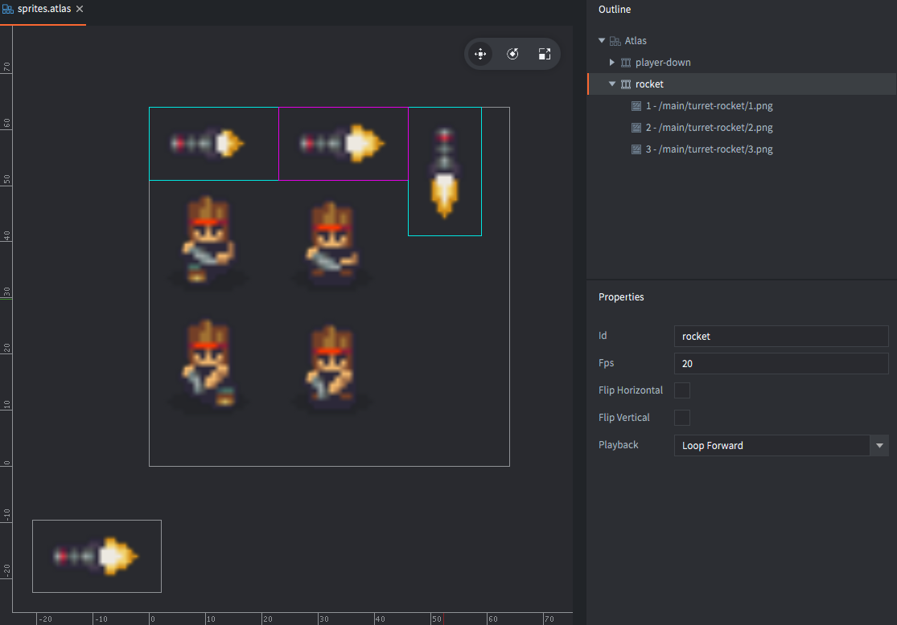

5. Open *rocket.go* and <kbd>Right click</kbd> the root in the *Outline* and select <kbd>Add component ▸ Sprite</kbd>.

6. Set the *Image* property of the sprite to "/main/sprites.atlas" and the *Default animation* to "rocket".

Now you have a basic rocket game object blueprint. The next step is to add functionality to spawn game objects based on this blueprint file. For that, you will use a *Factory* component. You also need to add a new input action for the firing mechanic.

## Spawning rockets

1. Open *main.collection* and <kbd>Right click</kbd> on the "player" game object. Select <kbd>Add component ▸ Factory</kbd>.

2. Select the new factory component and set its *Id* property to "rocketfactory" and its *Prototype* to the file "/main/rocket.go" that you created above. Now the player game object is all set.

3. Open the file */input/game.input_binding*.

4. Add a *Key trigger* for the firing action.

    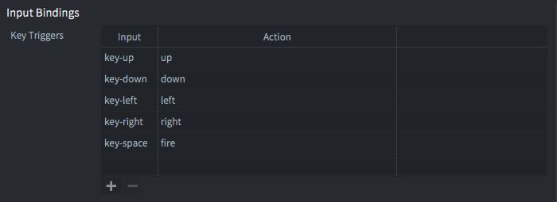

5. Open *main/player.script* and scroll down to the `on_input()` function. Add a fourth `elseif` for the case where the function is called with the "fire" action:

    ```lua
        ...
        elseif action_id == hash("right") then
            self.input.x = 1
        elseif action_id == hash("fire") and action.pressed then
            factory.create("#rocketfactory")
        end

        ...
    ```


## Explosions

## 