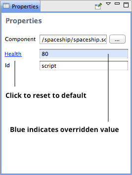
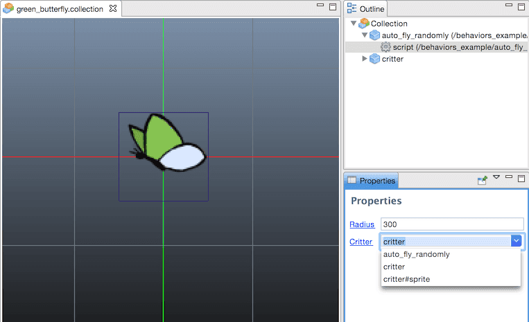

Script properties
=================

Script properties provide a simple and powerful way of exposing properties that control the behavior or look of a specific game object instance and allow non coders to change them in the editor.

Script properties allow for instance specific overrides of script properties. Common use cases is to set the health or speed of a specific enemy AI, the tint color of a pickup object, or what message a button object should send when pressed--and where to send it. There are many cases where script properties are very useful:

* When you want to override their values for specific instances in the editor, and thereby increase script re-usability.
* When you want to spawn a game object with initial values.
* When you want to animate the values of a property.
* When you want to access the data in one script from another.

::: sidenote
If access the data frequently, it is better to access it from a table rather than from properties in a foreign script for performance reasons.
:::

Most types of values that you use to control script behavior or component properties can be exposed as script properties:

Booleans
: True or False

Numbers
: Numerical values.

Hashes
: Hashed string values.

URLs
: References to objects or components.

Vector3
: 3 dimensional vector values.

Vector4
: 4 dimensional vector values.

Quaternion
: Quaternion values.


Suppose that you have a script which controls the health of a game object. The script can respond to damage through a message called `take_damage`:

```lua
function init(self)
    self.health = 100
end

function on_message(self, message_id, message, sender)
    if message_id == hash("take_damage") then
        self.health = self.health - message.damage
        if self.health <= 0 then
            go.delete()
        end
    end
end
```

If the health reaches +0`, the script destroys the game object. Now suppose that you want to use the script in two different game objects, but want the game objects to have different amounts of health. With the function [go.property](/ref/go#go.property) you can declare the property a script property and it will be set by the specific game object instance:

```lua
-- self.health will be automatically set to 100 by default
go.property("health", 100)

function on_message(self, message_id, message, sender)
    if message_id == hash("take_damage") then
        self.health = self.health - message.damage
        if self.health <= 0 then
            go.delete()
        end
    end
end
```

Any game object that includes the script can set the value specifically. Simply select the script node in the `Outline+ view in the editor and the property appears in the `Properties` view allowing you to edit it:



::: sidenote
In the case where you have the game object inside a sub-collection, expand the game object node in the collection to select the script.
:::

The editor property inspector will automatically show a widget that is feasible for the type of property that you have declared. Numbers are entered in text boxes, vectors and quartenions as a set of numbers in boxes, hashes allow you to enter the string that will be hashed and URLs give you a drop down with all _relative_, local (that is, within the same collection) objects and components. You are still able to enter URL values manually, too.



## Accessing script properties

There are several ways the value of a script property can be referenced and used:

Through `self`
: The `self` variable contains a reference to the script instance. Any defined script property is available as a stored member in `self`:


```lua
go.property("my_property", 1)

...
function init(self)
    self.other_property = 2
end

function update(self, dt)
    -- Read and write the property
    if self.my_property == 1 and self.other_property == 3 then
        self.my_property = 3
    end
end
```

As a script component property
: Many components expose properties (sprites expose `size` and `scale`, for instance). Any user-defined script property is avaliable for getting, setting and animating the same way as other component and game object properties:


.myobject.script
```lua
-- This script is attached to the object "myobject". The script component is called "script".
go.property("my_property", 1)

...
```

.another.script
```lua
-- increase "my_property" in "myobject#script" by 1
local val = go.get("myobject#script", "my_property")
go.set("myobject#script", "my_property", val + 1)

-- animate "my_property" in "myobject#script"
go.animate("myobject#script", "my_property", go.PLAYBACK_LOOP_PINGPONG, 100, go.EASING_LINEAR, 2.0)
```

## Factory created objects

If you use a factory to create the game object, it is possible to set script properties at creation time:

```lua
function on_message(self, message_id, message, sender)
    if message_id == hash("create_my_object") then
        factory.create("#factory", go.get_position(), go.get_rotation(), { health = 50 })
    end
end
```

When spawning a hierarchy of game objects through `collectionfactory.create()` you need to pair object id:s with property tables. These are put together in a table and passed to the `create()` function:

```lua
local props = {}
props[hash("/object1")] = { property = 1 }
props[hash("/object2")] = { property = 2, another_property = 3 }
props[hash("/object3")] = { another_property = 4 }

local ids = collectionfactory.create("#collectionfactory", nil, nil, props)
```

The property values provided via `factory.create()` and `collectionfactory.create()` override any value set in the game object file as well as the default value in the script.

::: important
If you have several script components attached to a game object, it is possible to put script properties in any of the script files. Suppose that the game object example above had another script component also containing the property `health`. When `factory.create()` is called, the `health` property for _both_ scripts are set to the provided value.
:::


